# 開発体系一覧（AIエージェント設計）

> **出典**: `ai_agent_catalog_v8-1_data.json` / `SKILL.md` / `AIエージェント基盤比較.xlsx`  
> 本書は上記データから機械生成（`docs/_generate.py`）。**要約・省略・改変なし**で全項目・全フィールドを掲載する。

## 0. 件数サマリ

| 区分 | 件数 |
|---|---|
| エージェント構成（agent） | 20 |
| メモリ設計（memory） | 10 |
| ツールユース（tool） | 10 |
| メモリファミリ（families） | 10 |
| 推奨ユースケース構成（recommended） | 30 |
| 相性: 構成×メモリ（amMatrix） | 48 |
| 相性: 構成×ツール（atMatrix） | 44 |
| タグ（tags） | 20 |

### 目次
1. [設計パターンカタログ](#1-設計パターンカタログ)
2. [メモリファミリと共通指針](#2-メモリファミリと共通指針)
3. [推奨ユースケース構成](#3-推奨ユースケース構成)
4. [相性マトリクス](#4-相性マトリクス)
5. [タグ一覧](#5-タグ一覧)
6. [実装基盤ベンダー比較](#6-実装基盤ベンダー比較)
7. [参照ドキュメント SKILL.md](#7-参照ドキュメント-skillmd)

## 1. 設計パターンカタログ

### 1.1 エージェント構成（agent）

#### シーケンシャル系

| ID | 名称 | 配置 | メモリ | 役割 |
|---|---|---|---|---|
| `simple-chain` | 単純チェーン型 | 直列 | 前段出力の受け渡し | 工程担当 |
| `pipeline` | パイプライン型 | 直列・継続処理 | ストリーム状態 | 処理段階担当 |
| `dag-workflow` | DAGワークフロー型 | 分岐・合流 | 状態オブジェクト | ノード担当 |
| `map-reduce` | Map-Reduce型 | 並列＋集約 | 部分結果 | Worker＋Aggregator |
| `iterative-loop` | 反復ループ型 | 循環 | 実行ログ・失敗履歴 | Executor＋Reviewer |
| `human-in-loop` | Human-in-the-loop型 | 人間を途中挿入 | 承認履歴・コメント | Agent＋Human Reviewer |

##### 単純チェーン型  `simple-chain`

| 属性 | 値 |
|---|---|
| 分類(category) | シーケンシャル系 |
| 配置(placement) | 直列 |
| メモリ/状態(memory) | 前段出力の受け渡し |
| 役割(role) | 工程担当 |
| 主ファミリ(primaryFamily) | F_STATE |
| ファミリコード(familyCodes) | F_STATE、F_SHORT |
| キーワード(keywords) | ワークフロー状態、状態・ワークフロー記憶、workflow、chain、直列、短期作業記憶、定型、短期・作業記憶 |

**要約**: 処理を固定順で流す最も基本的な構成。手順が明確で、前工程の成果物を次工程へ渡す場合に向く。

**処理ステップ（steps）**

| # | 工程(title) | 一言(short) | 説明(description) |
|---|---|---|---|
| 1 | 入力受付 | 要求を構造化 | ユーザー入力をタスク、制約、出力形式に分解し、後続工程が使える形にする。 |
| 2 | 前処理 | 不要情報を除去 | 入力の正規化、文書分割、形式変換、禁止条件の整理を行う。 |
| 3 | 主処理 | 成果物を生成 | 担当エージェントが調査、変換、生成など主要な作業を実施する。 |
| 4 | レビュー | 品質を確認 | 出力の形式、漏れ、矛盾、要件充足を確認する。 |
| 5 | 最終出力 | 利用可能化 | 最終回答、ファイル、API送信データなどに整形して返す。 |

**ユースケース例（useCases）**

| 例(title) | 場面(scene) | 入力(input) | 成功条件(success) |
|---|---|---|---|
| 定型レポート生成 | 月次レポートのように「収集→要約→レビュー→提出」の順序が固定されている業務。 | 売上CSV、前月比較条件、提出フォーマット。 | 全章が同じ順序で生成され、レビュー済みの最終レポートが出る。 |
| 社内文書の整形 | 議事メモや箇条書きを、所定テンプレートに沿った議事録へ変換する。 | 未整理メモ、参加者、決定事項、TODO。 | 決定事項、担当者、期限が漏れなく整理される。 |
| 単純な審査補助 | チェックリストに沿って申請内容を確認し、結果を通知文に変換する。 | 申請フォーム、チェック項目、承認基準。 | チェック結果と理由が一貫した文面で出力される。 |

**リスクと対策（risksControls）**

| リスク(risk) | 対策(control) |
|---|---|
| 前段の誤りが後段に伝播する | 各ステップの出力スキーマ検証、必須項目チェック、レビュー工程を入れる。 |
| 例外分岐に弱い | 分岐条件を明示し、対象外の場合はSupervisorや人間レビューへエスカレーションする。 |
| 長いチェーンで原因追跡が難しい | ステップごとのログ、入力・出力スナップショット、処理IDを保存する。 |

**メモリの使い方（memoryUse）**

- メモリ大分類(families): 状態・ワークフロー記憶、短期・作業記憶
- 具体パターン(branches): ワークフロー状態、短期作業記憶
- 主たるメモリ(primary): ワークフロー状態
- 読み出し(read): 単純チェーン型は分岐しないため、各ステップが読むのは主に直前ステップの出力と、ワークフロー状態（タスクID・現在ステップ・制約）で足りる。RAGなど外部知識を引く場合も、その工程に必要な範囲に限定する。
- 書き込み(write): 各ステップの成果物・判断理由・エラーを、ステップIDを付けてワークフロー状態へ追記する。後段は前段の出力だけ参照できればよいので保存は最小限でよいが、長いチェーンでは原因追跡のためステップ単位のスナップショットを残す。

**図の凡例（legend）**

| 記号(symbol) | 意味(meaning) |
|---|---|
| 四角ノード | エージェント、処理工程、UI、外部システムなどの実行主体 |
| 円柱ノード | メモリ、DB、RAG、状態ストアなど永続化・参照される情報 |
| 実線矢印 | データ、制御、成果物の主たる流れ |
| 点線矢印 | 補助的な参照、ステップ対応、確認・レビューの関係 |
| Step n | 処理順序。データフロー図と構成図の両方に同じステップを記載する |
| Memory Gate | 記憶の読み書き前に、権限、個人情報、機密、保存期間、保存目的を判定する制御点。 |

**データフロー図（dataFlowMermaid）**

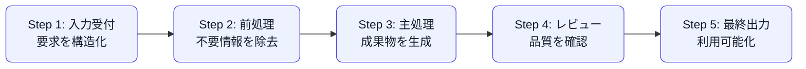

**構成図（architectureMermaid）**

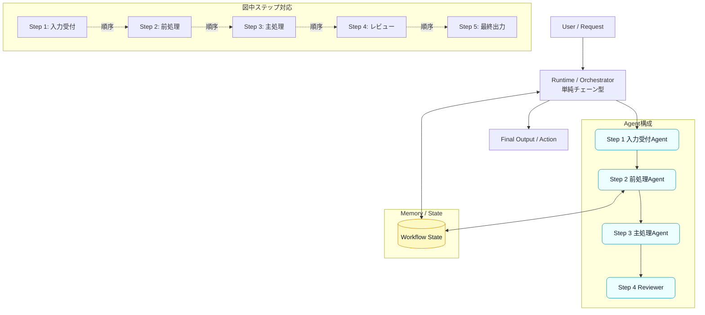

**メモリ使用図（memoryFlowMermaid）**

```mermaid
flowchart LR
  S1["Step 1: メモリ要否判定<br/>保存・参照する情報を分類"]
  G["Memory Gate<br/>権限・PII・TTL・目的確認"]
  R[("Read Memory<br/>ワークフロー状態")]
  A["Agent / Runtime<br/>単純チェーン型"]
  W[("Write Memory<br/>短期作業記憶")]
  L[("Audit Log<br/>出典・時刻・操作主体")]
  S2["Step 2: 読み出し<br/>必要最小限の文脈"]
  S3["Step 3: 推論・実行<br/>中間状態を更新"]
  S4["Step 4: 書き込み<br/>成果物・理由・エラー"]
  S5["Step 5: 維持管理<br/>期限切れ・再検証・削除"]
  S1 --> G
  G --> S2 --> R --> A
  A --> S3 --> S4 --> W
  W --> L
  L --> S5
  G -.拒否・マスク.-> A
  classDef step fill:#eef2ff,stroke:#4f46e5,color:#111827,rx:8,ry:8;
  classDef mem fill:#fef9c3,stroke:#ca8a04,color:#0f172a;
  classDef gate fill:#fee2e2,stroke:#dc2626,color:#111827,rx:8,ry:8;
  class S1,S2,S3,S4,S5,A step;
  class R,W,L mem;
  class G gate;
```

---

##### パイプライン型  `pipeline`

| 属性 | 値 |
|---|---|
| 分類(category) | シーケンシャル系 |
| 配置(placement) | 直列・継続処理 |
| メモリ/状態(memory) | ストリーム状態 |
| 役割(role) | 処理段階担当 |
| 主ファミリ(primaryFamily) | F_STATE |
| ファミリコード(familyCodes) | F_STATE、F_SHORT、F_CACHE |
| キーワード(keywords) | 状態・ワークフロー記憶、pipeline、継続処理、キャッシュ・作業記憶、ETL、キャッシュ・一時保存、ストリーム状態、stream、短期・作業記憶 |

**要約**: 継続的に流れる入力を工程ごとに処理する構成。バッチ、ストリーム、日次処理に向く。

**処理ステップ（steps）**

| # | 工程(title) | 一言(short) | 説明(description) |
|---|---|---|---|
| 1 | 収集 | 入力を取得 | メール、ログ、API、ファイルなどから継続的にデータを取り込む。 |
| 2 | 正規化 | 形式を揃える | 文字コード、項目名、タイムスタンプ、識別子を標準形式へ変換する。 |
| 3 | 分類 | 処理先を決める | 入力種別、優先度、顧客、リスクなどで分類する。 |
| 4 | 変換・分析 | 意味づけする | 要約、抽出、スコアリング、異常検知などを行う。 |
| 5 | 配信・登録 | 外部へ反映 | CRM、DB、通知、チケットなどに登録する。 |

**ユースケース例（useCases）**

| 例(title) | 場面(scene) | 入力(input) | 成功条件(success) |
|---|---|---|---|
| 問い合わせメール処理 | 受信メールを自動で分類し、要約して担当部署のキューに登録する。 | メール本文、添付ファイル、顧客ID。 | 分類精度、登録漏れゼロ、担当者がすぐ対応できる要約。 |
| ログ監視の一次分析 | アプリログを取り込み、エラー種別を分類し、重大度を判定する。 | ログストリーム、サービス名、エラーコード。 | 重大障害候補を短時間で通知できる。 |
| データ変換・登録 | 複数形式のCSVやJSONを正規化し、基幹DBに登録する。 | 取引ファイル、項目マッピング、登録ルール。 | 形式差異を吸収し、重複や欠損を検出する。 |

**リスクと対策（risksControls）**

| リスク(risk) | 対策(control) |
|---|---|
| 一部工程の遅延で全体が詰まる | キュー、バックプレッシャー、リトライ上限、デッドレターキューを設ける。 |
| 工程間の形式不整合 | 各工程の入出力スキーマと契約テストを定義する。 |
| 継続処理で誤分類が累積する | サンプリング監査、定期評価、手動訂正結果のフィードバックを行う。 |

**メモリの使い方（memoryUse）**

- メモリ大分類(families): 状態・ワークフロー記憶、短期・作業記憶、キャッシュ・一時保存
- 具体パターン(branches): ストリーム状態、キャッシュ・作業記憶
- 主たるメモリ(primary): ストリーム状態
- 読み出し(read): パイプライン型では、実行開始時に入力条件、過去の状態、必要な外部知識を読み出す。読み出し範囲はタスクID、ユーザー、権限、現在ステップで制限する。
- 書き込み(write): 各ステップの中間成果物、判断理由、エラー、外部ツール結果を必要最小限で書き込む。ストリーム状態へ保存する情報はスキーマ化し、再利用可能な情報と一時情報を分ける。

**図の凡例（legend）**

| 記号(symbol) | 意味(meaning) |
|---|---|
| 四角ノード | エージェント、処理工程、UI、外部システムなどの実行主体 |
| 円柱ノード | メモリ、DB、RAG、状態ストアなど永続化・参照される情報 |
| 実線矢印 | データ、制御、成果物の主たる流れ |
| 点線矢印 | 補助的な参照、ステップ対応、確認・レビューの関係 |
| Step n | 処理順序。データフロー図と構成図の両方に同じステップを記載する |
| Memory Gate | 記憶の読み書き前に、権限、個人情報、機密、保存期間、保存目的を判定する制御点。 |

**データフロー図（dataFlowMermaid）**

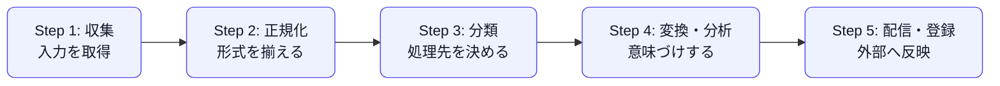

**構成図（architectureMermaid）**

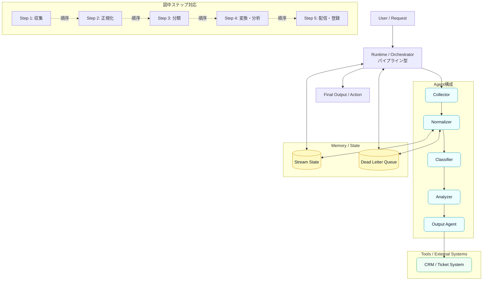

**メモリ使用図（memoryFlowMermaid）**

```mermaid
flowchart LR
  S1["Step 1: メモリ要否判定<br/>保存・参照する情報を分類"]
  G["Memory Gate<br/>権限・PII・TTL・目的確認"]
  R[("Read Memory<br/>ストリーム状態")]
  A["Agent / Runtime<br/>パイプライン型"]
  W[("Write Memory<br/>キャッシュ・作業記憶")]
  L[("Audit Log<br/>出典・時刻・操作主体")]
  S2["Step 2: 読み出し<br/>必要最小限の文脈"]
  S3["Step 3: 推論・実行<br/>中間状態を更新"]
  S4["Step 4: 書き込み<br/>成果物・理由・エラー"]
  S5["Step 5: 維持管理<br/>期限切れ・再検証・削除"]
  S1 --> G
  G --> S2 --> R --> A
  A --> S3 --> S4 --> W
  W --> L
  L --> S5
  G -.拒否・マスク.-> A
  classDef step fill:#eef2ff,stroke:#4f46e5,color:#111827,rx:8,ry:8;
  classDef mem fill:#fef9c3,stroke:#ca8a04,color:#0f172a;
  classDef gate fill:#fee2e2,stroke:#dc2626,color:#111827,rx:8,ry:8;
  class S1,S2,S3,S4,S5,A step;
  class R,W,L mem;
  class G gate;
```

---

##### DAGワークフロー型  `dag-workflow`

| 属性 | 値 |
|---|---|
| 分類(category) | シーケンシャル系 |
| 配置(placement) | 分岐・合流 |
| メモリ/状態(memory) | 状態オブジェクト |
| 役割(role) | ノード担当 |
| 主ファミリ(primaryFamily) | F_STATE |
| ファミリコード(familyCodes) | F_STATE、F_SHARED |
| キーワード(keywords) | DAG、graph、ワークフロー状態、状態・ワークフロー記憶、共有メモリ、共有・チーム記憶、分岐、合流 |

**要約**: 処理を有向非巡回グラフとして定義し、分岐・並列・合流を明示的に制御する構成。

**処理ステップ（steps）**

| # | 工程(title) | 一言(short) | 説明(description) |
|---|---|---|---|
| 1 | 計画 | 依存関係を決める | タスクをノードに分解し、どの処理が並列可能かを決める。 |
| 2 | 分岐実行 | 複数経路を処理 | 調査、データ分析、要件確認などを並列または条件分岐で進める。 |
| 3 | 中間検証 | 各枝を検証 | 枝ごとの成果物をスキーマ、品質、前提条件で検査する。 |
| 4 | 合流 | 成果物を統合 | 複数枝の結果を統合し、矛盾や重複を解消する。 |
| 5 | 最終レビュー | 全体整合性を確認 | 合流後の成果物が目的に合うか、漏れや矛盾がないか確認する。 |

**ユースケース例（useCases）**

| 例(title) | 場面(scene) | 入力(input) | 成功条件(success) |
|---|---|---|---|
| 複雑な調査レポート | 市場、競合、技術、法規制を並列に調べて統合する。 | 調査テーマ、参照範囲、章立て。 | 各観点の根拠が統合され、一貫した提言になる。 |
| 審査ワークフロー | 本人確認、与信、書類確認、リスク判定を枝分かれで処理する。 | 申請データ、証憑、判定基準。 | 枝ごとの判定結果と最終判定理由が追跡できる。 |
| データ分析工程 | データ抽出、クレンジング、特徴量生成、可視化を依存関係に沿って実行する。 | 分析目的、データセット、評価指標。 | 再実行可能な分析成果物が生成される。 |

**リスクと対策（risksControls）**

| リスク(risk) | 対策(control) |
|---|---|
| グラフ定義が複雑化する | ノード責務、依存関係、入出力契約を文書化し、可視化する。 |
| 合流時に矛盾が発生する | Aggregatorに矛盾検出ルールと優先順位を持たせる。 |
| 一部ノード失敗で全体停止する | 部分再実行、代替経路、失敗ノードの隔離を設計する。 |

**メモリの使い方（memoryUse）**

- メモリ大分類(families): 状態・ワークフロー記憶、共有・チーム記憶
- 具体パターン(branches): ワークフロー状態、共有メモリ
- 主たるメモリ(primary): ワークフロー状態
- 読み出し(read): DAGワークフロー型では、実行開始時に入力条件、過去の状態、必要な外部知識を読み出す。読み出し範囲はタスクID、ユーザー、権限、現在ステップで制限する。
- 書き込み(write): 各ステップの中間成果物、判断理由、エラー、外部ツール結果を必要最小限で書き込む。ワークフロー状態へ保存する情報はスキーマ化し、再利用可能な情報と一時情報を分ける。

**図の凡例（legend）**

| 記号(symbol) | 意味(meaning) |
|---|---|
| 四角ノード | エージェント、処理工程、UI、外部システムなどの実行主体 |
| 円柱ノード | メモリ、DB、RAG、状態ストアなど永続化・参照される情報 |
| 実線矢印 | データ、制御、成果物の主たる流れ |
| 点線矢印 | 補助的な参照、ステップ対応、確認・レビューの関係 |
| Step n | 処理順序。データフロー図と構成図の両方に同じステップを記載する |
| Memory Gate | 記憶の読み書き前に、権限、個人情報、機密、保存期間、保存目的を判定する制御点。 |

**データフロー図（dataFlowMermaid）**

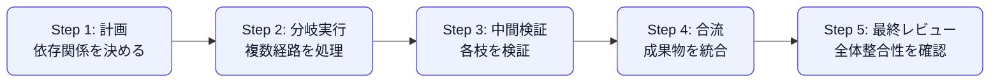

**構成図（architectureMermaid）**

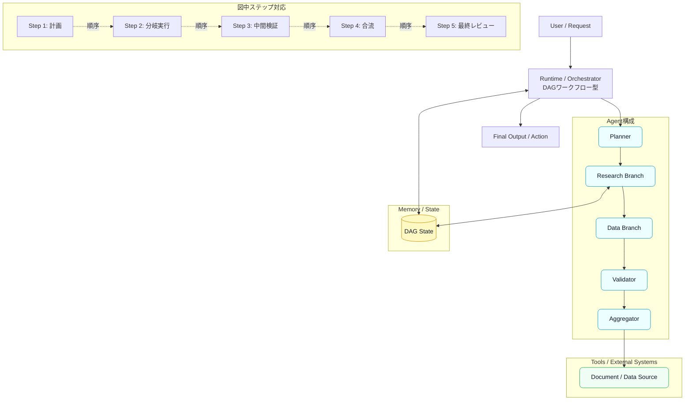

**メモリ使用図（memoryFlowMermaid）**

```mermaid
flowchart LR
  S1["Step 1: メモリ要否判定<br/>保存・参照する情報を分類"]
  G["Memory Gate<br/>権限・PII・TTL・目的確認"]
  R[("Read Memory<br/>ワークフロー状態")]
  A["Agent / Runtime<br/>DAGワークフロー型"]
  W[("Write Memory<br/>共有メモリ")]
  L[("Audit Log<br/>出典・時刻・操作主体")]
  S2["Step 2: 読み出し<br/>必要最小限の文脈"]
  S3["Step 3: 推論・実行<br/>中間状態を更新"]
  S4["Step 4: 書き込み<br/>成果物・理由・エラー"]
  S5["Step 5: 維持管理<br/>期限切れ・再検証・削除"]
  S1 --> G
  G --> S2 --> R --> A
  A --> S3 --> S4 --> W
  W --> L
  L --> S5
  G -.拒否・マスク.-> A
  classDef step fill:#eef2ff,stroke:#4f46e5,color:#111827,rx:8,ry:8;
  classDef mem fill:#fef9c3,stroke:#ca8a04,color:#0f172a;
  classDef gate fill:#fee2e2,stroke:#dc2626,color:#111827,rx:8,ry:8;
  class S1,S2,S3,S4,S5,A step;
  class R,W,L mem;
  class G gate;
```

---

##### Map-Reduce型  `map-reduce`

| 属性 | 値 |
|---|---|
| 分類(category) | シーケンシャル系 |
| 配置(placement) | 並列＋集約 |
| メモリ/状態(memory) | 部分結果 |
| 役割(role) | Worker＋Aggregator |
| 主ファミリ(primaryFamily) | F_SHARED |
| ファミリコード(familyCodes) | F_SHARED、F_SHORT |
| キーワード(keywords) | 並列、共有メモリ、共有・チーム記憶、aggregator、map reduce、短期・作業記憶、parallel、部分結果メモリ |

**要約**: 入力を分割し、複数Workerで並列処理した後、Aggregatorが統合する構成。大量データ処理に向く。

**処理ステップ（steps）**

| # | 工程(title) | 一言(short) | 説明(description) |
|---|---|---|---|
| 1 | 分割 | 入力をチャンク化 | 文書、候補、データセットを独立処理可能な単位へ分割する。 |
| 2 | 並列処理 | 各Workerが処理 | 同種または専門別Workerがチャンクごとに抽出、要約、評価を行う。 |
| 3 | 部分検証 | 部分結果を確認 | 各Workerの出力スキーマ、重複、欠損、根拠を確認する。 |
| 4 | 集約 | 結果を統合 | 部分結果を統合し、重複排除、優先順位付け、矛盾解消を行う。 |
| 5 | 全体要約 | 利用形に整形 | 統合結果をレポート、ランキング、最終回答に変換する。 |

**ユースケース例（useCases）**

| 例(title) | 場面(scene) | 入力(input) | 成功条件(success) |
|---|---|---|---|
| 大量文書要約 | 数十〜数百のPDFや議事録を分割要約し、統合サマリを作る。 | 文書群、抽出観点、要約粒度。 | 重複の少ない全体要約と文書別根拠が得られる。 |
| 複数候補の比較 | 製品、ベンダー、施策案を並列評価し、総合ランキングを作る。 | 候補一覧、評価軸、重み。 | 評価理由つきで上位候補を説明できる。 |
| レビュー観点の並列化 | 法務、技術、UX、コストなど観点別にレビューして統合する。 | 対象文書、観点定義、リスク基準。 | 観点別の指摘と総合判断が整理される。 |

**リスクと対策（risksControls）**

| リスク(risk) | 対策(control) |
|---|---|
| 部分結果の粒度が揃わない | Worker出力テンプレート、スコア基準、必須フィールドを統一する。 |
| Aggregatorが矛盾を見落とす | 矛盾検出、根拠リンク、二次レビューを追加する。 |
| 並列実行コストが膨らむ | チャンクサイズ、Worker数、早期打ち切り条件を設定する。 |

**メモリの使い方（memoryUse）**

- メモリ大分類(families): 共有・チーム記憶、短期・作業記憶
- 具体パターン(branches): 部分結果メモリ、共有メモリ
- 主たるメモリ(primary): 部分結果メモリ
- 読み出し(read): Map-Reduce型では、実行開始時に入力条件、過去の状態、必要な外部知識を読み出す。読み出し範囲はタスクID、ユーザー、権限、現在ステップで制限する。
- 書き込み(write): 各ステップの中間成果物、判断理由、エラー、外部ツール結果を必要最小限で書き込む。部分結果メモリへ保存する情報はスキーマ化し、再利用可能な情報と一時情報を分ける。

**図の凡例（legend）**

| 記号(symbol) | 意味(meaning) |
|---|---|
| 四角ノード | エージェント、処理工程、UI、外部システムなどの実行主体 |
| 円柱ノード | メモリ、DB、RAG、状態ストアなど永続化・参照される情報 |
| 実線矢印 | データ、制御、成果物の主たる流れ |
| 点線矢印 | 補助的な参照、ステップ対応、確認・レビューの関係 |
| Step n | 処理順序。データフロー図と構成図の両方に同じステップを記載する |
| Memory Gate | 記憶の読み書き前に、権限、個人情報、機密、保存期間、保存目的を判定する制御点。 |

**データフロー図（dataFlowMermaid）**

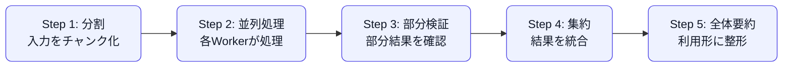

**構成図（architectureMermaid）**

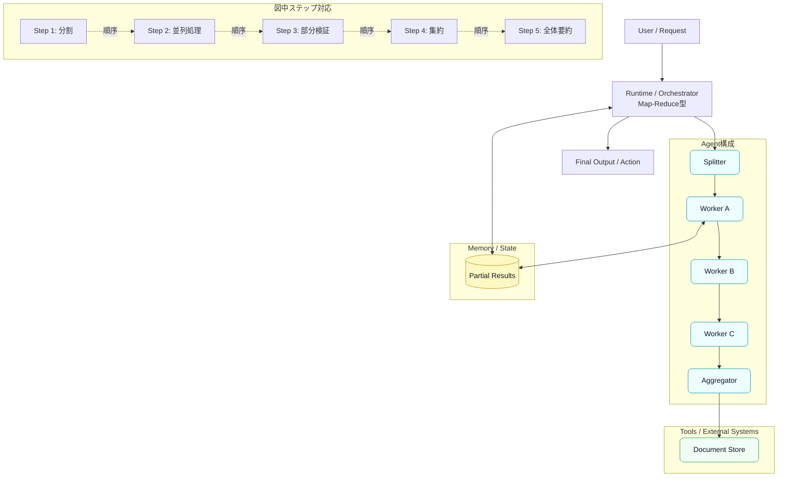

**メモリ使用図（memoryFlowMermaid）**

```mermaid
flowchart LR
  S1["Step 1: メモリ要否判定<br/>保存・参照する情報を分類"]
  G["Memory Gate<br/>権限・PII・TTL・目的確認"]
  R[("Read Memory<br/>部分結果メモリ")]
  A["Agent / Runtime<br/>Map-Reduce型"]
  W[("Write Memory<br/>共有メモリ")]
  L[("Audit Log<br/>出典・時刻・操作主体")]
  S2["Step 2: 読み出し<br/>必要最小限の文脈"]
  S3["Step 3: 推論・実行<br/>中間状態を更新"]
  S4["Step 4: 書き込み<br/>成果物・理由・エラー"]
  S5["Step 5: 維持管理<br/>期限切れ・再検証・削除"]
  S1 --> G
  G --> S2 --> R --> A
  A --> S3 --> S4 --> W
  W --> L
  L --> S5
  G -.拒否・マスク.-> A
  classDef step fill:#eef2ff,stroke:#4f46e5,color:#111827,rx:8,ry:8;
  classDef mem fill:#fef9c3,stroke:#ca8a04,color:#0f172a;
  classDef gate fill:#fee2e2,stroke:#dc2626,color:#111827,rx:8,ry:8;
  class S1,S2,S3,S4,S5,A step;
  class R,W,L mem;
  class G gate;
```

---

##### 反復ループ型  `iterative-loop`

| 属性 | 値 |
|---|---|
| 分類(category) | シーケンシャル系 |
| 配置(placement) | 循環 |
| メモリ/状態(memory) | 実行ログ・失敗履歴 |
| 役割(role) | Executor＋Reviewer |
| 主ファミリ(primaryFamily) | F_AUDIT |
| ファミリコード(familyCodes) | F_AUDIT、F_SHORT |
| キーワード(keywords) | loop、ログ・監査記憶、improve、反復、短期作業記憶、実行ログ・反復記憶、短期・作業記憶、review |

**要約**: 実行、観察、レビュー、改善を繰り返す構成。品質改善、コード生成、テスト修正に向く。

**処理ステップ（steps）**

| # | 工程(title) | 一言(short) | 説明(description) |
|---|---|---|---|
| 1 | 初期計画 | 仮説を作る | 達成条件、制約、最初の実行計画を作る。 |
| 2 | 実行 | 成果物を作る | コード生成、文章生成、ツール実行などを行う。 |
| 3 | 観察 | 結果を取得 | テスト結果、エラー、レビューコメント、実行ログを収集する。 |
| 4 | 評価 | 合否を判定 | 成功条件と照合し、継続、修正、停止を判断する。 |
| 5 | 改善 | 差分修正 | 失敗原因に基づき計画や成果物を修正して再実行する。 |

**ユースケース例（useCases）**

| 例(title) | 場面(scene) | 入力(input) | 成功条件(success) |
|---|---|---|---|
| コード生成とテスト | 仕様からコードを生成し、テスト失敗を見て修正を繰り返す。 | 仕様、既存コード、テストコマンド。 | テストが通り、変更理由と差分が説明される。 |
| 文章品質改善 | 初稿を生成し、観点別レビューに基づいて改善する。 | 目的、読者、トーン、レビュー観点。 | 誤字、論理飛躍、表現の一貫性が改善される。 |
| 調査仮説の更新 | 初期仮説で調査し、矛盾する証拠が出たら仮説を修正する。 | 調査テーマ、仮説、評価軸。 | 根拠に応じて仮説が更新される。 |

**リスクと対策（risksControls）**

| リスク(risk) | 対策(control) |
|---|---|
| 無限ループ化する | 最大反復回数、改善幅の閾値、タイムアウト、停止理由を設定する。 |
| 誤った評価基準で改善が迷走する | 評価基準を明文化し、人間または別Criticで監査する。 |
| 履歴が長くなりコンテキストが汚れる | 反復ごとに要約ログ、差分ログ、失敗原因だけを保持する。 |

**メモリの使い方（memoryUse）**

- メモリ大分類(families): ログ・監査記憶、短期・作業記憶
- 具体パターン(branches): 実行ログ・反復記憶、短期作業記憶
- 主たるメモリ(primary): 実行ログ・反復記憶
- 読み出し(read): 反復ループ型では、実行開始時に入力条件、過去の状態、必要な外部知識を読み出す。読み出し範囲はタスクID、ユーザー、権限、現在ステップで制限する。
- 書き込み(write): 各ステップの中間成果物、判断理由、エラー、外部ツール結果を必要最小限で書き込む。実行ログ・反復記憶へ保存する情報はスキーマ化し、再利用可能な情報と一時情報を分ける。

**図の凡例（legend）**

| 記号(symbol) | 意味(meaning) |
|---|---|
| 四角ノード | エージェント、処理工程、UI、外部システムなどの実行主体 |
| 円柱ノード | メモリ、DB、RAG、状態ストアなど永続化・参照される情報 |
| 実線矢印 | データ、制御、成果物の主たる流れ |
| 点線矢印 | 補助的な参照、ステップ対応、確認・レビューの関係 |
| Step n | 処理順序。データフロー図と構成図の両方に同じステップを記載する |
| Memory Gate | 記憶の読み書き前に、権限、個人情報、機密、保存期間、保存目的を判定する制御点。 |

**データフロー図（dataFlowMermaid）**

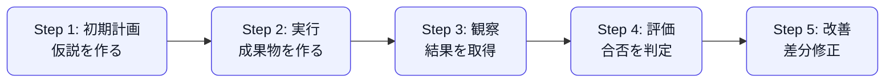

**構成図（architectureMermaid）**

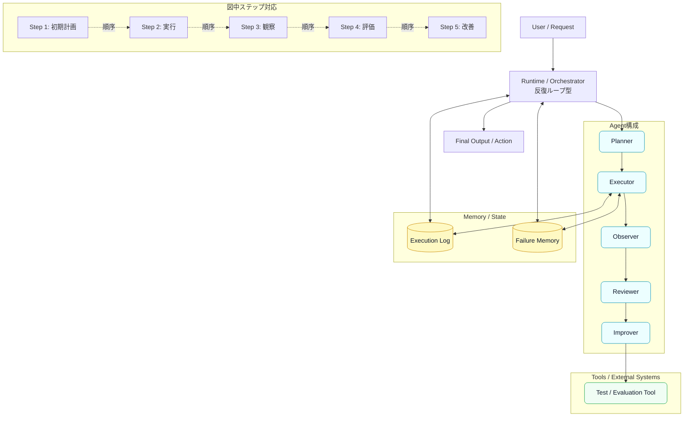

**メモリ使用図（memoryFlowMermaid）**

```mermaid
flowchart LR
  S1["Step 1: メモリ要否判定<br/>保存・参照する情報を分類"]
  G["Memory Gate<br/>権限・PII・TTL・目的確認"]
  R[("Read Memory<br/>実行ログ・反復記憶")]
  A["Agent / Runtime<br/>反復ループ型"]
  W[("Write Memory<br/>短期作業記憶")]
  L[("Audit Log<br/>出典・時刻・操作主体")]
  S2["Step 2: 読み出し<br/>必要最小限の文脈"]
  S3["Step 3: 推論・実行<br/>中間状態を更新"]
  S4["Step 4: 書き込み<br/>成果物・理由・エラー"]
  S5["Step 5: 維持管理<br/>期限切れ・再検証・削除"]
  S1 --> G
  G --> S2 --> R --> A
  A --> S3 --> S4 --> W
  W --> L
  L --> S5
  G -.拒否・マスク.-> A
  classDef step fill:#eef2ff,stroke:#4f46e5,color:#111827,rx:8,ry:8;
  classDef mem fill:#fef9c3,stroke:#ca8a04,color:#0f172a;
  classDef gate fill:#fee2e2,stroke:#dc2626,color:#111827,rx:8,ry:8;
  class S1,S2,S3,S4,S5,A step;
  class R,W,L mem;
  class G gate;
```

---

##### Human-in-the-loop型  `human-in-loop`

| 属性 | 値 |
|---|---|
| 分類(category) | シーケンシャル系 |
| 配置(placement) | 人間を途中挿入 |
| メモリ/状態(memory) | 承認履歴・コメント |
| 役割(role) | Agent＋Human Reviewer |
| 主ファミリ(primaryFamily) | F_STATE |
| ファミリコード(familyCodes) | F_STATE、F_AUDIT |
| キーワード(keywords) | ワークフロー状態、状態・ワークフロー記憶、承認履歴メモリ、ログ・監査記憶、HITL、human in the loop、承認、approval |

**要約**: エージェント処理の途中に人間の確認、承認、修正を挟む構成。高リスク業務に向く。

**処理ステップ（steps）**

| # | 工程(title) | 一言(short) | 説明(description) |
|---|---|---|---|
| 1 | ドラフト生成 | 候補を作る | エージェントが文書、判断案、実行案を作る。 |
| 2 | 人間レビュー | 妥当性を確認 | 担当者が内容、根拠、リスク、送信可否を確認する。 |
| 3 | 修正反映 | コメントを適用 | 人間の指示を反映し、必要なら再生成する。 |
| 4 | 承認判定 | 実行可否を決める | 承認、差し戻し、保留、エスカレーションを記録する。 |
| 5 | 実行・記録 | 外部へ反映 | 送信、登録、通知を行い、承認履歴を保存する。 |

**ユースケース例（useCases）**

| 例(title) | 場面(scene) | 入力(input) | 成功条件(success) |
|---|---|---|---|
| 契約書ドラフト確認 | AIが契約条項案を作り、法務担当が承認してから相手方へ送る。 | 契約条件、雛形、リスク観点。 | 承認者、修正履歴、最終版が追跡できる。 |
| 金融・医療領域の助言補助 | AIが候補説明を作り、有資格者や担当者が最終確認する。 | 相談内容、制約、禁止事項。 | AI単独判断にならず、人間承認が残る。 |
| 社外メール送信前確認 | AIが返信案を作り、人間がニュアンスと機密情報を確認する。 | 受信メール、返信方針、社外送信ルール。 | 誤送信や機密漏洩を防いで送信できる。 |

**リスクと対策（risksControls）**

| リスク(risk) | 対策(control) |
|---|---|
| 人間が形だけ承認する | 重要リスクをハイライトし、承認チェック項目を必須化する。 |
| 承認履歴が残らない | 誰が何をいつ承認・修正したか監査ログに保存する。 |
| 待ち時間が長くなる | リスクレベル別に自動承認、簡易レビュー、厳格レビューを分ける。 |

**メモリの使い方（memoryUse）**

- メモリ大分類(families): 状態・ワークフロー記憶、ログ・監査記憶
- 具体パターン(branches): 承認履歴メモリ、ワークフロー状態
- 主たるメモリ(primary): 承認履歴メモリ
- 読み出し(read): Human-in-the-loop型では、実行開始時に入力条件、過去の状態、必要な外部知識を読み出す。読み出し範囲はタスクID、ユーザー、権限、現在ステップで制限する。
- 書き込み(write): 各ステップの中間成果物、判断理由、エラー、外部ツール結果を必要最小限で書き込む。承認履歴メモリへ保存する情報はスキーマ化し、再利用可能な情報と一時情報を分ける。

**図の凡例（legend）**

| 記号(symbol) | 意味(meaning) |
|---|---|
| 四角ノード | エージェント、処理工程、UI、外部システムなどの実行主体 |
| 円柱ノード | メモリ、DB、RAG、状態ストアなど永続化・参照される情報 |
| 実線矢印 | データ、制御、成果物の主たる流れ |
| 点線矢印 | 補助的な参照、ステップ対応、確認・レビューの関係 |
| Step n | 処理順序。データフロー図と構成図の両方に同じステップを記載する |
| Humanノード | 人間による確認、判断、承認を表す |
| Memory Gate | 記憶の読み書き前に、権限、個人情報、機密、保存期間、保存目的を判定する制御点。 |

**データフロー図（dataFlowMermaid）**

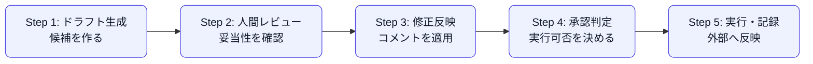

**構成図（architectureMermaid）**

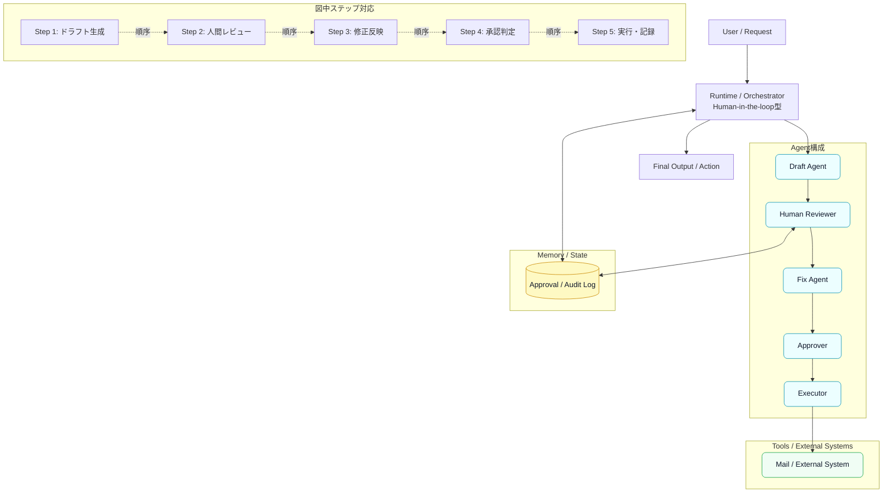

**メモリ使用図（memoryFlowMermaid）**

```mermaid
flowchart LR
  S1["Step 1: メモリ要否判定<br/>保存・参照する情報を分類"]
  G["Memory Gate<br/>権限・PII・TTL・目的確認"]
  R[("Read Memory<br/>承認履歴メモリ")]
  A["Agent / Runtime<br/>Human-in-the-loop型"]
  W[("Write Memory<br/>ワークフロー状態")]
  L[("Audit Log<br/>出典・時刻・操作主体")]
  S2["Step 2: 読み出し<br/>必要最小限の文脈"]
  S3["Step 3: 推論・実行<br/>中間状態を更新"]
  S4["Step 4: 書き込み<br/>成果物・理由・エラー"]
  S5["Step 5: 維持管理<br/>期限切れ・再検証・削除"]
  S1 --> G
  G --> S2 --> R --> A
  A --> S3 --> S4 --> W
  W --> L
  L --> S5
  G -.拒否・マスク.-> A
  classDef step fill:#eef2ff,stroke:#4f46e5,color:#111827,rx:8,ry:8;
  classDef mem fill:#fef9c3,stroke:#ca8a04,color:#0f172a;
  classDef gate fill:#fee2e2,stroke:#dc2626,color:#111827,rx:8,ry:8;
  class S1,S2,S3,S4,S5,A step;
  class R,W,L mem;
  class G gate;
```

---

#### スーパーバイザー系

| ID | 名称 | 配置 | メモリ | 役割 |
|---|---|---|---|---|
| `router-supervisor` | Router型Supervisor | 中央ルーター | 最小文脈 | Router＋専門Agent |
| `manager-worker` | Manager-Worker型 | 中央管理 | Managerが全体保持 | Manager＋Worker |
| `planner-executor` | Planner-Executor型 | 計画役＋実行役 | 計画・実行ログ | Planner＋Executor＋Observer |
| `agents-as-tools` | Agents-as-Tools型 | 中央Agentが呼出 | 中央状態 | Tool化Agent |
| `hierarchical-supervisor` | 階層型Supervisor | ツリー構造 | 階層別状態 | 上位Supervisor＋下位Worker |
| `critic-supervisor` | Critic付きSupervisor | 中央＋評価役 | 出力・評価履歴 | Worker＋Critic＋Verifier |
| `memory-manager` | Memory Manager付きSupervisor | 中央＋記憶管理 | 短期・長期・RAG分離 | Supervisor＋Memory Manager |

##### Router型Supervisor  `router-supervisor`

| 属性 | 値 |
|---|---|
| 分類(category) | スーパーバイザー系 |
| 配置(placement) | 中央ルーター |
| メモリ/状態(memory) | 最小文脈 |
| 役割(role) | Router＋専門Agent |
| 主ファミリ(primaryFamily) | F_AUDIT |
| ファミリコード(familyCodes) | F_AUDIT、F_SHORT、F_PROC |
| キーワード(keywords) | triage、routing、分類、ルーティング履歴、ログ・監査記憶、短期セッションメモリ、router、手続き・スキル記憶、短期・作業記憶 |

**要約**: 入力を分類し、最適な専門エージェントへ振り分ける構成。問い合わせ窓口や機能選択に向く。

**処理ステップ（steps）**

| # | 工程(title) | 一言(short) | 説明(description) |
|---|---|---|---|
| 1 | 入力分類 | 意図を判定 | ユーザー要求のカテゴリ、緊急度、必要ツールを判定する。 |
| 2 | 担当選択 | 専門Agentを選ぶ | FAQ、SQL、検索、コードなど適切な担当先を選択する。 |
| 3 | 限定文脈渡し | 必要情報だけ渡す | 担当Agentに必要な入力、制約、履歴だけを渡す。 |
| 4 | 専門処理 | 担当Agentが回答 | 選ばれたAgentが処理し、結果をRouterへ返す。 |
| 5 | 回答整形 | 一貫性を調整 | Routerが回答形式やトーンを整えて返す。 |

**ユースケース例（useCases）**

| 例(title) | 場面(scene) | 入力(input) | 成功条件(success) |
|---|---|---|---|
| 社内ヘルプデスク | 問い合わせ内容からIT、総務、人事、経理のどのAgentに渡すか判断する。 | 問い合わせ文、ユーザー属性、社内規程。 | 適切な窓口へ即時転送され、回答形式が統一される。 |
| AIアプリの機能選択 | 自然文から検索、DB照会、文書生成、コード実行を選ぶ。 | ユーザー依頼、利用可能ツール一覧。 | 不要なツールを呼ばず、最短経路で処理できる。 |
| カスタマーサポート一次振分け | 請求、技術、不具合、解約などの専門窓口へ振り分ける。 | 顧客発話、契約情報、履歴。 | 誤転送率が低く、会話の引き継ぎが自然。 |

**リスクと対策（risksControls）**

| リスク(risk) | 対策(control) |
|---|---|
| ルーティングミス | 分類信頼度を出し、低信頼時は確認質問または人間へ回す。 |
| 過剰な文脈共有 | 担当Agentには最小必要情報だけ渡し、個人情報はマスキングする。 |
| 未知カテゴリに弱い | fallback Agentと未分類ログのレビューを用意する。 |

**メモリの使い方（memoryUse）**

- メモリ大分類(families): ログ・監査記憶、短期・作業記憶、手続き・スキル記憶
- 具体パターン(branches): 短期セッションメモリ、ルーティング履歴
- 主たるメモリ(primary): 短期セッションメモリ
- 読み出し(read): Router型Supervisorでは、実行開始時に入力条件、過去の状態、必要な外部知識を読み出す。読み出し範囲はタスクID、ユーザー、権限、現在ステップで制限する。
- 書き込み(write): 各ステップの中間成果物、判断理由、エラー、外部ツール結果を必要最小限で書き込む。短期セッションメモリへ保存する情報はスキーマ化し、再利用可能な情報と一時情報を分ける。

**図の凡例（legend）**

| 記号(symbol) | 意味(meaning) |
|---|---|
| 四角ノード | エージェント、処理工程、UI、外部システムなどの実行主体 |
| 円柱ノード | メモリ、DB、RAG、状態ストアなど永続化・参照される情報 |
| 実線矢印 | データ、制御、成果物の主たる流れ |
| 点線矢印 | 補助的な参照、ステップ対応、確認・レビューの関係 |
| Step n | 処理順序。データフロー図と構成図の両方に同じステップを記載する |
| Memory Gate | 記憶の読み書き前に、権限、個人情報、機密、保存期間、保存目的を判定する制御点。 |

**データフロー図（dataFlowMermaid）**

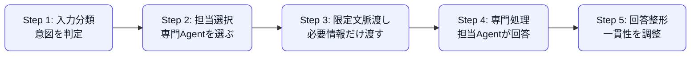

**構成図（architectureMermaid）**

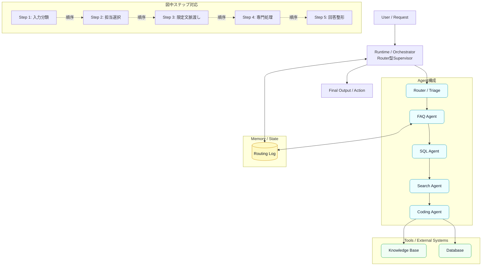

**メモリ使用図（memoryFlowMermaid）**

```mermaid
flowchart LR
  S1["Step 1: メモリ要否判定<br/>保存・参照する情報を分類"]
  G["Memory Gate<br/>権限・PII・TTL・目的確認"]
  R[("Read Memory<br/>短期セッションメモリ")]
  A["Agent / Runtime<br/>Router型Supervisor"]
  W[("Write Memory<br/>ルーティング履歴")]
  L[("Audit Log<br/>出典・時刻・操作主体")]
  S2["Step 2: 読み出し<br/>必要最小限の文脈"]
  S3["Step 3: 推論・実行<br/>中間状態を更新"]
  S4["Step 4: 書き込み<br/>成果物・理由・エラー"]
  S5["Step 5: 維持管理<br/>期限切れ・再検証・削除"]
  S1 --> G
  G --> S2 --> R --> A
  A --> S3 --> S4 --> W
  W --> L
  L --> S5
  G -.拒否・マスク.-> A
  classDef step fill:#eef2ff,stroke:#4f46e5,color:#111827,rx:8,ry:8;
  classDef mem fill:#fef9c3,stroke:#ca8a04,color:#0f172a;
  classDef gate fill:#fee2e2,stroke:#dc2626,color:#111827,rx:8,ry:8;
  class S1,S2,S3,S4,S5,A step;
  class R,W,L mem;
  class G gate;
```

---

##### Manager-Worker型  `manager-worker`

| 属性 | 値 |
|---|---|
| 分類(category) | スーパーバイザー系 |
| 配置(placement) | 中央管理 |
| メモリ/状態(memory) | Managerが全体保持 |
| 役割(role) | Manager＋Worker |
| 主ファミリ(primaryFamily) | F_STATE |
| ファミリコード(familyCodes) | F_STATE、F_SHARED |
| キーワード(keywords) | supervisor、ワークフロー状態、状態・ワークフロー記憶、中央共有メモリ、共有・チーム記憶、委任、manager、worker |

**要約**: Managerがタスク分解、割当、統合を行い、Workerが専門処理を担当する構成。

**処理ステップ（steps）**

| # | 工程(title) | 一言(short) | 説明(description) |
|---|---|---|---|
| 1 | 目的理解 | ゴールを定義 | Managerが目的、制約、成果物形式を明確化する。 |
| 2 | タスク分解 | 作業を分ける | 調査、分析、執筆、検証などに分解する。 |
| 3 | Worker割当 | 専門家へ委任 | 各Workerに役割、入力、期待出力を渡す。 |
| 4 | 結果統合 | 成果物をまとめる | Worker結果を統合し、重複や矛盾を解消する。 |
| 5 | 最終判断 | 品質を保証 | Managerが最終回答として整形し、必要なら再委任する。 |

**ユースケース例（useCases）**

| 例(title) | 場面(scene) | 入力(input) | 成功条件(success) |
|---|---|---|---|
| 事業企画の調査 | Managerが市場調査、競合分析、収益試算、リスク評価を分担させる。 | 企画テーマ、対象市場、制約条件。 | 観点別成果物が統合され、意思決定資料になる。 |
| 社内AI秘書 | 依頼を分解し、予定確認、メール作成、資料検索をWorkerに任せる。 | ユーザー依頼、カレンダー、メール、社内文書。 | 複数システムを横断した一貫した提案が返る。 |
| 技術調査レポート | Researcher、Engineer、Reviewerが分担し、Managerが最終レポートにする。 | 調査対象技術、比較軸、制約。 | 技術・コスト・導入リスクを統合して説明できる。 |

**リスクと対策（risksControls）**

| リスク(risk) | 対策(control) |
|---|---|
| Managerがボトルネック | 分解単位を大きくしすぎず、階層化や並列化を検討する。 |
| Worker出力の情報落ち | Workerの根拠、未確定事項、詳細ログを保持する。 |
| Managerの判断偏り | Critic、Verifier、人間レビューを追加する。 |

**メモリの使い方（memoryUse）**

- メモリ大分類(families): 状態・ワークフロー記憶、共有・チーム記憶
- 具体パターン(branches): 中央共有メモリ、ワークフロー状態
- 主たるメモリ(primary): 中央共有メモリ
- 読み出し(read): Manager-Worker型では、実行開始時に入力条件、過去の状態、必要な外部知識を読み出す。読み出し範囲はタスクID、ユーザー、権限、現在ステップで制限する。
- 書き込み(write): 各ステップの中間成果物、判断理由、エラー、外部ツール結果を必要最小限で書き込む。中央共有メモリへ保存する情報はスキーマ化し、再利用可能な情報と一時情報を分ける。

**図の凡例（legend）**

| 記号(symbol) | 意味(meaning) |
|---|---|
| 四角ノード | エージェント、処理工程、UI、外部システムなどの実行主体 |
| 円柱ノード | メモリ、DB、RAG、状態ストアなど永続化・参照される情報 |
| 実線矢印 | データ、制御、成果物の主たる流れ |
| 点線矢印 | 補助的な参照、ステップ対応、確認・レビューの関係 |
| Step n | 処理順序。データフロー図と構成図の両方に同じステップを記載する |
| Memory Gate | 記憶の読み書き前に、権限、個人情報、機密、保存期間、保存目的を判定する制御点。 |

**データフロー図（dataFlowMermaid）**

```mermaid
flowchart LR
  S1["Step 1: 目的理解<br/>ゴールを定義"]
  S2["Step 2: タスク分解<br/>作業を分ける"]
  S3["Step 3: Worker割当<br/>専門家へ委任"]
  S4["Step 4: 結果統合<br/>成果物をまとめる"]
  S5["Step 5: 最終判断<br/>品質を保証"]
  S1 --> S2
  S2 --> S3
  S3 --> S4
  S4 --> S5
  classDef step fill:#eef2ff,stroke:#4f46e5,color:#111827,rx:8,ry:8;
  class S1,S2,S3,S4,S5,S6 step;
```

**構成図（architectureMermaid）**

```mermaid
flowchart TD
  User["User / Request"] --> Runtime["Runtime / Orchestrator<br/>Manager-Worker型"]
  subgraph Agents["Agent構成"]
    M["Manager / Supervisor"]
    R["Researcher"]
    A["Analyst"]
    W["Writer"]
    V["Reviewer"]
  end
  Runtime --> M
  M --> R
  R --> A
  A --> W
  W --> V
  subgraph Memory["Memory / State"]
    Plan[("Plan / Task State")] 
    Context[("Global Context")] 
  end
  Runtime <--> Plan
  R <--> Plan
  Runtime <--> Context
  R <--> Context
  subgraph Tools["Tools / External Systems"]
    Docs["Docs / Search"]
    API["APIs"]
  end
  V --> Docs
  V --> API
  Runtime --> Output["Final Output / Action"]
  subgraph StepMap["図中ステップ対応"]
    M1["Step 1: 目的理解"]
    M2["Step 2: タスク分解"]
    M3["Step 3: Worker割当"]
    M4["Step 4: 結果統合"]
    M5["Step 5: 最終判断"]
  end
  M1 -.順序.-> M2
  M2 -.順序.-> M3
  M3 -.順序.-> M4
  M4 -.順序.-> M5
  classDef agent fill:#ecfeff,stroke:#0891b2,color:#0f172a,rx:8,ry:8;
  classDef state fill:#fef9c3,stroke:#ca8a04,color:#0f172a;
  classDef tool fill:#f0fdf4,stroke:#16a34a,color:#0f172a,rx:8,ry:8;
  class M,R,A,W,V agent;
  class Plan,Context state;
  class Docs,API tool;
```

**メモリ使用図（memoryFlowMermaid）**

```mermaid
flowchart LR
  S1["Step 1: メモリ要否判定<br/>保存・参照する情報を分類"]
  G["Memory Gate<br/>権限・PII・TTL・目的確認"]
  R[("Read Memory<br/>中央共有メモリ")]
  A["Agent / Runtime<br/>Manager-Worker型"]
  W[("Write Memory<br/>ワークフロー状態")]
  L[("Audit Log<br/>出典・時刻・操作主体")]
  S2["Step 2: 読み出し<br/>必要最小限の文脈"]
  S3["Step 3: 推論・実行<br/>中間状態を更新"]
  S4["Step 4: 書き込み<br/>成果物・理由・エラー"]
  S5["Step 5: 維持管理<br/>期限切れ・再検証・削除"]
  S1 --> G
  G --> S2 --> R --> A
  A --> S3 --> S4 --> W
  W --> L
  L --> S5
  G -.拒否・マスク.-> A
  classDef step fill:#eef2ff,stroke:#4f46e5,color:#111827,rx:8,ry:8;
  classDef mem fill:#fef9c3,stroke:#ca8a04,color:#0f172a;
  classDef gate fill:#fee2e2,stroke:#dc2626,color:#111827,rx:8,ry:8;
  class S1,S2,S3,S4,S5,A step;
  class R,W,L mem;
  class G gate;
```

---

##### Planner-Executor型  `planner-executor`

| 属性 | 値 |
|---|---|
| 分類(category) | スーパーバイザー系 |
| 配置(placement) | 計画役＋実行役 |
| メモリ/状態(memory) | 計画・実行ログ |
| 役割(role) | Planner＋Executor＋Observer |
| 主ファミリ(primaryFamily) | F_STATE |
| ファミリコード(familyCodes) | F_STATE、F_AUDIT |
| キーワード(keywords) | 状態・ワークフロー記憶、ログ・監査記憶、observer、planner、executor、replan、実行ログ・反復記憶、計画メモリ |

**要約**: 計画作成と実行を分離し、実行結果の観察に基づいて再計画する構成。

**処理ステップ（steps）**

| # | 工程(title) | 一言(short) | 説明(description) |
|---|---|---|---|
| 1 | 計画生成 | 手順を設計 | Plannerがツール選択、順序、成功条件を定義する。 |
| 2 | 実行 | ツールを動かす | ExecutorがAPI、ブラウザ、コードなどを実行する。 |
| 3 | 観察 | 結果を読む | Observerがレスポンス、画面、ログ、エラーを取得する。 |
| 4 | 再計画 | 計画を更新 | 想定外の結果に応じて手順やツールを変更する。 |
| 5 | 完了判定 | 成果を確定 | 成功条件に達したか判断し、成果物を返す。 |

**ユースケース例（useCases）**

| 例(title) | 場面(scene) | 入力(input) | 成功条件(success) |
|---|---|---|---|
| ブラウザ操作自動化 | Web画面を操作して情報収集やフォーム入力を進める。 | 操作目標、対象サイト、入力データ。 | 画面変化を観察しながら安全に完了する。 |
| RPA的な事務処理 | 複数システムへログインし、照会、登録、通知を行う。 | 業務手順、認証情報、入力ファイル。 | エラー時に再計画または停止判断できる。 |
| コード実行を伴う分析 | Python等で分析を実行し、エラーが出たら修正して再実行する。 | データ、分析目的、制約。 | 実行結果、グラフ、検証ログが得られる。 |

**リスクと対策（risksControls）**

| リスク(risk) | 対策(control) |
|---|---|
| 計画が現実のUIやAPIとズレる | Observerの結果を必ずPlannerへ戻し、再計画を許可する。 |
| 危険なツール実行 | 実行前承認、権限スコープ、dry-run、sandboxを使う。 |
| 実行ログ不足 | 各アクション、入力、出力、エラー、再計画理由を保存する。 |

**メモリの使い方（memoryUse）**

- メモリ大分類(families): 状態・ワークフロー記憶、ログ・監査記憶
- 具体パターン(branches): 計画メモリ、実行ログ・反復記憶
- 主たるメモリ(primary): 計画メモリ
- 読み出し(read): Planner-Executor型では、実行開始時に入力条件、過去の状態、必要な外部知識を読み出す。読み出し範囲はタスクID、ユーザー、権限、現在ステップで制限する。
- 書き込み(write): 各ステップの中間成果物、判断理由、エラー、外部ツール結果を必要最小限で書き込む。計画メモリへ保存する情報はスキーマ化し、再利用可能な情報と一時情報を分ける。

**図の凡例（legend）**

| 記号(symbol) | 意味(meaning) |
|---|---|
| 四角ノード | エージェント、処理工程、UI、外部システムなどの実行主体 |
| 円柱ノード | メモリ、DB、RAG、状態ストアなど永続化・参照される情報 |
| 実線矢印 | データ、制御、成果物の主たる流れ |
| 点線矢印 | 補助的な参照、ステップ対応、確認・レビューの関係 |
| Step n | 処理順序。データフロー図と構成図の両方に同じステップを記載する |
| Memory Gate | 記憶の読み書き前に、権限、個人情報、機密、保存期間、保存目的を判定する制御点。 |

**データフロー図（dataFlowMermaid）**

```mermaid
flowchart LR
  S1["Step 1: 計画生成<br/>手順を設計"]
  S2["Step 2: 実行<br/>ツールを動かす"]
  S3["Step 3: 観察<br/>結果を読む"]
  S4["Step 4: 再計画<br/>計画を更新"]
  S5["Step 5: 完了判定<br/>成果を確定"]
  S1 --> S2
  S2 --> S3
  S3 --> S4
  S4 --> S5
  classDef step fill:#eef2ff,stroke:#4f46e5,color:#111827,rx:8,ry:8;
  class S1,S2,S3,S4,S5,S6 step;
```

**構成図（architectureMermaid）**

```mermaid
flowchart TD
  User["User / Request"] --> Runtime["Runtime / Orchestrator<br/>Planner-Executor型"]
  subgraph Agents["Agent構成"]
    P["Planner"]
    E["Executor"]
    O["Observer"]
    RP["Replanner"]
    J["Completion Judge"]
  end
  Runtime --> P
  P --> E
  E --> O
  O --> RP
  RP --> J
  subgraph Memory["Memory / State"]
    RunLog[("Execution Log")] 
    PlanStore[("Plan Store")] 
  end
  Runtime <--> RunLog
  E <--> RunLog
  Runtime <--> PlanStore
  E <--> PlanStore
  subgraph Tools["Tools / External Systems"]
    Browser["Browser / API / Code Tool"]
  end
  J --> Browser
  Runtime --> Output["Final Output / Action"]
  subgraph StepMap["図中ステップ対応"]
    M1["Step 1: 計画生成"]
    M2["Step 2: 実行"]
    M3["Step 3: 観察"]
    M4["Step 4: 再計画"]
    M5["Step 5: 完了判定"]
  end
  M1 -.順序.-> M2
  M2 -.順序.-> M3
  M3 -.順序.-> M4
  M4 -.順序.-> M5
  classDef agent fill:#ecfeff,stroke:#0891b2,color:#0f172a,rx:8,ry:8;
  classDef state fill:#fef9c3,stroke:#ca8a04,color:#0f172a;
  classDef tool fill:#f0fdf4,stroke:#16a34a,color:#0f172a,rx:8,ry:8;
  class P,E,O,RP,J agent;
  class RunLog,PlanStore state;
  class Browser tool;
```

**メモリ使用図（memoryFlowMermaid）**

```mermaid
flowchart LR
  S1["Step 1: メモリ要否判定<br/>保存・参照する情報を分類"]
  G["Memory Gate<br/>権限・PII・TTL・目的確認"]
  R[("Read Memory<br/>計画メモリ")]
  A["Agent / Runtime<br/>Planner-Executor型"]
  W[("Write Memory<br/>実行ログ・反復記憶")]
  L[("Audit Log<br/>出典・時刻・操作主体")]
  S2["Step 2: 読み出し<br/>必要最小限の文脈"]
  S3["Step 3: 推論・実行<br/>中間状態を更新"]
  S4["Step 4: 書き込み<br/>成果物・理由・エラー"]
  S5["Step 5: 維持管理<br/>期限切れ・再検証・削除"]
  S1 --> G
  G --> S2 --> R --> A
  A --> S3 --> S4 --> W
  W --> L
  L --> S5
  G -.拒否・マスク.-> A
  classDef step fill:#eef2ff,stroke:#4f46e5,color:#111827,rx:8,ry:8;
  classDef mem fill:#fef9c3,stroke:#ca8a04,color:#0f172a;
  classDef gate fill:#fee2e2,stroke:#dc2626,color:#111827,rx:8,ry:8;
  class S1,S2,S3,S4,S5,A step;
  class R,W,L mem;
  class G gate;
```

---

##### Agents-as-Tools型  `agents-as-tools`

| 属性 | 値 |
|---|---|
| 分類(category) | スーパーバイザー系 |
| 配置(placement) | 中央Agentが呼出 |
| メモリ/状態(memory) | 中央状態 |
| 役割(role) | Tool化Agent |
| 主ファミリ(primaryFamily) | F_STATE |
| ファミリコード(familyCodes) | F_STATE、F_AUDIT |
| キーワード(keywords) | ツール実行ログ、状態・ワークフロー記憶、API、ログ・監査記憶、中央状態メモリ、agents as tools、function、tool |

**要約**: 専門エージェントをツール関数のように中央Agentから呼び出す構成。制御性を重視する本番実装に向く。

**処理ステップ（steps）**

| # | 工程(title) | 一言(short) | 説明(description) |
|---|---|---|---|
| 1 | 要求解釈 | 必要能力を特定 | 中央Agentが必要な専門処理を判断する。 |
| 2 | ツール化Agent選択 | 呼出先を決定 | SearchAgent、CodeAgent、ReportAgentなどを関数のように選ぶ。 |
| 3 | 引数生成 | 限定入力を作る | 呼び出しに必要な入力、制約、期待出力を構造化する。 |
| 4 | 呼び出し実行 | 専門処理を実行 | Agent-as-toolが独立処理し、構造化結果を返す。 |
| 5 | 統合 | 最終回答化 | 中央Agentが複数結果を組み合わせる。 |

**ユースケース例（useCases）**

| 例(title) | 場面(scene) | 入力(input) | 成功条件(success) |
|---|---|---|---|
| 業務アプリのAI機能 | 中央AIが検索、DB、帳票作成などを必要に応じて呼び出す。 | ユーザー依頼、ツール一覧、権限。 | 不要な自律会話を避け、監査しやすく処理できる。 |
| 開発支援 | 中央AgentがCodeAgent、TestAgent、DocAgentをツールとして呼ぶ。 | Issue、リポジトリ情報、テスト条件。 | 差分、テスト結果、説明文が統合される。 |
| 社内ナレッジ回答 | 検索Agentと要約Agentを呼び、根拠つき回答を生成する。 | 質問、検索対象、回答形式。 | 根拠と要約が分かれ、再利用しやすい。 |

**リスクと対策（risksControls）**

| リスク(risk) | 対策(control) |
|---|---|
| Agentの自律性が低く柔軟性不足 | 複雑タスクはManager-WorkerやPlanner-Executorへ切り替える。 |
| 引数注入や権限逸脱 | 引数スキーマ、入力検証、権限チェックを行う。 |
| 呼び出し結果の過信 | 返却スキーマにconfidence、根拠、未確定事項を含める。 |

**メモリの使い方（memoryUse）**

- メモリ大分類(families): 状態・ワークフロー記憶、ログ・監査記憶
- 具体パターン(branches): 中央状態メモリ、ツール実行ログ
- 主たるメモリ(primary): 中央状態メモリ
- 読み出し(read): Agents-as-Tools型では、実行開始時に入力条件、過去の状態、必要な外部知識を読み出す。読み出し範囲はタスクID、ユーザー、権限、現在ステップで制限する。
- 書き込み(write): 各ステップの中間成果物、判断理由、エラー、外部ツール結果を必要最小限で書き込む。中央状態メモリへ保存する情報はスキーマ化し、再利用可能な情報と一時情報を分ける。

**図の凡例（legend）**

| 記号(symbol) | 意味(meaning) |
|---|---|
| 四角ノード | エージェント、処理工程、UI、外部システムなどの実行主体 |
| 円柱ノード | メモリ、DB、RAG、状態ストアなど永続化・参照される情報 |
| 実線矢印 | データ、制御、成果物の主たる流れ |
| 点線矢印 | 補助的な参照、ステップ対応、確認・レビューの関係 |
| Step n | 処理順序。データフロー図と構成図の両方に同じステップを記載する |
| Memory Gate | 記憶の読み書き前に、権限、個人情報、機密、保存期間、保存目的を判定する制御点。 |

**データフロー図（dataFlowMermaid）**

```mermaid
flowchart LR
  S1["Step 1: 要求解釈<br/>必要能力を特定"]
  S2["Step 2: ツール化Agent選択<br/>呼出先を決定"]
  S3["Step 3: 引数生成<br/>限定入力を作る"]
  S4["Step 4: 呼び出し実行<br/>専門処理を実行"]
  S5["Step 5: 統合<br/>最終回答化"]
  S1 --> S2
  S2 --> S3
  S3 --> S4
  S4 --> S5
  classDef step fill:#eef2ff,stroke:#4f46e5,color:#111827,rx:8,ry:8;
  class S1,S2,S3,S4,S5,S6 step;
```

**構成図（architectureMermaid）**

```mermaid
flowchart TD
  User["User / Request"] --> Runtime["Runtime / Orchestrator<br/>Agents-as-Tools型"]
  subgraph Agents["Agent構成"]
    S["Supervisor"]
    SA["SearchAgent()"]
    CA["CodeAgent()"]
    RA["ReportAgent()"]
    IN["Integrator"]
  end
  Runtime --> S
  S --> SA
  SA --> CA
  CA --> RA
  RA --> IN
  subgraph Memory["Memory / State"]
    Central[("Central State")] 
  end
  Runtime <--> Central
  SA <--> Central
  subgraph Tools["Tools / External Systems"]
    API["Tool Gateway / APIs"]
  end
  IN --> API
  Runtime --> Output["Final Output / Action"]
  subgraph StepMap["図中ステップ対応"]
    M1["Step 1: 要求解釈"]
    M2["Step 2: ツール化Agent選択"]
    M3["Step 3: 引数生成"]
    M4["Step 4: 呼び出し実行"]
    M5["Step 5: 統合"]
  end
  M1 -.順序.-> M2
  M2 -.順序.-> M3
  M3 -.順序.-> M4
  M4 -.順序.-> M5
  classDef agent fill:#ecfeff,stroke:#0891b2,color:#0f172a,rx:8,ry:8;
  classDef state fill:#fef9c3,stroke:#ca8a04,color:#0f172a;
  classDef tool fill:#f0fdf4,stroke:#16a34a,color:#0f172a,rx:8,ry:8;
  class S,SA,CA,RA,IN agent;
  class Central state;
  class API tool;
```

**メモリ使用図（memoryFlowMermaid）**

```mermaid
flowchart LR
  S1["Step 1: メモリ要否判定<br/>保存・参照する情報を分類"]
  G["Memory Gate<br/>権限・PII・TTL・目的確認"]
  R[("Read Memory<br/>中央状態メモリ")]
  A["Agent / Runtime<br/>Agents-as-Tools型"]
  W[("Write Memory<br/>ツール実行ログ")]
  L[("Audit Log<br/>出典・時刻・操作主体")]
  S2["Step 2: 読み出し<br/>必要最小限の文脈"]
  S3["Step 3: 推論・実行<br/>中間状態を更新"]
  S4["Step 4: 書き込み<br/>成果物・理由・エラー"]
  S5["Step 5: 維持管理<br/>期限切れ・再検証・削除"]
  S1 --> G
  G --> S2 --> R --> A
  A --> S3 --> S4 --> W
  W --> L
  L --> S5
  G -.拒否・マスク.-> A
  classDef step fill:#eef2ff,stroke:#4f46e5,color:#111827,rx:8,ry:8;
  classDef mem fill:#fef9c3,stroke:#ca8a04,color:#0f172a;
  classDef gate fill:#fee2e2,stroke:#dc2626,color:#111827,rx:8,ry:8;
  class S1,S2,S3,S4,S5,A step;
  class R,W,L mem;
  class G gate;
```

---

##### 階層型Supervisor  `hierarchical-supervisor`

| 属性 | 値 |
|---|---|
| 分類(category) | スーパーバイザー系 |
| 配置(placement) | ツリー構造 |
| メモリ/状態(memory) | 階層別状態 |
| 役割(role) | 上位Supervisor＋下位Worker |
| 主ファミリ(primaryFamily) | F_STATE |
| ファミリコード(familyCodes) | F_STATE、F_SHARED |
| キーワード(keywords) | 状態・ワークフロー記憶、大規模、中央共有メモリ、共有・チーム記憶、tree、階層別メモリ、hierarchical、階層 |

**要約**: 上位Supervisorの下に領域別Supervisorと専門Workerを置く大規模構成。

**処理ステップ（steps）**

| # | 工程(title) | 一言(short) | 説明(description) |
|---|---|---|---|
| 1 | 全体方針 | 上位目標を決める | Global Supervisorが全体目標、制約、評価基準を定義する。 |
| 2 | 領域分割 | サブチームへ分ける | 研究、開発、運用、法務など領域別Supervisorへ分担する。 |
| 3 | 下位実行 | 専門Workerが処理 | 各領域内でさらにWorkerへタスクを割り当てる。 |
| 4 | 階層統合 | 領域成果を集約 | 領域Supervisorが結果をまとめて上位へ返す。 |
| 5 | 全体レビュー | 全体最適化 | Global Supervisorが矛盾、優先順位、最終判断を行う。 |

**ユースケース例（useCases）**

| 例(title) | 場面(scene) | 入力(input) | 成功条件(success) |
|---|---|---|---|
| 大規模プロジェクト支援 | プロダクト、開発、マーケ、法務の各領域でAIチームを構成する。 | 事業目標、部署別タスク、期限。 | 領域別アウトプットと全体計画が統合される。 |
| 自律開発エージェント | Backend、Frontend、QA、DocsのSupervisorを持つ開発支援。 | Issue、設計方針、リポジトリ。 | 大きな変更を領域別に分解して進められる。 |
| 研究支援 | 文献調査、実験設計、統計解析、執筆を階層的に分担する。 | 研究課題、制約、評価基準。 | 各領域の成果を統合した研究計画や草稿になる。 |

**リスクと対策（risksControls）**

| リスク(risk) | 対策(control) |
|---|---|
| 階層が深く情報落ちする | 各階層で要約だけでなく根拠リンクと詳細ログを保持する。 |
| 上位Supervisorの判断負荷が高い | 中間Supervisorに裁量と評価基準を持たせる。 |
| 責任所在が不明確 | 階層ごとの責務、承認範囲、エスカレーション条件を定義する。 |

**メモリの使い方（memoryUse）**

- メモリ大分類(families): 状態・ワークフロー記憶、共有・チーム記憶
- 具体パターン(branches): 階層別メモリ、中央共有メモリ
- 主たるメモリ(primary): 階層別メモリ
- 読み出し(read): 階層型Supervisorでは、実行開始時に入力条件、過去の状態、必要な外部知識を読み出す。読み出し範囲はタスクID、ユーザー、権限、現在ステップで制限する。
- 書き込み(write): 各ステップの中間成果物、判断理由、エラー、外部ツール結果を必要最小限で書き込む。階層別メモリへ保存する情報はスキーマ化し、再利用可能な情報と一時情報を分ける。

**図の凡例（legend）**

| 記号(symbol) | 意味(meaning) |
|---|---|
| 四角ノード | エージェント、処理工程、UI、外部システムなどの実行主体 |
| 円柱ノード | メモリ、DB、RAG、状態ストアなど永続化・参照される情報 |
| 実線矢印 | データ、制御、成果物の主たる流れ |
| 点線矢印 | 補助的な参照、ステップ対応、確認・レビューの関係 |
| Step n | 処理順序。データフロー図と構成図の両方に同じステップを記載する |
| Memory Gate | 記憶の読み書き前に、権限、個人情報、機密、保存期間、保存目的を判定する制御点。 |

**データフロー図（dataFlowMermaid）**

```mermaid
flowchart LR
  S1["Step 1: 全体方針<br/>上位目標を決める"]
  S2["Step 2: 領域分割<br/>サブチームへ分ける"]
  S3["Step 3: 下位実行<br/>専門Workerが処理"]
  S4["Step 4: 階層統合<br/>領域成果を集約"]
  S5["Step 5: 全体レビュー<br/>全体最適化"]
  S1 --> S2
  S2 --> S3
  S3 --> S4
  S4 --> S5
  classDef step fill:#eef2ff,stroke:#4f46e5,color:#111827,rx:8,ry:8;
  class S1,S2,S3,S4,S5,S6 step;
```

**構成図（architectureMermaid）**

```mermaid
flowchart TD
  User["User / Request"] --> Runtime["Runtime / Orchestrator<br/>階層型Supervisor"]
  subgraph Agents["Agent構成"]
    G["Global Supervisor"]
    RS["Research Supervisor"]
    ES["Engineering Supervisor"]
    WA["Web Agent"]
    TA["Test Agent"]
  end
  Runtime --> G
  G --> RS
  RS --> ES
  ES --> WA
  WA --> TA
  subgraph Memory["Memory / State"]
    GlobalState[("Global State")] 
    LocalState[("Domain State")] 
  end
  Runtime <--> GlobalState
  RS <--> GlobalState
  Runtime <--> LocalState
  RS <--> LocalState
  subgraph Tools["Tools / External Systems"]
    Repo["Repo / Docs / APIs"]
  end
  TA --> Repo
  Runtime --> Output["Final Output / Action"]
  subgraph StepMap["図中ステップ対応"]
    M1["Step 1: 全体方針"]
    M2["Step 2: 領域分割"]
    M3["Step 3: 下位実行"]
    M4["Step 4: 階層統合"]
    M5["Step 5: 全体レビュー"]
  end
  M1 -.順序.-> M2
  M2 -.順序.-> M3
  M3 -.順序.-> M4
  M4 -.順序.-> M5
  classDef agent fill:#ecfeff,stroke:#0891b2,color:#0f172a,rx:8,ry:8;
  classDef state fill:#fef9c3,stroke:#ca8a04,color:#0f172a;
  classDef tool fill:#f0fdf4,stroke:#16a34a,color:#0f172a,rx:8,ry:8;
  class G,RS,ES,WA,TA agent;
  class GlobalState,LocalState state;
  class Repo tool;
```

**メモリ使用図（memoryFlowMermaid）**

```mermaid
flowchart LR
  S1["Step 1: メモリ要否判定<br/>保存・参照する情報を分類"]
  G["Memory Gate<br/>権限・PII・TTL・目的確認"]
  R[("Read Memory<br/>階層別メモリ")]
  A["Agent / Runtime<br/>階層型Supervisor"]
  W[("Write Memory<br/>中央共有メモリ")]
  L[("Audit Log<br/>出典・時刻・操作主体")]
  S2["Step 2: 読み出し<br/>必要最小限の文脈"]
  S3["Step 3: 推論・実行<br/>中間状態を更新"]
  S4["Step 4: 書き込み<br/>成果物・理由・エラー"]
  S5["Step 5: 維持管理<br/>期限切れ・再検証・削除"]
  S1 --> G
  G --> S2 --> R --> A
  A --> S3 --> S4 --> W
  W --> L
  L --> S5
  G -.拒否・マスク.-> A
  classDef step fill:#eef2ff,stroke:#4f46e5,color:#111827,rx:8,ry:8;
  classDef mem fill:#fef9c3,stroke:#ca8a04,color:#0f172a;
  classDef gate fill:#fee2e2,stroke:#dc2626,color:#111827,rx:8,ry:8;
  class S1,S2,S3,S4,S5,A step;
  class R,W,L mem;
  class G gate;
```

---

##### Critic付きSupervisor  `critic-supervisor`

| 属性 | 値 |
|---|---|
| 分類(category) | スーパーバイザー系 |
| 配置(placement) | 中央＋評価役 |
| メモリ/状態(memory) | 出力・評価履歴 |
| 役割(role) | Worker＋Critic＋Verifier |
| 主ファミリ(primaryFamily) | F_STATE |
| ファミリコード(familyCodes) | F_STATE、F_AUDIT |
| キーワード(keywords) | critic、verifier、ワークフロー状態、状態・ワークフロー記憶、品質、ログ・監査記憶、guardrail、評価履歴メモリ |

**要約**: 生成担当とは別に批評、検証、安全確認のエージェントを置く品質管理型の構成。

**処理ステップ（steps）**

| # | 工程(title) | 一言(short) | 説明(description) |
|---|---|---|---|
| 1 | 生成 | Workerが出力 | 主担当Agentが回答、文書、コード、判断案を作る。 |
| 2 | 批評 | Criticが問題検出 | 論理、網羅性、表現、要件不一致を指摘する。 |
| 3 | 検証 | Verifierが根拠確認 | 事実、計算、参照、ルール適合を確認する。 |
| 4 | 安全確認 | Guardrailが判定 | 機密、法務、安全、ポリシー違反を確認する。 |
| 5 | 修正・承認 | Supervisorが統合 | 指摘を反映し、最終出力または差し戻しを行う。 |

**ユースケース例（useCases）**

| 例(title) | 場面(scene) | 入力(input) | 成功条件(success) |
|---|---|---|---|
| 社外文書の品質保証 | 提案書やプレス文面を生成後、批評と安全確認を通す。 | 草稿、ブランドルール、禁止表現。 | 誤解を招く表現や機密漏洩を防ぐ。 |
| 法務・金融・医療の補助 | 専門的な説明案を生成し、根拠と禁止事項を検証する。 | 相談内容、規程、根拠資料。 | 断定しすぎず、確認事項を明示できる。 |
| 技術回答の検証 | コードや設定手順を生成後、実行可能性とリスクを検査する。 | 技術質問、環境条件、制約。 | 危険な手順や誤設定を減らす。 |

**リスクと対策（risksControls）**

| リスク(risk) | 対策(control) |
|---|---|
| Criticが過剰に厳しく進まない | 評価基準、重要度、修正優先順位を定義する。 |
| Verifierが根拠不足を見逃す | 根拠必須フィールド、引用、テスト、二重確認を導入する。 |
| 評価コストが増える | リスクレベルに応じてCriticの深さを切り替える。 |

**メモリの使い方（memoryUse）**

- メモリ大分類(families): 状態・ワークフロー記憶、ログ・監査記憶
- 具体パターン(branches): 評価履歴メモリ、ワークフロー状態
- 主たるメモリ(primary): 評価履歴メモリ
- 読み出し(read): Critic付きSupervisorでは、実行開始時に入力条件、過去の状態、必要な外部知識を読み出す。読み出し範囲はタスクID、ユーザー、権限、現在ステップで制限する。
- 書き込み(write): 各ステップの中間成果物、判断理由、エラー、外部ツール結果を必要最小限で書き込む。評価履歴メモリへ保存する情報はスキーマ化し、再利用可能な情報と一時情報を分ける。

**図の凡例（legend）**

| 記号(symbol) | 意味(meaning) |
|---|---|
| 四角ノード | エージェント、処理工程、UI、外部システムなどの実行主体 |
| 円柱ノード | メモリ、DB、RAG、状態ストアなど永続化・参照される情報 |
| 実線矢印 | データ、制御、成果物の主たる流れ |
| 点線矢印 | 補助的な参照、ステップ対応、確認・レビューの関係 |
| Step n | 処理順序。データフロー図と構成図の両方に同じステップを記載する |
| Memory Gate | 記憶の読み書き前に、権限、個人情報、機密、保存期間、保存目的を判定する制御点。 |

**データフロー図（dataFlowMermaid）**

```mermaid
flowchart LR
  S1["Step 1: 生成<br/>Workerが出力"]
  S2["Step 2: 批評<br/>Criticが問題検出"]
  S3["Step 3: 検証<br/>Verifierが根拠確認"]
  S4["Step 4: 安全確認<br/>Guardrailが判定"]
  S5["Step 5: 修正・承認<br/>Supervisorが統合"]
  S1 --> S2
  S2 --> S3
  S3 --> S4
  S4 --> S5
  classDef step fill:#eef2ff,stroke:#4f46e5,color:#111827,rx:8,ry:8;
  class S1,S2,S3,S4,S5,S6 step;
```

**構成図（architectureMermaid）**

```mermaid
flowchart TD
  User["User / Request"] --> Runtime["Runtime / Orchestrator<br/>Critic付きSupervisor"]
  subgraph Agents["Agent構成"]
    S["Supervisor"]
    W["Worker"]
    C["Critic"]
    V["Verifier"]
    G["Guardrail"]
  end
  Runtime --> S
  S --> W
  W --> C
  C --> V
  V --> G
  subgraph Memory["Memory / State"]
    EvalLog[("Evaluation Log")] 
  end
  Runtime <--> EvalLog
  W <--> EvalLog
  subgraph Tools["Tools / External Systems"]
    Policy["Policy / Rule Base"]
    Search["Evidence Source"]
  end
  G --> Policy
  G --> Search
  Runtime --> Output["Final Output / Action"]
  subgraph StepMap["図中ステップ対応"]
    M1["Step 1: 生成"]
    M2["Step 2: 批評"]
    M3["Step 3: 検証"]
    M4["Step 4: 安全確認"]
    M5["Step 5: 修正・承認"]
  end
  M1 -.順序.-> M2
  M2 -.順序.-> M3
  M3 -.順序.-> M4
  M4 -.順序.-> M5
  classDef agent fill:#ecfeff,stroke:#0891b2,color:#0f172a,rx:8,ry:8;
  classDef state fill:#fef9c3,stroke:#ca8a04,color:#0f172a;
  classDef tool fill:#f0fdf4,stroke:#16a34a,color:#0f172a,rx:8,ry:8;
  class S,W,C,V,G agent;
  class EvalLog state;
  class Policy,Search tool;
```

**メモリ使用図（memoryFlowMermaid）**

```mermaid
flowchart LR
  S1["Step 1: メモリ要否判定<br/>保存・参照する情報を分類"]
  G["Memory Gate<br/>権限・PII・TTL・目的確認"]
  R[("Read Memory<br/>評価履歴メモリ")]
  A["Agent / Runtime<br/>Critic付きSupervisor"]
  W[("Write Memory<br/>ワークフロー状態")]
  L[("Audit Log<br/>出典・時刻・操作主体")]
  S2["Step 2: 読み出し<br/>必要最小限の文脈"]
  S3["Step 3: 推論・実行<br/>中間状態を更新"]
  S4["Step 4: 書き込み<br/>成果物・理由・エラー"]
  S5["Step 5: 維持管理<br/>期限切れ・再検証・削除"]
  S1 --> G
  G --> S2 --> R --> A
  A --> S3 --> S4 --> W
  W --> L
  L --> S5
  G -.拒否・マスク.-> A
  classDef step fill:#eef2ff,stroke:#4f46e5,color:#111827,rx:8,ry:8;
  classDef mem fill:#fef9c3,stroke:#ca8a04,color:#0f172a;
  classDef gate fill:#fee2e2,stroke:#dc2626,color:#111827,rx:8,ry:8;
  class S1,S2,S3,S4,S5,A step;
  class R,W,L mem;
  class G gate;
```

---

##### Memory Manager付きSupervisor  `memory-manager`

| 属性 | 値 |
|---|---|
| 分類(category) | スーパーバイザー系 |
| 配置(placement) | 中央＋記憶管理 |
| メモリ/状態(memory) | 短期・長期・RAG分離 |
| 役割(role) | Supervisor＋Memory Manager |
| 主ファミリ(primaryFamily) | F_RAG |
| ファミリコード(familyCodes) | F_RAG、F_LONG |
| キーワード(keywords) | 長期メモリ、memory、メモリ管理メタデータ、長期記憶、長期・エピソード記憶、RAG・外部知識、retrieval、RAGメモリ、RAG |

**要約**: メモリの読み書きを専門エージェントに分離し、記憶の品質、権限、鮮度を管理する構成。

**処理ステップ（steps）**

| # | 工程(title) | 一言(short) | 説明(description) |
|---|---|---|---|
| 1 | 文脈判定 | 必要な記憶を決める | 現在タスクに必要な短期、長期、RAG情報を判断する。 |
| 2 | 検索・読込 | 記憶を取得 | Memory Managerがユーザー履歴、文書、DBを検索する。 |
| 3 | タスク実行 | 取得文脈を使う | Task Agentが必要な記憶だけを使って処理する。 |
| 4 | 書込判定 | 保存可否を決める | 成果、ユーザー嗜好、重要事実を保存すべきか判定する。 |
| 5 | 保存・失効 | 記憶を管理 | 長期記憶への保存、更新、削除、期限設定を行う。 |

**ユースケース例（useCases）**

| 例(title) | 場面(scene) | 入力(input) | 成功条件(success) |
|---|---|---|---|
| 長期利用AIアシスタント | ユーザーの好みや過去タスクを適切に参照し、不要な記憶は保存しない。 | 会話履歴、ユーザー設定、進行中タスク。 | 便利さとプライバシーを両立できる。 |
| 社内ナレッジAI | RAGと会話文脈を分け、文書根拠に基づく回答を作る。 | 社内文書、質問、アクセス権。 | 権限範囲内の根拠つき回答になる。 |
| 顧客対応履歴の活用 | 過去問い合わせや契約情報を参照し、対応品質を上げる。 | 顧客ID、問い合わせ履歴、契約データ。 | 関連履歴を使いつつ不要な個人情報露出を避ける。 |

**リスクと対策（risksControls）**

| リスク(risk) | 対策(control) |
|---|---|
| 古い記憶を使う | 記憶に作成日、更新日、失効日、信頼度を持たせる。 |
| 保存すべきでない情報を記憶する | 書込ポリシー、同意、PIIフィルター、削除機能を用意する。 |
| RAG検索の誤ヒット | 検索結果のスコア、出典、再ランキング、根拠表示を必須化する。 |

**メモリの使い方（memoryUse）**

- メモリ大分類(families): RAG・外部知識、長期・エピソード記憶
- 具体パターン(branches): 長期メモリ、RAGメモリ、メモリ管理メタデータ
- 主たるメモリ(primary): 長期メモリ
- 読み出し(read): Memory Manager付きSupervisorでは、実行開始時に入力条件、過去の状態、必要な外部知識を読み出す。読み出し範囲はタスクID、ユーザー、権限、現在ステップで制限する。
- 書き込み(write): 各ステップの中間成果物、判断理由、エラー、外部ツール結果を必要最小限で書き込む。長期メモリへ保存する情報はスキーマ化し、再利用可能な情報と一時情報を分ける。

**図の凡例（legend）**

| 記号(symbol) | 意味(meaning) |
|---|---|
| 四角ノード | エージェント、処理工程、UI、外部システムなどの実行主体 |
| 円柱ノード | メモリ、DB、RAG、状態ストアなど永続化・参照される情報 |
| 実線矢印 | データ、制御、成果物の主たる流れ |
| 点線矢印 | 補助的な参照、ステップ対応、確認・レビューの関係 |
| Step n | 処理順序。データフロー図と構成図の両方に同じステップを記載する |
| Memory Gate | 記憶の読み書き前に、権限、個人情報、機密、保存期間、保存目的を判定する制御点。 |

**データフロー図（dataFlowMermaid）**

```mermaid
flowchart LR
  S1["Step 1: 文脈判定<br/>必要な記憶を決める"]
  S2["Step 2: 検索・読込<br/>記憶を取得"]
  S3["Step 3: タスク実行<br/>取得文脈を使う"]
  S4["Step 4: 書込判定<br/>保存可否を決める"]
  S5["Step 5: 保存・失効<br/>記憶を管理"]
  S1 --> S2
  S2 --> S3
  S3 --> S4
  S4 --> S5
  classDef step fill:#eef2ff,stroke:#4f46e5,color:#111827,rx:8,ry:8;
  class S1,S2,S3,S4,S5,S6 step;
```

**構成図（architectureMermaid）**

```mermaid
flowchart TD
  User["User / Request"] --> Runtime["Runtime / Orchestrator<br/>Memory Manager付きSupervisor"]
  subgraph Agents["Agent構成"]
    S["Supervisor"]
    MM["Memory Manager"]
    RA["Retrieval Agent"]
    T["Task Agent"]
    J["Write Judge"]
  end
  Runtime --> S
  S --> MM
  MM --> RA
  RA --> T
  T --> J
  subgraph Memory["Memory / State"]
    Short[("Short-term Memory")] 
    Long[("Long-term Memory")] 
    RAG[("RAG / Vector DB")] 
  end
  Runtime <--> Short
  MM <--> Short
  Runtime <--> Long
  MM <--> Long
  Runtime <--> RAG
  MM <--> RAG
  subgraph Tools["Tools / External Systems"]
    Docs["Docs / DB"]
  end
  J --> Docs
  Runtime --> Output["Final Output / Action"]
  subgraph StepMap["図中ステップ対応"]
    M1["Step 1: 文脈判定"]
    M2["Step 2: 検索・読込"]
    M3["Step 3: タスク実行"]
    M4["Step 4: 書込判定"]
    M5["Step 5: 保存・失効"]
  end
  M1 -.順序.-> M2
  M2 -.順序.-> M3
  M3 -.順序.-> M4
  M4 -.順序.-> M5
  classDef agent fill:#ecfeff,stroke:#0891b2,color:#0f172a,rx:8,ry:8;
  classDef state fill:#fef9c3,stroke:#ca8a04,color:#0f172a;
  classDef tool fill:#f0fdf4,stroke:#16a34a,color:#0f172a,rx:8,ry:8;
  class S,MM,RA,T,J agent;
  class Short,Long,RAG state;
  class Docs tool;
```

**メモリ使用図（memoryFlowMermaid）**

```mermaid
flowchart LR
  S1["Step 1: メモリ要否判定<br/>保存・参照する情報を分類"]
  G["Memory Gate<br/>権限・PII・TTL・目的確認"]
  R[("Read Memory<br/>長期メモリ")]
  A["Agent / Runtime<br/>Memory Manager付きSupervisor"]
  W[("Write Memory<br/>RAGメモリ")]
  L[("Audit Log<br/>出典・時刻・操作主体")]
  S2["Step 2: 読み出し<br/>必要最小限の文脈"]
  S3["Step 3: 推論・実行<br/>中間状態を更新"]
  S4["Step 4: 書き込み<br/>成果物・理由・エラー"]
  S5["Step 5: 維持管理<br/>期限切れ・再検証・削除"]
  S1 --> G
  G --> S2 --> R --> A
  A --> S3 --> S4 --> W
  W --> L
  L --> S5
  G -.拒否・マスク.-> A
  classDef step fill:#eef2ff,stroke:#4f46e5,color:#111827,rx:8,ry:8;
  classDef mem fill:#fef9c3,stroke:#ca8a04,color:#0f172a;
  classDef gate fill:#fee2e2,stroke:#dc2626,color:#111827,rx:8,ry:8;
  class S1,S2,S3,S4,S5,A step;
  class R,W,L mem;
  class G gate;
```

---

#### スウォーム系

| ID | 名称 | 配置 | メモリ | 役割 |
|---|---|---|---|---|
| `handoff-swarm` | Handoff Swarm型 | 動的引き継ぎ | 会話文脈の引き継ぎ | 専門窓口Agent |
| `group-chat` | Group Chat型 | 共有会話空間 | チャット履歴 | 発言者Agent |
| `blackboard` | Blackboard型 | 共有作業場 | 共有メモリ | 協調Agent |
| `debate-committee` | Debate / Committee型 | 複数意見＋判定役 | 議論履歴・評価基準 | Proposer＋Critic＋Judge |
| `market-bidding` | Market / Bidding型 | 分散選択 | タスクボード・能力情報 | Bidder＋Executor |
| `role-playing-crew` | Role-playing Crew型 | チーム型 | 共有文脈＋個別記憶 | 職能Agent |
| `event-driven-swarm` | Event-driven Swarm型 | イベントバス中心 | イベントログ・状態ストア | Subscriber Agent |

##### Handoff Swarm型  `handoff-swarm`

| 属性 | 値 |
|---|---|
| 分類(category) | スウォーム系 |
| 配置(placement) | 動的引き継ぎ |
| メモリ/状態(memory) | 会話文脈の引き継ぎ |
| 役割(role) | 専門窓口Agent |
| 主ファミリ(primaryFamily) | F_SHORT |
| ファミリコード(familyCodes) | F_SHORT |
| キーワード(keywords) | swarm、引き継ぎ、短期セッションメモリ、引き継ぎメモリ、短期・作業記憶、handoff |

**要約**: 現在のエージェントが、より適切な専門エージェントへ制御を渡す分散協調構成。

**処理ステップ（steps）**

| # | 工程(title) | 一言(short) | 説明(description) |
|---|---|---|---|
| 1 | 初期受付 | 用件を把握 | Triage Agentが相談内容と必要専門性を判定する。 |
| 2 | 引き継ぎ判断 | 担当を選ぶ | 現在Agentが自分で処理するか、別Agentへhandoffするか判断する。 |
| 3 | 文脈引継ぎ | 必要情報を渡す | 要点、履歴、制約、未解決事項を次Agentへ渡す。 |
| 4 | 専門対応 | 担当Agentが処理 | 引き継ぎ先Agentが専門的に処理する。 |
| 5 | 終了・再引継ぎ | 完了または転送 | 解決、追加引き継ぎ、人間対応のいずれかを選ぶ。 |

**ユースケース例（useCases）**

| 例(title) | 場面(scene) | 入力(input) | 成功条件(success) |
|---|---|---|---|
| カスタマーサポート | 請求、技術、不具合、返金などを会話途中で専門Agentに切り替える。 | 顧客発話、契約情報、過去問い合わせ。 | ユーザーが同じ説明を繰り返さずに対応が進む。 |
| 社内相談窓口 | 人事、IT、法務、総務などの専門Agentへ動的に引き継ぐ。 | 相談内容、社員属性、社内ルール。 | 専門窓口への切替が自然で、履歴も引き継がれる。 |
| 複合トラブル対応 | 障害調査中にインフラ、アプリ、DBの各Agentへ切り替える。 | 障害内容、ログ、影響範囲。 | 適切な専門Agentが順番に原因を絞り込む。 |

**リスクと対策（risksControls）**

| リスク(risk) | 対策(control) |
|---|---|
| handoffが連鎖して迷走する | 最大handoff回数、引き継ぎ理由、終了条件を設定する。 |
| 文脈が引き継がれない | handoff summaryの必須スキーマを定義する。 |
| 責任所在が曖昧 | 現在の担当Agent、前担当、次担当をログに残す。 |

**メモリの使い方（memoryUse）**

- メモリ大分類(families): 短期・作業記憶
- 具体パターン(branches): 引き継ぎメモリ、短期セッションメモリ
- 主たるメモリ(primary): 引き継ぎメモリ
- 読み出し(read): Handoff Swarm型では、実行開始時に入力条件、過去の状態、必要な外部知識を読み出す。読み出し範囲はタスクID、ユーザー、権限、現在ステップで制限する。
- 書き込み(write): 各ステップの中間成果物、判断理由、エラー、外部ツール結果を必要最小限で書き込む。引き継ぎメモリへ保存する情報はスキーマ化し、再利用可能な情報と一時情報を分ける。

**図の凡例（legend）**

| 記号(symbol) | 意味(meaning) |
|---|---|
| 四角ノード | エージェント、処理工程、UI、外部システムなどの実行主体 |
| 円柱ノード | メモリ、DB、RAG、状態ストアなど永続化・参照される情報 |
| 実線矢印 | データ、制御、成果物の主たる流れ |
| 点線矢印 | 補助的な参照、ステップ対応、確認・レビューの関係 |
| Step n | 処理順序。データフロー図と構成図の両方に同じステップを記載する |
| handoff矢印 | 制御権と必要文脈を別Agentへ渡す関係 |
| Memory Gate | 記憶の読み書き前に、権限、個人情報、機密、保存期間、保存目的を判定する制御点。 |

**データフロー図（dataFlowMermaid）**

```mermaid
flowchart LR
  S1["Step 1: 初期受付<br/>用件を把握"]
  S2["Step 2: 引き継ぎ判断<br/>担当を選ぶ"]
  S3["Step 3: 文脈引継ぎ<br/>必要情報を渡す"]
  S4["Step 4: 専門対応<br/>担当Agentが処理"]
  S5["Step 5: 終了・再引継ぎ<br/>完了または転送"]
  S1 --> S2
  S2 --> S3
  S3 --> S4
  S4 --> S5
  classDef step fill:#eef2ff,stroke:#4f46e5,color:#111827,rx:8,ry:8;
  class S1,S2,S3,S4,S5,S6 step;
```

**構成図（architectureMermaid）**

```mermaid
flowchart TD
  User["User / Request"] --> Runtime["Runtime / Orchestrator<br/>Handoff Swarm型"]
  subgraph Agents["Agent構成"]
    T["Triage Agent"]
    B["Billing Agent"]
    TECH["Technical Agent"]
    R["Refund Agent"]
    H["Human Escalation"]
  end
  Runtime --> T
  T --> B
  B --> TECH
  TECH --> R
  R --> H
  subgraph Memory["Memory / State"]
    Shared[("Conversation Context")] 
  end
  Runtime <--> Shared
  B <--> Shared
  subgraph Tools["Tools / External Systems"]
    CRM["CRM / Ticket"]
  end
  H --> CRM
  Runtime --> Output["Final Output / Action"]
  subgraph StepMap["図中ステップ対応"]
    M1["Step 1: 初期受付"]
    M2["Step 2: 引き継ぎ判断"]
    M3["Step 3: 文脈引継ぎ"]
    M4["Step 4: 専門対応"]
    M5["Step 5: 終了・再引継ぎ"]
  end
  M1 -.順序.-> M2
  M2 -.順序.-> M3
  M3 -.順序.-> M4
  M4 -.順序.-> M5
  classDef agent fill:#ecfeff,stroke:#0891b2,color:#0f172a,rx:8,ry:8;
  classDef state fill:#fef9c3,stroke:#ca8a04,color:#0f172a;
  classDef tool fill:#f0fdf4,stroke:#16a34a,color:#0f172a,rx:8,ry:8;
  class T,B,TECH,R,H agent;
  class Shared state;
  class CRM tool;
```

**メモリ使用図（memoryFlowMermaid）**

```mermaid
flowchart LR
  S1["Step 1: メモリ要否判定<br/>保存・参照する情報を分類"]
  G["Memory Gate<br/>権限・PII・TTL・目的確認"]
  R[("Read Memory<br/>引き継ぎメモリ")]
  A["Agent / Runtime<br/>Handoff Swarm型"]
  W[("Write Memory<br/>短期セッションメモリ")]
  L[("Audit Log<br/>出典・時刻・操作主体")]
  S2["Step 2: 読み出し<br/>必要最小限の文脈"]
  S3["Step 3: 推論・実行<br/>中間状態を更新"]
  S4["Step 4: 書き込み<br/>成果物・理由・エラー"]
  S5["Step 5: 維持管理<br/>期限切れ・再検証・削除"]
  S1 --> G
  G --> S2 --> R --> A
  A --> S3 --> S4 --> W
  W --> L
  L --> S5
  G -.拒否・マスク.-> A
  classDef step fill:#eef2ff,stroke:#4f46e5,color:#111827,rx:8,ry:8;
  classDef mem fill:#fef9c3,stroke:#ca8a04,color:#0f172a;
  classDef gate fill:#fee2e2,stroke:#dc2626,color:#111827,rx:8,ry:8;
  class S1,S2,S3,S4,S5,A step;
  class R,W,L mem;
  class G gate;
```

---

##### Group Chat型  `group-chat`

| 属性 | 値 |
|---|---|
| 分類(category) | スウォーム系 |
| 配置(placement) | 共有会話空間 |
| メモリ/状態(memory) | チャット履歴 |
| 役割(role) | 発言者Agent |
| 主ファミリ(primaryFamily) | F_SHARED |
| ファミリコード(familyCodes) | F_SHARED、F_INDIV、F_AUDIT |
| キーワード(keywords) | selector、group chat、共有・チーム記憶、ログ・監査記憶、共有会話履歴、議論、個別・専門記憶、個別メモリ、共有会話 |

**要約**: 複数エージェントが同じ会話空間に参加し、状況に応じて発言・作業する構成。

**処理ステップ（steps）**

| # | 工程(title) | 一言(short) | 説明(description) |
|---|---|---|---|
| 1 | 議題提示 | 共有空間へ投入 | ユーザー要求やタスクを共有チャットに置く。 |
| 2 | 発言者選択 | 次のAgentを選ぶ | Selectorまたはルールが次に発言・作業するAgentを決める。 |
| 3 | 専門発言 | 観点を提示 | 各Agentが専門観点で提案、質問、指摘を行う。 |
| 4 | 合意形成 | 議論を収束 | 重要論点、未解決事項、結論候補を整理する。 |
| 5 | 最終化 | 成果物へ変換 | 議論結果を最終回答、設計案、TODOにまとめる。 |

**ユースケース例（useCases）**

| 例(title) | 場面(scene) | 入力(input) | 成功条件(success) |
|---|---|---|---|
| 設計レビュー会議 | PM、Engineer、Security、QA Agentが設計案をレビューする。 | 設計案、要件、制約。 | 観点別指摘と合意事項が残る。 |
| ブレインストーミング | 複数ロールがアイデアを出し、良案を選ぶ。 | テーマ、制約、評価軸。 | 多様な案と選定理由が得られる。 |
| 複数専門家相談 | 法務、技術、運用、UXなどが同じ会話で検討する。 | 相談内容、前提条件、意思決定期限。 | 相互の観点を踏まえた結論になる。 |

**リスクと対策（risksControls）**

| リスク(risk) | 対策(control) |
|---|---|
| 会話が冗長になる | 発言回数上限、要約者、終了条件を設定する。 |
| 同じ観点が繰り返される | Agentごとの役割と発言条件を明確にする。 |
| 結論が曖昧 | AggregatorまたはJudgeが決定事項、未決事項、次アクションをまとめる。 |

**メモリの使い方（memoryUse）**

- メモリ大分類(families): 共有・チーム記憶、個別・専門記憶、ログ・監査記憶
- 具体パターン(branches): 共有会話履歴、個別メモリ
- 主たるメモリ(primary): 共有会話履歴
- 読み出し(read): Group Chat型では、実行開始時に入力条件、過去の状態、必要な外部知識を読み出す。読み出し範囲はタスクID、ユーザー、権限、現在ステップで制限する。
- 書き込み(write): 各ステップの中間成果物、判断理由、エラー、外部ツール結果を必要最小限で書き込む。共有会話履歴へ保存する情報はスキーマ化し、再利用可能な情報と一時情報を分ける。

**図の凡例（legend）**

| 記号(symbol) | 意味(meaning) |
|---|---|
| 四角ノード | エージェント、処理工程、UI、外部システムなどの実行主体 |
| 円柱ノード | メモリ、DB、RAG、状態ストアなど永続化・参照される情報 |
| 実線矢印 | データ、制御、成果物の主たる流れ |
| 点線矢印 | 補助的な参照、ステップ対応、確認・レビューの関係 |
| Step n | 処理順序。データフロー図と構成図の両方に同じステップを記載する |
| 共有会話空間 | 全Agentが参照する会話ログ、議論履歴 |
| Memory Gate | 記憶の読み書き前に、権限、個人情報、機密、保存期間、保存目的を判定する制御点。 |

**データフロー図（dataFlowMermaid）**

```mermaid
flowchart LR
  S1["Step 1: 議題提示<br/>共有空間へ投入"]
  S2["Step 2: 発言者選択<br/>次のAgentを選ぶ"]
  S3["Step 3: 専門発言<br/>観点を提示"]
  S4["Step 4: 合意形成<br/>議論を収束"]
  S5["Step 5: 最終化<br/>成果物へ変換"]
  S1 --> S2
  S2 --> S3
  S3 --> S4
  S4 --> S5
  classDef step fill:#eef2ff,stroke:#4f46e5,color:#111827,rx:8,ry:8;
  class S1,S2,S3,S4,S5,S6 step;
```

**構成図（architectureMermaid）**

```mermaid
flowchart TD
  User["User / Request"] --> Runtime["Runtime / Orchestrator<br/>Group Chat型"]
  subgraph Agents["Agent構成"]
    SEL["Selector"]
    PM["PM Agent"]
    ENG["Engineer Agent"]
    SEC["Security Agent"]
    QA["QA Agent"]
  end
  Runtime --> SEL
  SEL --> PM
  PM --> ENG
  ENG --> SEC
  SEC --> QA
  subgraph Memory["Memory / State"]
    Chat[("Shared Chat History")] 
  end
  Runtime <--> Chat
  PM <--> Chat
  Runtime --> Output["Final Output / Action"]
  subgraph StepMap["図中ステップ対応"]
    M1["Step 1: 議題提示"]
    M2["Step 2: 発言者選択"]
    M3["Step 3: 専門発言"]
    M4["Step 4: 合意形成"]
    M5["Step 5: 最終化"]
  end
  M1 -.順序.-> M2
  M2 -.順序.-> M3
  M3 -.順序.-> M4
  M4 -.順序.-> M5
  classDef agent fill:#ecfeff,stroke:#0891b2,color:#0f172a,rx:8,ry:8;
  classDef state fill:#fef9c3,stroke:#ca8a04,color:#0f172a;
  classDef tool fill:#f0fdf4,stroke:#16a34a,color:#0f172a,rx:8,ry:8;
  class SEL,PM,ENG,SEC,QA agent;
  class Chat state;
```

**メモリ使用図（memoryFlowMermaid）**

```mermaid
flowchart LR
  S1["Step 1: メモリ要否判定<br/>保存・参照する情報を分類"]
  G["Memory Gate<br/>権限・PII・TTL・目的確認"]
  R[("Read Memory<br/>共有会話履歴")]
  A["Agent / Runtime<br/>Group Chat型"]
  W[("Write Memory<br/>個別メモリ")]
  L[("Audit Log<br/>出典・時刻・操作主体")]
  S2["Step 2: 読み出し<br/>必要最小限の文脈"]
  S3["Step 3: 推論・実行<br/>中間状態を更新"]
  S4["Step 4: 書き込み<br/>成果物・理由・エラー"]
  S5["Step 5: 維持管理<br/>期限切れ・再検証・削除"]
  S1 --> G
  G --> S2 --> R --> A
  A --> S3 --> S4 --> W
  W --> L
  L --> S5
  G -.拒否・マスク.-> A
  classDef step fill:#eef2ff,stroke:#4f46e5,color:#111827,rx:8,ry:8;
  classDef mem fill:#fef9c3,stroke:#ca8a04,color:#0f172a;
  classDef gate fill:#fee2e2,stroke:#dc2626,color:#111827,rx:8,ry:8;
  class S1,S2,S3,S4,S5,A step;
  class R,W,L mem;
  class G gate;
```

---

##### Blackboard型  `blackboard`

| 属性 | 値 |
|---|---|
| 分類(category) | スウォーム系 |
| 配置(placement) | 共有作業場 |
| メモリ/状態(memory) | 共有メモリ |
| 役割(role) | 協調Agent |
| 主ファミリ(primaryFamily) | F_SHARED |
| ファミリコード(familyCodes) | F_SHARED |
| キーワード(keywords) | 共有作業場、共有メモリ、shared memory、共有・チーム記憶、Blackboard、blackboard |

**要約**: 共有作業場に仮説、タスク、成果物を書き込み、各Agentが読み書きして協調する構成。

**処理ステップ（steps）**

| # | 工程(title) | 一言(short) | 説明(description) |
|---|---|---|---|
| 1 | 課題登録 | Blackboardに置く | 目的、仮説、未解決タスクを共有作業場に登録する。 |
| 2 | 状況監視 | 必要作業を検出 | 各AgentがBlackboardを読み、自分が処理すべき項目を見つける。 |
| 3 | 専門処理 | 成果を書き込む | Agentが調査、分析、検証を行い、中間成果をBlackboardへ戻す。 |
| 4 | 統合整理 | 衝突を解消 | 重複、矛盾、古い情報を整理し、現在の状態を更新する。 |
| 5 | 完了判定 | 成果物を確定 | 必要情報が揃ったら最終成果物として確定する。 |

**ユースケース例（useCases）**

| 例(title) | 場面(scene) | 入力(input) | 成功条件(success) |
|---|---|---|---|
| 障害対応コラボレーション | ログ、仮説、調査結果をBlackboardに集め、各専門Agentが更新する。 | 障害情報、ログ、メトリクス。 | 原因候補と対応状況が共有される。 |
| 科学研究・調査 | 仮説、文献、実験結果、未解決問いを共有して進める。 | 研究テーマ、論文、実験結果。 | 仮説の変化と根拠が追跡できる。 |
| 複雑な設計作業 | 機能要件、制約、設計案、リスクを共有作業場で管理する。 | 要求仕様、制約、関係者コメント。 | 全Agentが最新の設計状態を参照できる。 |

**リスクと対策（risksControls）**

| リスク(risk) | 対策(control) |
|---|---|
| 共有メモリが汚れる | 書き込みスキーマ、更新者、時刻、信頼度、TTLを持たせる。 |
| 競合・上書きが起こる | ロック、バージョン管理、差分承認を導入する。 |
| 重要情報が埋もれる | 重要度スコア、未解決タスク一覧、定期要約を設ける。 |

**メモリの使い方（memoryUse）**

- メモリ大分類(families): 共有・チーム記憶
- 具体パターン(branches): 共有メモリ、Blackboard
- 主たるメモリ(primary): 共有メモリ
- 読み出し(read): Blackboard型では、実行開始時に入力条件、過去の状態、必要な外部知識を読み出す。読み出し範囲はタスクID、ユーザー、権限、現在ステップで制限する。
- 書き込み(write): 各ステップの中間成果物、判断理由、エラー、外部ツール結果を必要最小限で書き込む。共有メモリへ保存する情報はスキーマ化し、再利用可能な情報と一時情報を分ける。

**図の凡例（legend）**

| 記号(symbol) | 意味(meaning) |
|---|---|
| 四角ノード | エージェント、処理工程、UI、外部システムなどの実行主体 |
| 円柱ノード | メモリ、DB、RAG、状態ストアなど永続化・参照される情報 |
| 実線矢印 | データ、制御、成果物の主たる流れ |
| 点線矢印 | 補助的な参照、ステップ対応、確認・レビューの関係 |
| Step n | 処理順序。データフロー図と構成図の両方に同じステップを記載する |
| Blackboard | 全Agentが読み書きする共有作業場 |
| Memory Gate | 記憶の読み書き前に、権限、個人情報、機密、保存期間、保存目的を判定する制御点。 |

**データフロー図（dataFlowMermaid）**

```mermaid
flowchart LR
  S1["Step 1: 課題登録<br/>Blackboardに置く"]
  S2["Step 2: 状況監視<br/>必要作業を検出"]
  S3["Step 3: 専門処理<br/>成果を書き込む"]
  S4["Step 4: 統合整理<br/>衝突を解消"]
  S5["Step 5: 完了判定<br/>成果物を確定"]
  S1 --> S2
  S2 --> S3
  S3 --> S4
  S4 --> S5
  classDef step fill:#eef2ff,stroke:#4f46e5,color:#111827,rx:8,ry:8;
  class S1,S2,S3,S4,S5,S6 step;
```

**構成図（architectureMermaid）**

```mermaid
flowchart TD
  User["User / Request"] --> Runtime["Runtime / Orchestrator<br/>Blackboard型"]
  subgraph Agents["Agent構成"]
    BB["Blackboard Controller"]
    A1["Research Agent"]
    A2["Analysis Agent"]
    A3["Verifier Agent"]
    AG["Aggregator"]
  end
  Runtime --> BB
  BB --> A1
  A1 --> A2
  A2 --> A3
  A3 --> AG
  subgraph Memory["Memory / State"]
    Board[("Blackboard / Shared Memory")] 
  end
  Runtime <--> Board
  A1 <--> Board
  subgraph Tools["Tools / External Systems"]
    Docs["Docs / Logs"]
  end
  AG --> Docs
  Runtime --> Output["Final Output / Action"]
  subgraph StepMap["図中ステップ対応"]
    M1["Step 1: 課題登録"]
    M2["Step 2: 状況監視"]
    M3["Step 3: 専門処理"]
    M4["Step 4: 統合整理"]
    M5["Step 5: 完了判定"]
  end
  M1 -.順序.-> M2
  M2 -.順序.-> M3
  M3 -.順序.-> M4
  M4 -.順序.-> M5
  classDef agent fill:#ecfeff,stroke:#0891b2,color:#0f172a,rx:8,ry:8;
  classDef state fill:#fef9c3,stroke:#ca8a04,color:#0f172a;
  classDef tool fill:#f0fdf4,stroke:#16a34a,color:#0f172a,rx:8,ry:8;
  class BB,A1,A2,A3,AG agent;
  class Board state;
  class Docs tool;
```

**メモリ使用図（memoryFlowMermaid）**

```mermaid
flowchart LR
  S1["Step 1: メモリ要否判定<br/>保存・参照する情報を分類"]
  G["Memory Gate<br/>権限・PII・TTL・目的確認"]
  R[("Read Memory<br/>共有メモリ")]
  A["Agent / Runtime<br/>Blackboard型"]
  W[("Write Memory<br/>Blackboard")]
  L[("Audit Log<br/>出典・時刻・操作主体")]
  S2["Step 2: 読み出し<br/>必要最小限の文脈"]
  S3["Step 3: 推論・実行<br/>中間状態を更新"]
  S4["Step 4: 書き込み<br/>成果物・理由・エラー"]
  S5["Step 5: 維持管理<br/>期限切れ・再検証・削除"]
  S1 --> G
  G --> S2 --> R --> A
  A --> S3 --> S4 --> W
  W --> L
  L --> S5
  G -.拒否・マスク.-> A
  classDef step fill:#eef2ff,stroke:#4f46e5,color:#111827,rx:8,ry:8;
  classDef mem fill:#fef9c3,stroke:#ca8a04,color:#0f172a;
  classDef gate fill:#fee2e2,stroke:#dc2626,color:#111827,rx:8,ry:8;
  class S1,S2,S3,S4,S5,A step;
  class R,W,L mem;
  class G gate;
```

---

##### Debate / Committee型  `debate-committee`

| 属性 | 値 |
|---|---|
| 分類(category) | スウォーム系 |
| 配置(placement) | 複数意見＋判定役 |
| メモリ/状態(memory) | 議論履歴・評価基準 |
| 役割(role) | Proposer＋Critic＋Judge |
| 主ファミリ(primaryFamily) | F_AUDIT |
| ファミリコード(familyCodes) | F_AUDIT |
| キーワード(keywords) | 評価基準メモリ、debate、議論履歴メモリ、評価、judge、ログ・監査記憶、committee |

**要約**: 複数Agentが異なる立場で提案・反論し、Judgeが評価する構成。

**処理ステップ（steps）**

| # | 工程(title) | 一言(short) | 説明(description) |
|---|---|---|---|
| 1 | 論点設定 | 評価軸を決める | JudgeまたはModeratorが判断基準と論点を定義する。 |
| 2 | 提案 | 複数案を出す | Proposer群が異なる解決案や見解を提示する。 |
| 3 | 反論 | 弱点を指摘 | Critic群がリスク、前提、矛盾を指摘する。 |
| 4 | 再主張 | 案を改善 | 提案者が反論を踏まえて案を修正する。 |
| 5 | 判定 | 結論を選ぶ | Judgeが評価軸に基づき採用案、保留、追加調査を決める。 |

**ユースケース例（useCases）**

| 例(title) | 場面(scene) | 入力(input) | 成功条件(success) |
|---|---|---|---|
| 施策案の意思決定 | 複数のマーケ施策を提案・反論させ、投資判断を行う。 | 施策候補、予算、KPI。 | 採用理由、却下理由、主要リスクが明確になる。 |
| リスク評価 | 賛成、反対、リスク、法務の各Agentが議論して判断する。 | 対象施策、規制、影響範囲。 | 見落としや楽観バイアスを減らす。 |
| 設計案比較 | 複数アーキテクチャ案を競わせ、性能・運用・コストで評価する。 | 設計候補、非機能要件。 | トレードオフ込みで選定できる。 |

**リスクと対策（risksControls）**

| リスク(risk) | 対策(control) |
|---|---|
| 議論コストが高い | ラウンド数、発言長、評価軸を制限する。 |
| Judgeの偏り | 複数Judge、採点根拠、評価基準の事前固定を行う。 |
| 架空の根拠で議論する | 根拠必須、引用、未確認フラグを設定する。 |

**メモリの使い方（memoryUse）**

- メモリ大分類(families): ログ・監査記憶
- 具体パターン(branches): 議論履歴メモリ、評価基準メモリ
- 主たるメモリ(primary): 議論履歴メモリ
- 読み出し(read): Debate / Committee型では、実行開始時に入力条件、過去の状態、必要な外部知識を読み出す。読み出し範囲はタスクID、ユーザー、権限、現在ステップで制限する。
- 書き込み(write): 各ステップの中間成果物、判断理由、エラー、外部ツール結果を必要最小限で書き込む。議論履歴メモリへ保存する情報はスキーマ化し、再利用可能な情報と一時情報を分ける。

**図の凡例（legend）**

| 記号(symbol) | 意味(meaning) |
|---|---|
| 四角ノード | エージェント、処理工程、UI、外部システムなどの実行主体 |
| 円柱ノード | メモリ、DB、RAG、状態ストアなど永続化・参照される情報 |
| 実線矢印 | データ、制御、成果物の主たる流れ |
| 点線矢印 | 補助的な参照、ステップ対応、確認・レビューの関係 |
| Step n | 処理順序。データフロー図と構成図の両方に同じステップを記載する |
| Memory Gate | 記憶の読み書き前に、権限、個人情報、機密、保存期間、保存目的を判定する制御点。 |

**データフロー図（dataFlowMermaid）**

```mermaid
flowchart LR
  S1["Step 1: 論点設定<br/>評価軸を決める"]
  S2["Step 2: 提案<br/>複数案を出す"]
  S3["Step 3: 反論<br/>弱点を指摘"]
  S4["Step 4: 再主張<br/>案を改善"]
  S5["Step 5: 判定<br/>結論を選ぶ"]
  S1 --> S2
  S2 --> S3
  S3 --> S4
  S4 --> S5
  classDef step fill:#eef2ff,stroke:#4f46e5,color:#111827,rx:8,ry:8;
  class S1,S2,S3,S4,S5,S6 step;
```

**構成図（architectureMermaid）**

```mermaid
flowchart TD
  User["User / Request"] --> Runtime["Runtime / Orchestrator<br/>Debate / Committee型"]
  subgraph Agents["Agent構成"]
    MOD["Moderator"]
    P1["Proposer A"]
    P2["Proposer B"]
    C["Critic"]
    J["Judge"]
  end
  Runtime --> MOD
  MOD --> P1
  P1 --> P2
  P2 --> C
  C --> J
  subgraph Memory["Memory / State"]
    DebateLog[("Debate Log")] 
    Criteria[("Evaluation Criteria")] 
  end
  Runtime <--> DebateLog
  P1 <--> DebateLog
  Runtime <--> Criteria
  P1 <--> Criteria
  subgraph Tools["Tools / External Systems"]
    Evidence["Evidence Source"]
  end
  J --> Evidence
  Runtime --> Output["Final Output / Action"]
  subgraph StepMap["図中ステップ対応"]
    M1["Step 1: 論点設定"]
    M2["Step 2: 提案"]
    M3["Step 3: 反論"]
    M4["Step 4: 再主張"]
    M5["Step 5: 判定"]
  end
  M1 -.順序.-> M2
  M2 -.順序.-> M3
  M3 -.順序.-> M4
  M4 -.順序.-> M5
  classDef agent fill:#ecfeff,stroke:#0891b2,color:#0f172a,rx:8,ry:8;
  classDef state fill:#fef9c3,stroke:#ca8a04,color:#0f172a;
  classDef tool fill:#f0fdf4,stroke:#16a34a,color:#0f172a,rx:8,ry:8;
  class MOD,P1,P2,C,J agent;
  class DebateLog,Criteria state;
  class Evidence tool;
```

**メモリ使用図（memoryFlowMermaid）**

```mermaid
flowchart LR
  S1["Step 1: メモリ要否判定<br/>保存・参照する情報を分類"]
  G["Memory Gate<br/>権限・PII・TTL・目的確認"]
  R[("Read Memory<br/>議論履歴メモリ")]
  A["Agent / Runtime<br/>Debate / Committee型"]
  W[("Write Memory<br/>評価基準メモリ")]
  L[("Audit Log<br/>出典・時刻・操作主体")]
  S2["Step 2: 読み出し<br/>必要最小限の文脈"]
  S3["Step 3: 推論・実行<br/>中間状態を更新"]
  S4["Step 4: 書き込み<br/>成果物・理由・エラー"]
  S5["Step 5: 維持管理<br/>期限切れ・再検証・削除"]
  S1 --> G
  G --> S2 --> R --> A
  A --> S3 --> S4 --> W
  W --> L
  L --> S5
  G -.拒否・マスク.-> A
  classDef step fill:#eef2ff,stroke:#4f46e5,color:#111827,rx:8,ry:8;
  classDef mem fill:#fef9c3,stroke:#ca8a04,color:#0f172a;
  classDef gate fill:#fee2e2,stroke:#dc2626,color:#111827,rx:8,ry:8;
  class S1,S2,S3,S4,S5,A step;
  class R,W,L mem;
  class G gate;
```

---

##### Market / Bidding型  `market-bidding`

| 属性 | 値 |
|---|---|
| 分類(category) | スウォーム系 |
| 配置(placement) | 分散選択 |
| メモリ/状態(memory) | タスクボード・能力情報 |
| 役割(role) | Bidder＋Executor |
| 主ファミリ(primaryFamily) | F_INDIV |
| ファミリコード(familyCodes) | F_INDIV |
| キーワード(keywords) | market、個別・専門記憶、auction、入札、能力・コストメモリ、タスクボードメモリ、bidding |

**要約**: 各Agentがタスクに対して実行可能性やコストを提示し、選ばれたAgentが実行する構成。

**処理ステップ（steps）**

| # | 工程(title) | 一言(short) | 説明(description) |
|---|---|---|---|
| 1 | タスク掲示 | 依頼を公開 | Task Boardにタスク、期限、品質条件を掲示する。 |
| 2 | 入札 | 能力とコスト提示 | Agentが実行可否、見積もり、必要権限を提示する。 |
| 3 | 選定 | 最適Agentを選ぶ | コスト、信頼度、負荷、専門性で実行者を選ぶ。 |
| 4 | 実行 | 選定Agentが処理 | 選ばれたAgentがタスクを実行する。 |
| 5 | 評価・更新 | 能力情報を更新 | 結果品質を評価し、Agentの実績やコストモデルを更新する。 |

**ユースケース例（useCases）**

| 例(title) | 場面(scene) | 入力(input) | 成功条件(success) |
|---|---|---|---|
| 動的タスク割当 | 複数の専門Agentから、空き状況と専門性に応じて担当を選ぶ。 | タスク一覧、Agent能力、期限。 | 負荷分散しながら適切な担当へ割り当てる。 |
| リソース制約下の処理 | 高価なモデルや外部APIを使うAgentをコスト基準で選ぶ。 | 予算、精度要件、候補Agent。 | 必要十分なコストで処理できる。 |
| 大規模自動化 | 多数の小タスクをAgent群に分散して処理する。 | タスクボード、優先度、SLA。 | 処理待ち時間と失敗率を管理できる。 |

**リスクと対策（risksControls）**

| リスク(risk) | 対策(control) |
|---|---|
| 入札基準が不透明 | 選定基準、スコア計算、実績更新ルールを明示する。 |
| 低品質Agentが安値で選ばれる | 過去品質、信頼度、再作業コストをスコアに入れる。 |
| 過剰設計になる | 小規模ではRouter型やManager-Worker型を優先する。 |

**メモリの使い方（memoryUse）**

- メモリ大分類(families): 個別・専門記憶
- 具体パターン(branches): タスクボードメモリ、能力・コストメモリ
- 主たるメモリ(primary): タスクボードメモリ
- 読み出し(read): Market / Bidding型では、実行開始時に入力条件、過去の状態、必要な外部知識を読み出す。読み出し範囲はタスクID、ユーザー、権限、現在ステップで制限する。
- 書き込み(write): 各ステップの中間成果物、判断理由、エラー、外部ツール結果を必要最小限で書き込む。タスクボードメモリへ保存する情報はスキーマ化し、再利用可能な情報と一時情報を分ける。

**図の凡例（legend）**

| 記号(symbol) | 意味(meaning) |
|---|---|
| 四角ノード | エージェント、処理工程、UI、外部システムなどの実行主体 |
| 円柱ノード | メモリ、DB、RAG、状態ストアなど永続化・参照される情報 |
| 実線矢印 | データ、制御、成果物の主たる流れ |
| 点線矢印 | 補助的な参照、ステップ対応、確認・レビューの関係 |
| Step n | 処理順序。データフロー図と構成図の両方に同じステップを記載する |
| Task Board | タスク、入札、選定結果を管理する共有掲示板 |
| Memory Gate | 記憶の読み書き前に、権限、個人情報、機密、保存期間、保存目的を判定する制御点。 |

**データフロー図（dataFlowMermaid）**

```mermaid
flowchart LR
  S1["Step 1: タスク掲示<br/>依頼を公開"]
  S2["Step 2: 入札<br/>能力とコスト提示"]
  S3["Step 3: 選定<br/>最適Agentを選ぶ"]
  S4["Step 4: 実行<br/>選定Agentが処理"]
  S5["Step 5: 評価・更新<br/>能力情報を更新"]
  S1 --> S2
  S2 --> S3
  S3 --> S4
  S4 --> S5
  classDef step fill:#eef2ff,stroke:#4f46e5,color:#111827,rx:8,ry:8;
  class S1,S2,S3,S4,S5,S6 step;
```

**構成図（architectureMermaid）**

```mermaid
flowchart TD
  User["User / Request"] --> Runtime["Runtime / Orchestrator<br/>Market / Bidding型"]
  subgraph Agents["Agent構成"]
    TB["Task Board"]
    BA["Bidder Agent A"]
    BB["Bidder Agent B"]
    SEL["Selector"]
    EX["Selected Executor"]
  end
  Runtime --> TB
  TB --> BA
  BA --> BB
  BB --> SEL
  SEL --> EX
  subgraph Memory["Memory / State"]
    Capability[("Capability / Cost Store")] 
  end
  Runtime <--> Capability
  BA <--> Capability
  Runtime --> Output["Final Output / Action"]
  subgraph StepMap["図中ステップ対応"]
    M1["Step 1: タスク掲示"]
    M2["Step 2: 入札"]
    M3["Step 3: 選定"]
    M4["Step 4: 実行"]
    M5["Step 5: 評価・更新"]
  end
  M1 -.順序.-> M2
  M2 -.順序.-> M3
  M3 -.順序.-> M4
  M4 -.順序.-> M5
  classDef agent fill:#ecfeff,stroke:#0891b2,color:#0f172a,rx:8,ry:8;
  classDef state fill:#fef9c3,stroke:#ca8a04,color:#0f172a;
  classDef tool fill:#f0fdf4,stroke:#16a34a,color:#0f172a,rx:8,ry:8;
  class TB,BA,BB,SEL,EX agent;
  class Capability state;
```

**メモリ使用図（memoryFlowMermaid）**

```mermaid
flowchart LR
  S1["Step 1: メモリ要否判定<br/>保存・参照する情報を分類"]
  G["Memory Gate<br/>権限・PII・TTL・目的確認"]
  R[("Read Memory<br/>タスクボードメモリ")]
  A["Agent / Runtime<br/>Market / Bidding型"]
  W[("Write Memory<br/>能力・コストメモリ")]
  L[("Audit Log<br/>出典・時刻・操作主体")]
  S2["Step 2: 読み出し<br/>必要最小限の文脈"]
  S3["Step 3: 推論・実行<br/>中間状態を更新"]
  S4["Step 4: 書き込み<br/>成果物・理由・エラー"]
  S5["Step 5: 維持管理<br/>期限切れ・再検証・削除"]
  S1 --> G
  G --> S2 --> R --> A
  A --> S3 --> S4 --> W
  W --> L
  L --> S5
  G -.拒否・マスク.-> A
  classDef step fill:#eef2ff,stroke:#4f46e5,color:#111827,rx:8,ry:8;
  classDef mem fill:#fef9c3,stroke:#ca8a04,color:#0f172a;
  classDef gate fill:#fee2e2,stroke:#dc2626,color:#111827,rx:8,ry:8;
  class S1,S2,S3,S4,S5,A step;
  class R,W,L mem;
  class G gate;
```

---

##### Role-playing Crew型  `role-playing-crew`

| 属性 | 値 |
|---|---|
| 分類(category) | スウォーム系 |
| 配置(placement) | チーム型 |
| メモリ/状態(memory) | 共有文脈＋個別記憶 |
| 役割(role) | 職能Agent |
| 主ファミリ(primaryFamily) | F_SHARED |
| ファミリコード(familyCodes) | F_SHARED、F_INDIV |
| キーワード(keywords) | crew、共有チームメモリ、共有・チーム記憶、職能、role、team、個別・専門記憶、個別メモリ |

**要約**: PM、Engineer、Designer、QAなど職能ロールを持つAgent群で作業する構成。

**処理ステップ（steps）**

| # | 工程(title) | 一言(short) | 説明(description) |
|---|---|---|---|
| 1 | チーム編成 | ロールを決める | 必要な職能Agentと責務を定義する。 |
| 2 | ゴール共有 | 共通文脈を作る | 目的、制約、ユーザー像、成果物形式を共有する。 |
| 3 | 職能作業 | 各ロールが処理 | PM、Engineer、Designer、QAなどが専門観点で作業する。 |
| 4 | 相互レビュー | ロール間で確認 | 他ロールの成果物に対して指摘や修正提案を行う。 |
| 5 | 統合 | チーム成果物化 | 全職能の成果を一つの企画、仕様、実装計画へまとめる。 |

**ユースケース例（useCases）**

| 例(title) | 場面(scene) | 入力(input) | 成功条件(success) |
|---|---|---|---|
| プロダクト開発支援 | PM、UX、Engineer、QAが機能案を具体化する。 | 機能アイデア、ユーザー課題、制約。 | 仕様、画面案、技術リスク、テスト観点が揃う。 |
| 記事・コンテンツ制作 | Editor、Researcher、Writer、SEO、Reviewerで制作する。 | テーマ、読者、キーワード、媒体。 | 読みやすく根拠のある記事になる。 |
| 企画立案ワークショップ | 複数職能の視点で企画を磨き込む。 | 企画テーマ、制約、評価軸。 | 実現性と魅力の両面を検討できる。 |

**リスクと対策（risksControls）**

| リスク(risk) | 対策(control) |
|---|---|
| ロールが形骸化する | ロールごとの責務、出力、発言条件を明記する。 |
| 会話が長くなる | ファシリテーター、タイムボックス、要約ステップを設ける。 |
| 人間チームを模倣しすぎる | 実際に必要な職能だけに絞り、Agent数を増やしすぎない。 |

**メモリの使い方（memoryUse）**

- メモリ大分類(families): 共有・チーム記憶、個別・専門記憶
- 具体パターン(branches): 個別メモリ、共有チームメモリ
- 主たるメモリ(primary): 個別メモリ
- 読み出し(read): Role-playing Crew型では、実行開始時に入力条件、過去の状態、必要な外部知識を読み出す。読み出し範囲はタスクID、ユーザー、権限、現在ステップで制限する。
- 書き込み(write): 各ステップの中間成果物、判断理由、エラー、外部ツール結果を必要最小限で書き込む。個別メモリへ保存する情報はスキーマ化し、再利用可能な情報と一時情報を分ける。

**図の凡例（legend）**

| 記号(symbol) | 意味(meaning) |
|---|---|
| 四角ノード | エージェント、処理工程、UI、外部システムなどの実行主体 |
| 円柱ノード | メモリ、DB、RAG、状態ストアなど永続化・参照される情報 |
| 実線矢印 | データ、制御、成果物の主たる流れ |
| 点線矢印 | 補助的な参照、ステップ対応、確認・レビューの関係 |
| Step n | 処理順序。データフロー図と構成図の両方に同じステップを記載する |
| Memory Gate | 記憶の読み書き前に、権限、個人情報、機密、保存期間、保存目的を判定する制御点。 |

**データフロー図（dataFlowMermaid）**

```mermaid
flowchart LR
  S1["Step 1: チーム編成<br/>ロールを決める"]
  S2["Step 2: ゴール共有<br/>共通文脈を作る"]
  S3["Step 3: 職能作業<br/>各ロールが処理"]
  S4["Step 4: 相互レビュー<br/>ロール間で確認"]
  S5["Step 5: 統合<br/>チーム成果物化"]
  S1 --> S2
  S2 --> S3
  S3 --> S4
  S4 --> S5
  classDef step fill:#eef2ff,stroke:#4f46e5,color:#111827,rx:8,ry:8;
  class S1,S2,S3,S4,S5,S6 step;
```

**構成図（architectureMermaid）**

```mermaid
flowchart TD
  User["User / Request"] --> Runtime["Runtime / Orchestrator<br/>Role-playing Crew型"]
  subgraph Agents["Agent構成"]
    FAC["Facilitator"]
    PM["Product Manager"]
    ENG["Engineer"]
    DES["Designer"]
    QA["QA Agent"]
  end
  Runtime --> FAC
  FAC --> PM
  PM --> ENG
  ENG --> DES
  DES --> QA
  subgraph Memory["Memory / State"]
    TeamCtx[("Team Context")] 
    RoleMem[("Role-specific Memory")] 
  end
  Runtime <--> TeamCtx
  PM <--> TeamCtx
  Runtime <--> RoleMem
  PM <--> RoleMem
  subgraph Tools["Tools / External Systems"]
    Docs["Docs / Design Tool"]
  end
  QA --> Docs
  Runtime --> Output["Final Output / Action"]
  subgraph StepMap["図中ステップ対応"]
    M1["Step 1: チーム編成"]
    M2["Step 2: ゴール共有"]
    M3["Step 3: 職能作業"]
    M4["Step 4: 相互レビュー"]
    M5["Step 5: 統合"]
  end
  M1 -.順序.-> M2
  M2 -.順序.-> M3
  M3 -.順序.-> M4
  M4 -.順序.-> M5
  classDef agent fill:#ecfeff,stroke:#0891b2,color:#0f172a,rx:8,ry:8;
  classDef state fill:#fef9c3,stroke:#ca8a04,color:#0f172a;
  classDef tool fill:#f0fdf4,stroke:#16a34a,color:#0f172a,rx:8,ry:8;
  class FAC,PM,ENG,DES,QA agent;
  class TeamCtx,RoleMem state;
  class Docs tool;
```

**メモリ使用図（memoryFlowMermaid）**

```mermaid
flowchart LR
  S1["Step 1: メモリ要否判定<br/>保存・参照する情報を分類"]
  G["Memory Gate<br/>権限・PII・TTL・目的確認"]
  R[("Read Memory<br/>個別メモリ")]
  A["Agent / Runtime<br/>Role-playing Crew型"]
  W[("Write Memory<br/>共有チームメモリ")]
  L[("Audit Log<br/>出典・時刻・操作主体")]
  S2["Step 2: 読み出し<br/>必要最小限の文脈"]
  S3["Step 3: 推論・実行<br/>中間状態を更新"]
  S4["Step 4: 書き込み<br/>成果物・理由・エラー"]
  S5["Step 5: 維持管理<br/>期限切れ・再検証・削除"]
  S1 --> G
  G --> S2 --> R --> A
  A --> S3 --> S4 --> W
  W --> L
  L --> S5
  G -.拒否・マスク.-> A
  classDef step fill:#eef2ff,stroke:#4f46e5,color:#111827,rx:8,ry:8;
  classDef mem fill:#fef9c3,stroke:#ca8a04,color:#0f172a;
  classDef gate fill:#fee2e2,stroke:#dc2626,color:#111827,rx:8,ry:8;
  class S1,S2,S3,S4,S5,A step;
  class R,W,L mem;
  class G gate;
```

---

##### Event-driven Swarm型  `event-driven-swarm`

| 属性 | 値 |
|---|---|
| 分類(category) | スウォーム系 |
| 配置(placement) | イベントバス中心 |
| メモリ/状態(memory) | イベントログ・状態ストア |
| 役割(role) | Subscriber Agent |
| 主ファミリ(primaryFamily) | F_STATE |
| ファミリコード(familyCodes) | F_STATE、F_AUDIT、F_EVENT |
| キーワード(keywords) | pubsub、状態・ワークフロー記憶、イベント・キュー状態、状態ストア、ログ・監査記憶、queue、event、非同期、イベントログ |

**要約**: イベント発生をトリガーに、購読しているAgentが非同期に反応する構成。

**処理ステップ（steps）**

| # | 工程(title) | 一言(short) | 説明(description) |
|---|---|---|---|
| 1 | イベント発生 | システムが通知 | メール受信、ログ異常、チケット作成などのイベントが発生する。 |
| 2 | 配信 | Event Busが配る | イベント種別に応じて購読Agentへ配信する。 |
| 3 | 購読処理 | Agentが反応 | 該当Agentがイベントを読み、処理可否を判断する。 |
| 4 | 状態更新 | 結果を保存 | 処理結果、通知状況、失敗状態を状態ストアへ記録する。 |
| 5 | 後続イベント | 連鎖処理する | 必要に応じて新たなイベントを発行し、別Agentが続行する。 |

**ユースケース例（useCases）**

| 例(title) | 場面(scene) | 入力(input) | 成功条件(success) |
|---|---|---|---|
| 業務通知自動化 | 新規メール、支払い失敗、期限超過などに反応して処理する。 | イベント、顧客情報、通知ルール。 | 担当者通知やチケット作成が自動化される。 |
| 監視・障害対応 | エラーログやメトリクス異常をトリガーに調査Agentを起動する。 | 監視イベント、ログ、サービス情報。 | 初動調査と通知が素早く行われる。 |
| 非同期RPA | ファイル到着や申請提出を契機にバックオフィス処理を開始する。 | ファイル、申請ID、処理ルール。 | 人手で待機せず処理が開始される。 |

**リスクと対策（risksControls）**

| リスク(risk) | 対策(control) |
|---|---|
| イベント重複処理 | 冪等キー、処理済みID、重複排除を導入する。 |
| 順序保証が崩れる | 順序が必要なイベントはパーティションキーや状態機械で管理する。 |
| 失敗が見えにくい | イベントログ、DLQ、リトライ回数、監視ダッシュボードを整備する。 |

**メモリの使い方（memoryUse）**

- メモリ大分類(families): 状態・ワークフロー記憶、ログ・監査記憶、イベント・キュー状態
- 具体パターン(branches): イベントログ、状態ストア
- 主たるメモリ(primary): イベントログ
- 読み出し(read): Event-driven Swarm型では、実行開始時に入力条件、過去の状態、必要な外部知識を読み出す。読み出し範囲はタスクID、ユーザー、権限、現在ステップで制限する。
- 書き込み(write): 各ステップの中間成果物、判断理由、エラー、外部ツール結果を必要最小限で書き込む。イベントログへ保存する情報はスキーマ化し、再利用可能な情報と一時情報を分ける。

**図の凡例（legend）**

| 記号(symbol) | 意味(meaning) |
|---|---|
| 四角ノード | エージェント、処理工程、UI、外部システムなどの実行主体 |
| 円柱ノード | メモリ、DB、RAG、状態ストアなど永続化・参照される情報 |
| 実線矢印 | データ、制御、成果物の主たる流れ |
| 点線矢印 | 補助的な参照、ステップ対応、確認・レビューの関係 |
| Step n | 処理順序。データフロー図と構成図の両方に同じステップを記載する |
| Event Bus | イベントを購読Agentへ配信する非同期通信基盤 |
| Memory Gate | 記憶の読み書き前に、権限、個人情報、機密、保存期間、保存目的を判定する制御点。 |

**データフロー図（dataFlowMermaid）**

```mermaid
flowchart LR
  S1["Step 1: イベント発生<br/>システムが通知"]
  S2["Step 2: 配信<br/>Event Busが配る"]
  S3["Step 3: 購読処理<br/>Agentが反応"]
  S4["Step 4: 状態更新<br/>結果を保存"]
  S5["Step 5: 後続イベント<br/>連鎖処理する"]
  S1 --> S2
  S2 --> S3
  S3 --> S4
  S4 --> S5
  classDef step fill:#eef2ff,stroke:#4f46e5,color:#111827,rx:8,ry:8;
  class S1,S2,S3,S4,S5,S6 step;
```

**構成図（architectureMermaid）**

```mermaid
flowchart TD
  User["User / Request"] --> Runtime["Runtime / Orchestrator<br/>Event-driven Swarm型"]
  subgraph Agents["Agent構成"]
    EB["Event Bus"]
    MA["Mail Agent"]
    DA["Debug Agent"]
    SA["Support Agent"]
    BA["Billing Agent"]
  end
  Runtime --> EB
  EB --> MA
  MA --> DA
  DA --> SA
  SA --> BA
  subgraph Memory["Memory / State"]
    EventLog[("Event Log")] 
    State[("State Store")] 
  end
  Runtime <--> EventLog
  MA <--> EventLog
  Runtime <--> State
  MA <--> State
  subgraph Tools["Tools / External Systems"]
    Ticket["Ticket / Notification"]
  end
  BA --> Ticket
  Runtime --> Output["Final Output / Action"]
  subgraph StepMap["図中ステップ対応"]
    M1["Step 1: イベント発生"]
    M2["Step 2: 配信"]
    M3["Step 3: 購読処理"]
    M4["Step 4: 状態更新"]
    M5["Step 5: 後続イベント"]
  end
  M1 -.順序.-> M2
  M2 -.順序.-> M3
  M3 -.順序.-> M4
  M4 -.順序.-> M5
  classDef agent fill:#ecfeff,stroke:#0891b2,color:#0f172a,rx:8,ry:8;
  classDef state fill:#fef9c3,stroke:#ca8a04,color:#0f172a;
  classDef tool fill:#f0fdf4,stroke:#16a34a,color:#0f172a,rx:8,ry:8;
  class EB,MA,DA,SA,BA agent;
  class EventLog,State state;
  class Ticket tool;
```

**メモリ使用図（memoryFlowMermaid）**

```mermaid
flowchart LR
  S1["Step 1: メモリ要否判定<br/>保存・参照する情報を分類"]
  G["Memory Gate<br/>権限・PII・TTL・目的確認"]
  R[("Read Memory<br/>イベントログ")]
  A["Agent / Runtime<br/>Event-driven Swarm型"]
  W[("Write Memory<br/>状態ストア")]
  L[("Audit Log<br/>出典・時刻・操作主体")]
  S2["Step 2: 読み出し<br/>必要最小限の文脈"]
  S3["Step 3: 推論・実行<br/>中間状態を更新"]
  S4["Step 4: 書き込み<br/>成果物・理由・エラー"]
  S5["Step 5: 維持管理<br/>期限切れ・再検証・削除"]
  S1 --> G
  G --> S2 --> R --> A
  A --> S3 --> S4 --> W
  W --> L
  L --> S5
  G -.拒否・マスク.-> A
  classDef step fill:#eef2ff,stroke:#4f46e5,color:#111827,rx:8,ry:8;
  classDef mem fill:#fef9c3,stroke:#ca8a04,color:#0f172a;
  classDef gate fill:#fee2e2,stroke:#dc2626,color:#111827,rx:8,ry:8;
  class S1,S2,S3,S4,S5,A step;
  class R,W,L mem;
  class G gate;
```

---

### 1.2 メモリ設計（memory）

| ID | 名称 | 保存場所 | 役割 | 主ファミリ |
|---|---|---|---|---|
| `memory-stateless` | ステートレス型メモリ | 保存しない | Memory Policy | F_SHORT |
| `memory-session` | セッションメモリ型 | 会話セッション内 | Conversation Context | F_SHORT |
| `memory-workflow-state` | ワークフロー状態型 | Runtime / State Store | State Manager | F_STATE |
| `memory-shared` | 共有メモリ / Blackboard型 | 共有作業場 | Shared Workspace | F_SHARED |
| `memory-per-agent` | 個別メモリ型 | Agent単位 | Specialized Memory | F_INDIV |
| `memory-rag` | RAG / 外部知識メモリ型 | 検索Index / Vector DB | Retriever | F_RAG |
| `memory-episodic` | エピソード / 長期メモリ型 | User / Task History Store | Long-term Memory | F_LONG |
| `memory-procedural` | 手続き / スキルメモリ型 | Skill Library | Procedure Manager | F_PROC |
| `memory-cache` | キャッシュ / 作業記憶型 | 短期Cache / Scratchpad | Scratchpad Manager | F_CACHE |
| `memory-audit-event` | 監査ログ / イベント状態型 | Audit Log / Event Store | Audit / Replay Manager | F_AUDIT |

##### ステートレス型メモリ  `memory-stateless`

| 属性 | 値 |
|---|---|
| 分類(category) | メモリ設計 |
| 保存場所(placement) | 保存しない |
| メモリ/状態(memory) | なし / 入力のみ |
| 役割(role) | Memory Policy |
| 主ファミリ(primaryFamily) | F_SHORT |
| ファミリコード(familyCode) | F_SHORT |
| キーワード(keywords) | ステートレス、短期・作業記憶、ステートレス型メモリ |

**要約**: 過去の会話や実行状態を保存せず、毎回の入力だけで処理する。再現性・安全性を重視する最小構成。

**処理ステップ（steps）**

| # | 工程(title) | 一言(short) | 説明(description) |
|---|---|---|---|
| 1 | 入力受領 | 今回入力だけを使う | 過去状態を読み出さず、現在の入力とシステム設定だけで処理する。 |
| 2 | 一時推論 | 作業中だけ保持 | 推論中の一時メモは外部保存せず、応答生成後に破棄する。 |
| 3 | 出力 | 結果を返す | 保存が必要な場合も、デフォルトでは保存しない。 |
| 4 | 破棄 | 作業情報を消す | 中間情報、候補、失敗情報を残さない。 |

**ユースケース例（useCases）**

| 例(title) | 場面(scene) | 入力(input) | 成功条件(success) |
|---|---|---|---|
| 単発分類 | 問い合わせをカテゴリに分類するだけで、過去履歴が不要な場合。 | 本文、分類ラベル。 | 同じ入力なら同じ結果に近く、情報を残さない。 |
| 匿名変換 | 個人履歴を保持せずテキストを整形・翻訳する。 | 変換対象テキスト、出力形式。 | 変換後に中間情報が残らない。 |

**リスクと対策（risksControls）**

| リスク(risk) | 対策(control) |
|---|---|
| 文脈不足で精度が下がる | 必要な情報は毎回入力として渡す。 |
| 継続タスクに弱い | ワークフロー状態型へ切り替える条件を設ける。 |

**メモリの使い方（memoryUse）**

- メモリ大分類(families): 短期・作業記憶
- 具体パターン(branches): ステートレス
- 主たるメモリ(primary): ステートレス
- 読み出し(read): ステートレス型メモリでは、実行開始時に入力条件、過去の状態、必要な外部知識を読み出す。読み出し範囲はタスクID、ユーザー、権限、現在ステップで制限する。
- 書き込み(write): 各ステップの中間成果物、判断理由、エラー、外部ツール結果を必要最小限で書き込む。ステートレスへ保存する情報はスキーマ化し、再利用可能な情報と一時情報を分ける。

**図の凡例（legend）**

| 記号(symbol) | 意味(meaning) |
|---|---|
| 四角ノード | エージェント、処理工程、UI、外部システムなどの実行主体。 |
| 円柱ノード | メモリ、DB、RAG、状態ストア、イベントログなど保存・参照される情報。 |
| 実線矢印 | データ、制御、成果物の主たる流れ。 |
| 点線矢印 | 補助参照、レビュー、確認、ステップ対応、非同期通知。 |
| Step n | 処理順序。データフロー図、構成図、メモリ使用図で同じ番号を使う。 |
| Memory Gate | メモリの読み書き可否、PII、機密、TTL、監査ログを確認する制御点。 |

**データフロー図（dataFlowMermaid）**

```mermaid
flowchart LR
  S1["Step 1: 入力受領<br/>今回入力だけを使う"]
  S2["Step 2: 一時推論<br/>作業中だけ保持"]
  S3["Step 3: 出力<br/>結果を返す"]
  S4["Step 4: 破棄<br/>作業情報を消す"]
  MG["Memory Gate<br/>権限・PII・TTL・目的"]
  M[("ステートレス")]
  L[("Audit Log")]
  S1 --> MG --> S2 --> M --> S3 --> L --> S4
  MG -.拒否・マスク.-> S4
  classDef step fill:#eef2ff,stroke:#4f46e5,color:#111827,rx:8,ry:8;
  classDef mem fill:#fef9c3,stroke:#ca8a04,color:#0f172a;
  classDef gate fill:#fee2e2,stroke:#dc2626,color:#111827,rx:8,ry:8;
  class S1,S2,S3,S4 step;
  class M,L mem;
  class MG gate;
```

**構成図（architectureMermaid）**

```mermaid
flowchart TD
  User["User / Task"] --> Runtime["Runtime<br/>ステートレス型メモリ"]
  Runtime --> Policy["Memory Policy"]
  Policy --> Gate["Memory Gate"]
  Gate --> Read[("Read Store<br/>ステートレス")]
  Gate --> Write[("Write Store<br/>Audit Log")]
  Runtime --> Agent["Agent / Tool Caller"]
  Read --> Agent
  Agent --> Write
  Write --> Audit[("Audit / Metadata<br/>owner, source, ttl, confidence")]
  subgraph StepMap["図中ステップ対応"]
    M1["Step 1: 入力受領"]
    M2["Step 2: 一時推論"]
    M3["Step 3: 出力"]
    M4["Step 4: 破棄"]
  end
  M1 -.順序.-> M2
  M2 -.順序.-> M3
  M3 -.順序.-> M4
  classDef agent fill:#ecfeff,stroke:#0891b2,color:#0f172a,rx:8,ry:8;
  classDef state fill:#fef9c3,stroke:#ca8a04,color:#0f172a;
  classDef gate fill:#fee2e2,stroke:#dc2626,color:#111827,rx:8,ry:8;
  class Runtime,Policy,Agent agent;
  class Read,Write,Audit state;
  class Gate gate;
```

**メモリ使用図（memoryFlowMermaid）**

```mermaid
flowchart LR
  Need["Step 1: 記憶要否判定"] --> Classify["Step 2: 記憶分類<br/>短期・作業記憶"]
  Classify --> Gate["Memory Gate"]
  Gate --> Read[("Read: ステートレス")]
  Gate --> Write[("Write: Audit Log")]
  Write --> Meta[("Metadata<br/>source / owner / ttl / confidence")]
  Meta --> Maintain["Step 3: 維持管理<br/>更新・失効・削除"]
  Maintain --> Audit[("Step 4: 監査<br/>説明可能性")]
  classDef step fill:#eef2ff,stroke:#4f46e5,color:#111827,rx:8,ry:8;
  classDef mem fill:#fef9c3,stroke:#ca8a04,color:#0f172a;
  classDef gate fill:#fee2e2,stroke:#dc2626,color:#111827,rx:8,ry:8;
  class Need,Classify,Maintain,Audit step;
  class Read,Write,Meta mem;
  class Gate gate;
```

---

##### セッションメモリ型  `memory-session`

| 属性 | 値 |
|---|---|
| 分類(category) | メモリ設計 |
| 保存場所(placement) | 会話セッション内 |
| メモリ/状態(memory) | 短期セッションメモリ |
| 役割(role) | Conversation Context |
| 使う構成(usedByAgents) | router-supervisor、simple-chain |
| 主ファミリ(primaryFamily) | F_SHORT |
| ファミリコード(familyCode) | F_SHORT |
| キーワード(keywords) | 短期セッションメモリ、作業記憶、短期・作業記憶、セッションメモリ型 |

**要約**: 現在の会話や作業セッションの範囲でだけ履歴を保持する。チャット、相談、短時間の作業支援に向く。

**処理ステップ（steps）**

| # | 工程(title) | 一言(short) | 説明(description) |
|---|---|---|---|
| 1 | 履歴取得 | 現在会話を読む | 直近の発話、選択中の対象、未完了タスクを参照する。 |
| 2 | 文脈圧縮 | 必要部分だけ残す | 長い履歴から現在タスクに必要な情報を要約する。 |
| 3 | 応答生成 | 会話に沿って処理 | 会話文脈に基づき回答や次アクションを生成する。 |
| 4 | セッション終了 | 保持を終える | セッション終了時に破棄するか、明示許可された情報だけ長期化する。 |

**ユースケース例（useCases）**

| 例(title) | 場面(scene) | 入力(input) | 成功条件(success) |
|---|---|---|---|
| 対話型設計相談 | ユーザーが何度も条件を追加しながら設計を詰める。 | 会話履歴、現在の制約。 | 直前の修正要求を反映できる。 |
| 短期タスク支援 | 1つのレポートやコード修正を会話内で完結させる。 | 会話内成果物、修正指示。 | 作業終了まで一貫性が保たれる。 |

**リスクと対策（risksControls）**

| リスク(risk) | 対策(control) |
|---|---|
| 履歴が長くなりノイズが増える | 文脈圧縮と現在タスク優先順位付けを行う。 |
| 保存範囲が曖昧になる | セッション外へ保存しない方針を明示する。 |

**メモリの使い方（memoryUse）**

- メモリ大分類(families): 短期・作業記憶
- 具体パターン(branches): 短期セッションメモリ、作業記憶
- 主たるメモリ(primary): 短期セッションメモリ
- 読み出し(read): セッションメモリ型では、実行開始時に入力条件、過去の状態、必要な外部知識を読み出す。読み出し範囲はタスクID、ユーザー、権限、現在ステップで制限する。
- 書き込み(write): 各ステップの中間成果物、判断理由、エラー、外部ツール結果を必要最小限で書き込む。短期セッションメモリへ保存する情報はスキーマ化し、再利用可能な情報と一時情報を分ける。

**図の凡例（legend）**

| 記号(symbol) | 意味(meaning) |
|---|---|
| 四角ノード | エージェント、処理工程、UI、外部システムなどの実行主体。 |
| 円柱ノード | メモリ、DB、RAG、状態ストア、イベントログなど保存・参照される情報。 |
| 実線矢印 | データ、制御、成果物の主たる流れ。 |
| 点線矢印 | 補助参照、レビュー、確認、ステップ対応、非同期通知。 |
| Step n | 処理順序。データフロー図、構成図、メモリ使用図で同じ番号を使う。 |
| Memory Gate | メモリの読み書き可否、PII、機密、TTL、監査ログを確認する制御点。 |

**データフロー図（dataFlowMermaid）**

```mermaid
flowchart LR
  S1["Step 1: 履歴取得<br/>現在会話を読む"]
  S2["Step 2: 文脈圧縮<br/>必要部分だけ残す"]
  S3["Step 3: 応答生成<br/>会話に沿って処理"]
  S4["Step 4: セッション終了<br/>保持を終える"]
  MG["Memory Gate<br/>権限・PII・TTL・目的"]
  M[("短期セッションメモリ")]
  L[("作業記憶")]
  S1 --> MG --> S2 --> M --> S3 --> L --> S4
  MG -.拒否・マスク.-> S4
  classDef step fill:#eef2ff,stroke:#4f46e5,color:#111827,rx:8,ry:8;
  classDef mem fill:#fef9c3,stroke:#ca8a04,color:#0f172a;
  classDef gate fill:#fee2e2,stroke:#dc2626,color:#111827,rx:8,ry:8;
  class S1,S2,S3,S4 step;
  class M,L mem;
  class MG gate;
```

**構成図（architectureMermaid）**

```mermaid
flowchart TD
  User["User / Task"] --> Runtime["Runtime<br/>セッションメモリ型"]
  Runtime --> Policy["Memory Policy"]
  Policy --> Gate["Memory Gate"]
  Gate --> Read[("Read Store<br/>短期セッションメモリ")]
  Gate --> Write[("Write Store<br/>作業記憶")]
  Runtime --> Agent["Agent / Tool Caller"]
  Read --> Agent
  Agent --> Write
  Write --> Audit[("Audit / Metadata<br/>owner, source, ttl, confidence")]
  subgraph StepMap["図中ステップ対応"]
    M1["Step 1: 履歴取得"]
    M2["Step 2: 文脈圧縮"]
    M3["Step 3: 応答生成"]
    M4["Step 4: セッション終了"]
  end
  M1 -.順序.-> M2
  M2 -.順序.-> M3
  M3 -.順序.-> M4
  classDef agent fill:#ecfeff,stroke:#0891b2,color:#0f172a,rx:8,ry:8;
  classDef state fill:#fef9c3,stroke:#ca8a04,color:#0f172a;
  classDef gate fill:#fee2e2,stroke:#dc2626,color:#111827,rx:8,ry:8;
  class Runtime,Policy,Agent agent;
  class Read,Write,Audit state;
  class Gate gate;
```

**メモリ使用図（memoryFlowMermaid）**

```mermaid
flowchart LR
  Need["Step 1: 記憶要否判定"] --> Classify["Step 2: 記憶分類<br/>短期・作業記憶"]
  Classify --> Gate["Memory Gate"]
  Gate --> Read[("Read: 短期セッションメモリ")]
  Gate --> Write[("Write: 作業記憶")]
  Write --> Meta[("Metadata<br/>source / owner / ttl / confidence")]
  Meta --> Maintain["Step 3: 維持管理<br/>更新・失効・削除"]
  Maintain --> Audit[("Step 4: 監査<br/>説明可能性")]
  classDef step fill:#eef2ff,stroke:#4f46e5,color:#111827,rx:8,ry:8;
  classDef mem fill:#fef9c3,stroke:#ca8a04,color:#0f172a;
  classDef gate fill:#fee2e2,stroke:#dc2626,color:#111827,rx:8,ry:8;
  class Need,Classify,Maintain,Audit step;
  class Read,Write,Meta mem;
  class Gate gate;
```

---

##### ワークフロー状態型  `memory-workflow-state`

| 属性 | 値 |
|---|---|
| 分類(category) | メモリ設計 |
| 保存場所(placement) | Runtime / State Store |
| メモリ/状態(memory) | ステップ状態・中間成果物 |
| 役割(role) | State Manager |
| 使う構成(usedByAgents) | simple-chain、planner-executor、pipeline、agents-as-tools、dag-workflow、iterative-loop、hierarchical-supervisor |
| 主ファミリ(primaryFamily) | F_STATE |
| ファミリコード(familyCode) | F_STATE |
| キーワード(keywords) | ワークフロー状態、計画メモリ、実行ログ、状態・ワークフロー記憶、ログ・監査記憶、ワークフロー状態型 |

**要約**: タスク、ステップ、成果物、エラー、次アクションを構造化状態として保持する。DAG、反復、承認フローの基盤。

**処理ステップ（steps）**

| # | 工程(title) | 一言(short) | 説明(description) |
|---|---|---|---|
| 1 | 状態初期化 | task_idを作る | 入力、目的、制約、担当、期限を状態オブジェクトに保存する。 |
| 2 | ステップ更新 | 中間成果物を保存 | 各工程の入力、出力、ステータス、エラーを記録する。 |
| 3 | 分岐判定 | 次アクションを決める | 状態に基づいて次のAgent、Tool、人間承認を選ぶ。 |
| 4 | 完了・監査 | 状態を閉じる | 最終結果、判断理由、再実行に必要な情報を保存する。 |

**ユースケース例（useCases）**

| 例(title) | 場面(scene) | 入力(input) | 成功条件(success) |
|---|---|---|---|
| 審査ワークフロー | 申請を複数工程で確認し、差し戻しや承認を管理する。 | 申請ID、チェック結果、承認者。 | どの段階で止まっているか追跡できる。 |
| コード修正ループ | テスト失敗、修正、再テストの履歴を保持する。 | テストログ、変更差分。 | 再実行時に同じ失敗を避けられる。 |

**リスクと対策（risksControls）**

| リスク(risk) | 対策(control) |
|---|---|
| 状態が肥大化する | 保存項目とTTLを定義し、不要な中間物を削除する。 |
| 状態不整合が起きる | スキーマ、バージョン、排他制御を入れる。 |

**メモリの使い方（memoryUse）**

- メモリ大分類(families): 状態・ワークフロー記憶、ログ・監査記憶
- 具体パターン(branches): ワークフロー状態、計画メモリ、実行ログ
- 主たるメモリ(primary): ワークフロー状態
- 読み出し(read): ワークフロー状態型では、実行開始時に入力条件、過去の状態、必要な外部知識を読み出す。読み出し範囲はタスクID、ユーザー、権限、現在ステップで制限する。
- 書き込み(write): 各ステップの中間成果物、判断理由、エラー、外部ツール結果を必要最小限で書き込む。ワークフロー状態へ保存する情報はスキーマ化し、再利用可能な情報と一時情報を分ける。

**図の凡例（legend）**

| 記号(symbol) | 意味(meaning) |
|---|---|
| 四角ノード | エージェント、処理工程、UI、外部システムなどの実行主体。 |
| 円柱ノード | メモリ、DB、RAG、状態ストア、イベントログなど保存・参照される情報。 |
| 実線矢印 | データ、制御、成果物の主たる流れ。 |
| 点線矢印 | 補助参照、レビュー、確認、ステップ対応、非同期通知。 |
| Step n | 処理順序。データフロー図、構成図、メモリ使用図で同じ番号を使う。 |
| Memory Gate | メモリの読み書き可否、PII、機密、TTL、監査ログを確認する制御点。 |

**データフロー図（dataFlowMermaid）**

```mermaid
flowchart LR
  S1["Step 1: 状態初期化<br/>task_idを作る"]
  S2["Step 2: ステップ更新<br/>中間成果物を保存"]
  S3["Step 3: 分岐判定<br/>次アクションを決める"]
  S4["Step 4: 完了・監査<br/>状態を閉じる"]
  MG["Memory Gate<br/>権限・PII・TTL・目的"]
  M[("ワークフロー状態")]
  L[("計画メモリ")]
  S1 --> MG --> S2 --> M --> S3 --> L --> S4
  MG -.拒否・マスク.-> S4
  classDef step fill:#eef2ff,stroke:#4f46e5,color:#111827,rx:8,ry:8;
  classDef mem fill:#fef9c3,stroke:#ca8a04,color:#0f172a;
  classDef gate fill:#fee2e2,stroke:#dc2626,color:#111827,rx:8,ry:8;
  class S1,S2,S3,S4 step;
  class M,L mem;
  class MG gate;
```

**構成図（architectureMermaid）**

```mermaid
flowchart TD
  User["User / Task"] --> Runtime["Runtime<br/>ワークフロー状態型"]
  Runtime --> Policy["Memory Policy"]
  Policy --> Gate["Memory Gate"]
  Gate --> Read[("Read Store<br/>ワークフロー状態")]
  Gate --> Write[("Write Store<br/>計画メモリ")]
  Runtime --> Agent["Agent / Tool Caller"]
  Read --> Agent
  Agent --> Write
  Write --> Audit[("Audit / Metadata<br/>owner, source, ttl, confidence")]
  subgraph StepMap["図中ステップ対応"]
    M1["Step 1: 状態初期化"]
    M2["Step 2: ステップ更新"]
    M3["Step 3: 分岐判定"]
    M4["Step 4: 完了・監査"]
  end
  M1 -.順序.-> M2
  M2 -.順序.-> M3
  M3 -.順序.-> M4
  classDef agent fill:#ecfeff,stroke:#0891b2,color:#0f172a,rx:8,ry:8;
  classDef state fill:#fef9c3,stroke:#ca8a04,color:#0f172a;
  classDef gate fill:#fee2e2,stroke:#dc2626,color:#111827,rx:8,ry:8;
  class Runtime,Policy,Agent agent;
  class Read,Write,Audit state;
  class Gate gate;
```

**メモリ使用図（memoryFlowMermaid）**

```mermaid
flowchart LR
  Need["Step 1: 記憶要否判定"] --> Classify["Step 2: 記憶分類<br/>状態・ワークフロー記憶 / ログ・監査記憶"]
  Classify --> Gate["Memory Gate"]
  Gate --> Read[("Read: ワークフロー状態")]
  Gate --> Write[("Write: 計画メモリ")]
  Write --> Meta[("Metadata<br/>source / owner / ttl / confidence")]
  Meta --> Maintain["Step 3: 維持管理<br/>更新・失効・削除"]
  Maintain --> Audit[("Step 4: 監査<br/>説明可能性")]
  classDef step fill:#eef2ff,stroke:#4f46e5,color:#111827,rx:8,ry:8;
  classDef mem fill:#fef9c3,stroke:#ca8a04,color:#0f172a;
  classDef gate fill:#fee2e2,stroke:#dc2626,color:#111827,rx:8,ry:8;
  class Need,Classify,Maintain,Audit step;
  class Read,Write,Meta mem;
  class Gate gate;
```

---

##### 共有メモリ / Blackboard型  `memory-shared`

| 属性 | 値 |
|---|---|
| 分類(category) | メモリ設計 |
| 保存場所(placement) | 共有作業場 |
| メモリ/状態(memory) | 共有メモリ |
| 役割(role) | Shared Workspace |
| 使う構成(usedByAgents) | manager-worker、handoff-swarm、group-chat、role-playing-crew、map-reduce、hierarchical-supervisor、blackboard |
| 主ファミリ(primaryFamily) | F_SHARED |
| ファミリコード(familyCode) | F_SHARED |
| キーワード(keywords) | 共有メモリ、Blackboard、共有会話履歴、共有・チーム記憶、共有メモリ / Blackboard型 |

**要約**: 複数エージェントが同じ作業場に仮説、調査結果、未解決タスクを書き込みながら協調する。

**処理ステップ（steps）**

| # | 工程(title) | 一言(short) | 説明(description) |
|---|---|---|---|
| 1 | 共有項目定義 | 何を共有するか決める | 仮説、根拠、未解決論点、決定事項を分ける。 |
| 2 | 読み出し | 関連項目を参照 | 担当Agentが必要な共有情報だけ読む。 |
| 3 | 書き込み | 成果を追加 | 出典、担当、時刻、確信度を付けて追加する。 |
| 4 | 統合・清掃 | 重複と衝突を整理 | 古い仮説、矛盾、重複を統合・無効化する。 |

**ユースケース例（useCases）**

| 例(title) | 場面(scene) | 入力(input) | 成功条件(success) |
|---|---|---|---|
| 調査チーム | Researcher、Analyst、Writerが同じ調査ボードを共有する。 | 調査メモ、出典、未解決質問。 | 重複調査を減らし、統合しやすい。 |
| 障害対応 | 複数Agentがログ、仮説、対応状況を共有する。 | 障害ID、ログ抜粋、対応履歴。 | チーム全体で最新状況を追える。 |

**リスクと対策（risksControls）**

| リスク(risk) | 対策(control) |
|---|---|
| 共有メモリが汚れる | 書き込みスキーマ、レビューフラグ、古い情報の無効化を行う。 |
| 同時更新で衝突する | ロック、バージョン、差分マージを使う。 |

**メモリの使い方（memoryUse）**

- メモリ大分類(families): 共有・チーム記憶、ログ・監査記憶
- 具体パターン(branches): 共有メモリ、Blackboard、共有会話履歴
- 主たるメモリ(primary): 共有メモリ
- 読み出し(read): 共有メモリ / Blackboard型では、実行開始時に入力条件、過去の状態、必要な外部知識を読み出す。読み出し範囲はタスクID、ユーザー、権限、現在ステップで制限する。
- 書き込み(write): 各ステップの中間成果物、判断理由、エラー、外部ツール結果を必要最小限で書き込む。共有メモリへ保存する情報はスキーマ化し、再利用可能な情報と一時情報を分ける。

**図の凡例（legend）**

| 記号(symbol) | 意味(meaning) |
|---|---|
| 四角ノード | エージェント、処理工程、UI、外部システムなどの実行主体。 |
| 円柱ノード | メモリ、DB、RAG、状態ストア、イベントログなど保存・参照される情報。 |
| 実線矢印 | データ、制御、成果物の主たる流れ。 |
| 点線矢印 | 補助参照、レビュー、確認、ステップ対応、非同期通知。 |
| Step n | 処理順序。データフロー図、構成図、メモリ使用図で同じ番号を使う。 |
| Memory Gate | メモリの読み書き可否、PII、機密、TTL、監査ログを確認する制御点。 |

**データフロー図（dataFlowMermaid）**

```mermaid
flowchart LR
  S1["Step 1: 共有項目定義<br/>何を共有するか決める"]
  S2["Step 2: 読み出し<br/>関連項目を参照"]
  S3["Step 3: 書き込み<br/>成果を追加"]
  S4["Step 4: 統合・清掃<br/>重複と衝突を整理"]
  MG["Memory Gate<br/>権限・PII・TTL・目的"]
  M[("共有メモリ")]
  L[("Blackboard")]
  S1 --> MG --> S2 --> M --> S3 --> L --> S4
  MG -.拒否・マスク.-> S4
  classDef step fill:#eef2ff,stroke:#4f46e5,color:#111827,rx:8,ry:8;
  classDef mem fill:#fef9c3,stroke:#ca8a04,color:#0f172a;
  classDef gate fill:#fee2e2,stroke:#dc2626,color:#111827,rx:8,ry:8;
  class S1,S2,S3,S4 step;
  class M,L mem;
  class MG gate;
```

**構成図（architectureMermaid）**

```mermaid
flowchart TD
  User["User / Task"] --> Runtime["Runtime<br/>共有メモリ / Blackboard型"]
  Runtime --> Policy["Memory Policy"]
  Policy --> Gate["Memory Gate"]
  Gate --> Read[("Read Store<br/>共有メモリ")]
  Gate --> Write[("Write Store<br/>Blackboard")]
  Runtime --> Agent["Agent / Tool Caller"]
  Read --> Agent
  Agent --> Write
  Write --> Audit[("Audit / Metadata<br/>owner, source, ttl, confidence")]
  subgraph StepMap["図中ステップ対応"]
    M1["Step 1: 共有項目定義"]
    M2["Step 2: 読み出し"]
    M3["Step 3: 書き込み"]
    M4["Step 4: 統合・清掃"]
  end
  M1 -.順序.-> M2
  M2 -.順序.-> M3
  M3 -.順序.-> M4
  classDef agent fill:#ecfeff,stroke:#0891b2,color:#0f172a,rx:8,ry:8;
  classDef state fill:#fef9c3,stroke:#ca8a04,color:#0f172a;
  classDef gate fill:#fee2e2,stroke:#dc2626,color:#111827,rx:8,ry:8;
  class Runtime,Policy,Agent agent;
  class Read,Write,Audit state;
  class Gate gate;
```

**メモリ使用図（memoryFlowMermaid）**

```mermaid
flowchart LR
  Need["Step 1: 記憶要否判定"] --> Classify["Step 2: 記憶分類<br/>共有・チーム記憶"]
  Classify --> Gate["Memory Gate"]
  Gate --> Read[("Read: 共有メモリ")]
  Gate --> Write[("Write: Blackboard")]
  Write --> Meta[("Metadata<br/>source / owner / ttl / confidence")]
  Meta --> Maintain["Step 3: 維持管理<br/>更新・失効・削除"]
  Maintain --> Audit[("Step 4: 監査<br/>説明可能性")]
  classDef step fill:#eef2ff,stroke:#4f46e5,color:#111827,rx:8,ry:8;
  classDef mem fill:#fef9c3,stroke:#ca8a04,color:#0f172a;
  classDef gate fill:#fee2e2,stroke:#dc2626,color:#111827,rx:8,ry:8;
  class Need,Classify,Maintain,Audit step;
  class Read,Write,Meta mem;
  class Gate gate;
```

---

##### 個別メモリ型  `memory-per-agent`

| 属性 | 値 |
|---|---|
| 分類(category) | メモリ設計 |
| 保存場所(placement) | Agent単位 |
| メモリ/状態(memory) | 専門Agent別メモリ |
| 役割(role) | Specialized Memory |
| 使う構成(usedByAgents) | router-supervisor、market-bidding、role-playing-crew |
| 主ファミリ(primaryFamily) | F_INDIV |
| ファミリコード(familyCode) | F_INDIV |
| キーワード(keywords) | 個別メモリ、専門履歴、能力・コストメモリ、個別・専門記憶、個別メモリ型 |

**要約**: エージェントごとに専門知識、判断基準、過去の担当履歴を分けて保持する。SwarmやRole-playing Crewに向く。

**処理ステップ（steps）**

| # | 工程(title) | 一言(short) | 説明(description) |
|---|---|---|---|
| 1 | 専門領域定義 | Agentごとの記憶範囲を決める | Researcherは調査履歴、Reviewerは評価基準などを分離する。 |
| 2 | 局所読み出し | 自分の記憶だけ参照 | Agentが担当領域に必要な記憶を読む。 |
| 3 | 局所書き込み | 担当履歴を保存 | 成功例、失敗例、評価結果を個別に保存する。 |
| 4 | 共有要約 | 必要分だけ共有 | 全体に必要な情報だけ共有メモリへ要約する。 |

**ユースケース例（useCases）**

| 例(title) | 場面(scene) | 入力(input) | 成功条件(success) |
|---|---|---|---|
| 専門サポート窓口 | 請求、技術、返品などのAgentがそれぞれ過去対応を保持する。 | 問い合わせ履歴、専門FAQ。 | 担当切替後も専門性が保たれる。 |
| 職能チーム | PM、Designer、Engineerが各自の観点を保持する。 | 判断基準、過去のレビュー指摘。 | ロールごとの一貫性が出る。 |

**リスクと対策（risksControls）**

| リスク(risk) | 対策(control) |
|---|---|
| 情報が分断される | 共有要約とhandoffプロトコルを設定する。 |
| 個別記憶が偏る | 定期評価、リセット、クロスレビューを行う。 |

**メモリの使い方（memoryUse）**

- メモリ大分類(families): 個別・専門記憶、ログ・監査記憶
- 具体パターン(branches): 個別メモリ、専門履歴、能力・コストメモリ
- 主たるメモリ(primary): 個別メモリ
- 読み出し(read): 個別メモリ型では、実行開始時に入力条件、過去の状態、必要な外部知識を読み出す。読み出し範囲はタスクID、ユーザー、権限、現在ステップで制限する。
- 書き込み(write): 各ステップの中間成果物、判断理由、エラー、外部ツール結果を必要最小限で書き込む。個別メモリへ保存する情報はスキーマ化し、再利用可能な情報と一時情報を分ける。

**図の凡例（legend）**

| 記号(symbol) | 意味(meaning) |
|---|---|
| 四角ノード | エージェント、処理工程、UI、外部システムなどの実行主体。 |
| 円柱ノード | メモリ、DB、RAG、状態ストア、イベントログなど保存・参照される情報。 |
| 実線矢印 | データ、制御、成果物の主たる流れ。 |
| 点線矢印 | 補助参照、レビュー、確認、ステップ対応、非同期通知。 |
| Step n | 処理順序。データフロー図、構成図、メモリ使用図で同じ番号を使う。 |
| Memory Gate | メモリの読み書き可否、PII、機密、TTL、監査ログを確認する制御点。 |

**データフロー図（dataFlowMermaid）**

```mermaid
flowchart LR
  S1["Step 1: 専門領域定義<br/>Agentごとの記憶範囲を決める"]
  S2["Step 2: 局所読み出し<br/>自分の記憶だけ参照"]
  S3["Step 3: 局所書き込み<br/>担当履歴を保存"]
  S4["Step 4: 共有要約<br/>必要分だけ共有"]
  MG["Memory Gate<br/>権限・PII・TTL・目的"]
  M[("個別メモリ")]
  L[("専門履歴")]
  S1 --> MG --> S2 --> M --> S3 --> L --> S4
  MG -.拒否・マスク.-> S4
  classDef step fill:#eef2ff,stroke:#4f46e5,color:#111827,rx:8,ry:8;
  classDef mem fill:#fef9c3,stroke:#ca8a04,color:#0f172a;
  classDef gate fill:#fee2e2,stroke:#dc2626,color:#111827,rx:8,ry:8;
  class S1,S2,S3,S4 step;
  class M,L mem;
  class MG gate;
```

**構成図（architectureMermaid）**

```mermaid
flowchart TD
  User["User / Task"] --> Runtime["Runtime<br/>個別メモリ型"]
  Runtime --> Policy["Memory Policy"]
  Policy --> Gate["Memory Gate"]
  Gate --> Read[("Read Store<br/>個別メモリ")]
  Gate --> Write[("Write Store<br/>専門履歴")]
  Runtime --> Agent["Agent / Tool Caller"]
  Read --> Agent
  Agent --> Write
  Write --> Audit[("Audit / Metadata<br/>owner, source, ttl, confidence")]
  subgraph StepMap["図中ステップ対応"]
    M1["Step 1: 専門領域定義"]
    M2["Step 2: 局所読み出し"]
    M3["Step 3: 局所書き込み"]
    M4["Step 4: 共有要約"]
  end
  M1 -.順序.-> M2
  M2 -.順序.-> M3
  M3 -.順序.-> M4
  classDef agent fill:#ecfeff,stroke:#0891b2,color:#0f172a,rx:8,ry:8;
  classDef state fill:#fef9c3,stroke:#ca8a04,color:#0f172a;
  classDef gate fill:#fee2e2,stroke:#dc2626,color:#111827,rx:8,ry:8;
  class Runtime,Policy,Agent agent;
  class Read,Write,Audit state;
  class Gate gate;
```

**メモリ使用図（memoryFlowMermaid）**

```mermaid
flowchart LR
  Need["Step 1: 記憶要否判定"] --> Classify["Step 2: 記憶分類<br/>個別・専門記憶"]
  Classify --> Gate["Memory Gate"]
  Gate --> Read[("Read: 個別メモリ")]
  Gate --> Write[("Write: 専門履歴")]
  Write --> Meta[("Metadata<br/>source / owner / ttl / confidence")]
  Meta --> Maintain["Step 3: 維持管理<br/>更新・失効・削除"]
  Maintain --> Audit[("Step 4: 監査<br/>説明可能性")]
  classDef step fill:#eef2ff,stroke:#4f46e5,color:#111827,rx:8,ry:8;
  classDef mem fill:#fef9c3,stroke:#ca8a04,color:#0f172a;
  classDef gate fill:#fee2e2,stroke:#dc2626,color:#111827,rx:8,ry:8;
  class Need,Classify,Maintain,Audit step;
  class Read,Write,Meta mem;
  class Gate gate;
```

---

##### RAG / 外部知識メモリ型  `memory-rag`

| 属性 | 値 |
|---|---|
| 分類(category) | メモリ設計 |
| 保存場所(placement) | 検索Index / Vector DB |
| メモリ/状態(memory) | 文書・DB・検索結果 |
| 役割(role) | Retriever |
| 使う構成(usedByAgents) | map-reduce、agents-as-tools、critic-supervisor、memory-manager |
| 主ファミリ(primaryFamily) | F_RAG |
| ファミリコード(familyCode) | F_RAG |
| キーワード(keywords) | RAGメモリ、検索履歴、DB永続記憶、RAG・外部知識、RAG / 外部知識メモリ型 |

**要約**: 外部文書、DB、検索Indexを記憶として使い、必要時に検索して文脈に挿入する。社内QAや調査に向く。

**処理ステップ（steps）**

| # | 工程(title) | 一言(short) | 説明(description) |
|---|---|---|---|
| 1 | クエリ生成 | 検索意図を作る | ユーザー要求から検索語、フィルター、権限条件を作る。 |
| 2 | 検索 | 候補文書を取得 | Vector DB、全文検索、DBから関連情報を取得する。 |
| 3 | 根拠選別 | 使う情報を絞る | 関連度、鮮度、権限、出典で候補を選ぶ。 |
| 4 | 回答・保存 | 根拠付きで出力 | 引用、取得日時、文書IDを残す。 |

**ユースケース例（useCases）**

| 例(title) | 場面(scene) | 入力(input) | 成功条件(success) |
|---|---|---|---|
| 社内ナレッジQA | 規程や手順書を検索して回答する。 | 質問、部署、権限。 | 根拠文書つきで回答できる。 |
| 契約書レビュー | 契約条項と過去の審査基準を検索して指摘する。 | 契約書、審査観点。 | 条項と社内基準の対応が説明できる。 |

**リスクと対策（risksControls）**

| リスク(risk) | 対策(control) |
|---|---|
| 誤検索・古い文書参照 | 鮮度、文書バージョン、権限フィルターを必須にする。 |
| 根拠なし回答 | 出典IDと引用範囲を出力要件にする。 |

**メモリの使い方（memoryUse）**

- メモリ大分類(families): RAG・外部知識、ログ・監査記憶
- 具体パターン(branches): RAGメモリ、検索履歴、DB永続記憶
- 主たるメモリ(primary): RAGメモリ
- 読み出し(read): RAG / 外部知識メモリ型では、実行開始時に入力条件、過去の状態、必要な外部知識を読み出す。読み出し範囲はタスクID、ユーザー、権限、現在ステップで制限する。
- 書き込み(write): 各ステップの中間成果物、判断理由、エラー、外部ツール結果を必要最小限で書き込む。RAGメモリへ保存する情報はスキーマ化し、再利用可能な情報と一時情報を分ける。

**図の凡例（legend）**

| 記号(symbol) | 意味(meaning) |
|---|---|
| 四角ノード | エージェント、処理工程、UI、外部システムなどの実行主体。 |
| 円柱ノード | メモリ、DB、RAG、状態ストア、イベントログなど保存・参照される情報。 |
| 実線矢印 | データ、制御、成果物の主たる流れ。 |
| 点線矢印 | 補助参照、レビュー、確認、ステップ対応、非同期通知。 |
| Step n | 処理順序。データフロー図、構成図、メモリ使用図で同じ番号を使う。 |
| Memory Gate | メモリの読み書き可否、PII、機密、TTL、監査ログを確認する制御点。 |

**データフロー図（dataFlowMermaid）**

```mermaid
flowchart LR
  S1["Step 1: クエリ生成<br/>検索意図を作る"]
  S2["Step 2: 検索<br/>候補文書を取得"]
  S3["Step 3: 根拠選別<br/>使う情報を絞る"]
  S4["Step 4: 回答・保存<br/>根拠付きで出力"]
  MG["Memory Gate<br/>権限・PII・TTL・目的"]
  M[("RAGメモリ")]
  L[("検索履歴")]
  S1 --> MG --> S2 --> M --> S3 --> L --> S4
  MG -.拒否・マスク.-> S4
  classDef step fill:#eef2ff,stroke:#4f46e5,color:#111827,rx:8,ry:8;
  classDef mem fill:#fef9c3,stroke:#ca8a04,color:#0f172a;
  classDef gate fill:#fee2e2,stroke:#dc2626,color:#111827,rx:8,ry:8;
  class S1,S2,S3,S4 step;
  class M,L mem;
  class MG gate;
```

**構成図（architectureMermaid）**

```mermaid
flowchart TD
  User["User / Task"] --> Runtime["Runtime<br/>RAG / 外部知識メモリ型"]
  Runtime --> Policy["Memory Policy"]
  Policy --> Gate["Memory Gate"]
  Gate --> Read[("Read Store<br/>RAGメモリ")]
  Gate --> Write[("Write Store<br/>検索履歴")]
  Runtime --> Agent["Agent / Tool Caller"]
  Read --> Agent
  Agent --> Write
  Write --> Audit[("Audit / Metadata<br/>owner, source, ttl, confidence")]
  subgraph StepMap["図中ステップ対応"]
    M1["Step 1: クエリ生成"]
    M2["Step 2: 検索"]
    M3["Step 3: 根拠選別"]
    M4["Step 4: 回答・保存"]
  end
  M1 -.順序.-> M2
  M2 -.順序.-> M3
  M3 -.順序.-> M4
  classDef agent fill:#ecfeff,stroke:#0891b2,color:#0f172a,rx:8,ry:8;
  classDef state fill:#fef9c3,stroke:#ca8a04,color:#0f172a;
  classDef gate fill:#fee2e2,stroke:#dc2626,color:#111827,rx:8,ry:8;
  class Runtime,Policy,Agent agent;
  class Read,Write,Audit state;
  class Gate gate;
```

**メモリ使用図（memoryFlowMermaid）**

```mermaid
flowchart LR
  Need["Step 1: 記憶要否判定"] --> Classify["Step 2: 記憶分類<br/>RAG・外部知識"]
  Classify --> Gate["Memory Gate"]
  Gate --> Read[("Read: RAGメモリ")]
  Gate --> Write[("Write: 検索履歴")]
  Write --> Meta[("Metadata<br/>source / owner / ttl / confidence")]
  Meta --> Maintain["Step 3: 維持管理<br/>更新・失効・削除"]
  Maintain --> Audit[("Step 4: 監査<br/>説明可能性")]
  classDef step fill:#eef2ff,stroke:#4f46e5,color:#111827,rx:8,ry:8;
  classDef mem fill:#fef9c3,stroke:#ca8a04,color:#0f172a;
  classDef gate fill:#fee2e2,stroke:#dc2626,color:#111827,rx:8,ry:8;
  class Need,Classify,Maintain,Audit step;
  class Read,Write,Meta mem;
  class Gate gate;
```

---

##### エピソード / 長期メモリ型  `memory-episodic`

| 属性 | 値 |
|---|---|
| 分類(category) | メモリ設計 |
| 保存場所(placement) | User / Task History Store |
| メモリ/状態(memory) | 過去エピソード・嗜好・成功失敗 |
| 役割(role) | Long-term Memory |
| 使う構成(usedByAgents) | manager-worker、blackboard、memory-manager |
| 主ファミリ(primaryFamily) | F_LONG |
| ファミリコード(familyCode) | F_LONG |
| キーワード(keywords) | 長期メモリ、エピソード記憶、ユーザー嗜好、長期・エピソード記憶、エピソード / 長期メモリ型 |

**要約**: 過去のやり取り、成功・失敗、ユーザー嗜好、チーム固有ルールを長期的に保持する。パーソナルAIに向く。

**処理ステップ（steps）**

| # | 工程(title) | 一言(short) | 説明(description) |
|---|---|---|---|
| 1 | 記憶候補抽出 | 残す価値を判定 | 恒久的に役立つ嗜好、ルール、失敗知見だけ候補にする。 |
| 2 | 同意・分類 | 保存可否を決める | ユーザー許可、機密分類、保存期間を確認する。 |
| 3 | 保存 | 長期ストアへ保存 | 出典、更新日、適用範囲、信頼度を付ける。 |
| 4 | 再利用・更新 | 古い記憶を検証 | 利用時に現在も有効か確認し、必要なら更新・削除する。 |

**ユースケース例（useCases）**

| 例(title) | 場面(scene) | 入力(input) | 成功条件(success) |
|---|---|---|---|
| 個人アシスタント | ユーザーの文体、好み、定例作業を覚える。 | 過去依頼、明示された好み。 | 繰り返し説明が減る。 |
| チーム固有ルール | 部署独自の承認ルールや表現を保持する。 | チーム規程、レビュー指摘。 | 成果物が組織ルールに合う。 |

**リスクと対策（risksControls）**

| リスク(risk) | 対策(control) |
|---|---|
| 誤記憶が長期化する | 明示同意、編集・削除UI、定期再確認を用意する。 |
| プライバシーリスク | 最小保存、暗号化、アクセス制御、目的制限を入れる。 |

**メモリの使い方（memoryUse）**

- メモリ大分類(families): 長期・エピソード記憶
- 具体パターン(branches): 長期メモリ、エピソード記憶、ユーザー嗜好
- 主たるメモリ(primary): 長期メモリ
- 読み出し(read): エピソード / 長期メモリ型では、実行開始時に入力条件、過去の状態、必要な外部知識を読み出す。読み出し範囲はタスクID、ユーザー、権限、現在ステップで制限する。
- 書き込み(write): 各ステップの中間成果物、判断理由、エラー、外部ツール結果を必要最小限で書き込む。長期メモリへ保存する情報はスキーマ化し、再利用可能な情報と一時情報を分ける。

**図の凡例（legend）**

| 記号(symbol) | 意味(meaning) |
|---|---|
| 四角ノード | エージェント、処理工程、UI、外部システムなどの実行主体。 |
| 円柱ノード | メモリ、DB、RAG、状態ストア、イベントログなど保存・参照される情報。 |
| 実線矢印 | データ、制御、成果物の主たる流れ。 |
| 点線矢印 | 補助参照、レビュー、確認、ステップ対応、非同期通知。 |
| Step n | 処理順序。データフロー図、構成図、メモリ使用図で同じ番号を使う。 |
| Memory Gate | メモリの読み書き可否、PII、機密、TTL、監査ログを確認する制御点。 |

**データフロー図（dataFlowMermaid）**

```mermaid
flowchart LR
  S1["Step 1: 記憶候補抽出<br/>残す価値を判定"]
  S2["Step 2: 同意・分類<br/>保存可否を決める"]
  S3["Step 3: 保存<br/>長期ストアへ保存"]
  S4["Step 4: 再利用・更新<br/>古い記憶を検証"]
  MG["Memory Gate<br/>権限・PII・TTL・目的"]
  M[("長期メモリ")]
  L[("エピソード記憶")]
  S1 --> MG --> S2 --> M --> S3 --> L --> S4
  MG -.拒否・マスク.-> S4
  classDef step fill:#eef2ff,stroke:#4f46e5,color:#111827,rx:8,ry:8;
  classDef mem fill:#fef9c3,stroke:#ca8a04,color:#0f172a;
  classDef gate fill:#fee2e2,stroke:#dc2626,color:#111827,rx:8,ry:8;
  class S1,S2,S3,S4 step;
  class M,L mem;
  class MG gate;
```

**構成図（architectureMermaid）**

```mermaid
flowchart TD
  User["User / Task"] --> Runtime["Runtime<br/>エピソード / 長期メモリ型"]
  Runtime --> Policy["Memory Policy"]
  Policy --> Gate["Memory Gate"]
  Gate --> Read[("Read Store<br/>長期メモリ")]
  Gate --> Write[("Write Store<br/>エピソード記憶")]
  Runtime --> Agent["Agent / Tool Caller"]
  Read --> Agent
  Agent --> Write
  Write --> Audit[("Audit / Metadata<br/>owner, source, ttl, confidence")]
  subgraph StepMap["図中ステップ対応"]
    M1["Step 1: 記憶候補抽出"]
    M2["Step 2: 同意・分類"]
    M3["Step 3: 保存"]
    M4["Step 4: 再利用・更新"]
  end
  M1 -.順序.-> M2
  M2 -.順序.-> M3
  M3 -.順序.-> M4
  classDef agent fill:#ecfeff,stroke:#0891b2,color:#0f172a,rx:8,ry:8;
  classDef state fill:#fef9c3,stroke:#ca8a04,color:#0f172a;
  classDef gate fill:#fee2e2,stroke:#dc2626,color:#111827,rx:8,ry:8;
  class Runtime,Policy,Agent agent;
  class Read,Write,Audit state;
  class Gate gate;
```

**メモリ使用図（memoryFlowMermaid）**

```mermaid
flowchart LR
  Need["Step 1: 記憶要否判定"] --> Classify["Step 2: 記憶分類<br/>長期・エピソード記憶"]
  Classify --> Gate["Memory Gate"]
  Gate --> Read[("Read: 長期メモリ")]
  Gate --> Write[("Write: エピソード記憶")]
  Write --> Meta[("Metadata<br/>source / owner / ttl / confidence")]
  Meta --> Maintain["Step 3: 維持管理<br/>更新・失効・削除"]
  Maintain --> Audit[("Step 4: 監査<br/>説明可能性")]
  classDef step fill:#eef2ff,stroke:#4f46e5,color:#111827,rx:8,ry:8;
  classDef mem fill:#fef9c3,stroke:#ca8a04,color:#0f172a;
  classDef gate fill:#fee2e2,stroke:#dc2626,color:#111827,rx:8,ry:8;
  class Need,Classify,Maintain,Audit step;
  class Read,Write,Meta mem;
  class Gate gate;
```

---

##### 手続き / スキルメモリ型  `memory-procedural`

| 属性 | 値 |
|---|---|
| 分類(category) | メモリ設計 |
| 保存場所(placement) | Skill Library |
| メモリ/状態(memory) | 手順・プロンプト・ツール利用法 |
| 役割(role) | Procedure Manager |
| 使う構成(usedByAgents) | simple-chain |
| 主ファミリ(primaryFamily) | F_PROC |
| ファミリコード(familyCode) | F_PROC |
| キーワード(keywords) | 手続き記憶、スキル記憶、プロンプト手順、手続き・スキル記憶、手続き / スキルメモリ型 |

**要約**: 「どう実行するか」という手順、プロンプト、チェックリスト、ツール使用法を記憶する。業務エージェントの再利用性を高める。

**処理ステップ（steps）**

| # | 工程(title) | 一言(short) | 説明(description) |
|---|---|---|---|
| 1 | スキル選択 | 適用手順を選ぶ | タスク種別から適切な手順、テンプレート、チェックリストを選ぶ。 |
| 2 | 手順実行 | ステップに従う | 定義済みの工程、ツール、確認基準を使って処理する。 |
| 3 | 評価 | 手順の有効性を確認 | 成功・失敗・例外を記録する。 |
| 4 | 更新 | 手順を改善 | レビュー済みの改善だけスキルとして反映する。 |

**ユースケース例（useCases）**

| 例(title) | 場面(scene) | 入力(input) | 成功条件(success) |
|---|---|---|---|
| 標準作業の自動化 | 請求書確認、議事録作成、レポート生成を標準手順化する。 | 標準手順、入力ファイル。 | 担当者によらず同じ品質になる。 |
| ツール利用手順 | APIやMCPツールの使い方を手順として保持する。 | ツール仕様、引数例。 | 呼び出しミスが減る。 |

**リスクと対策（risksControls）**

| リスク(risk) | 対策(control) |
|---|---|
| 古い手順を使い続ける | 版管理、承認済み手順、廃止日を持たせる。 |
| 手順が過剰に硬い | 例外時のエスカレーションと再計画を許可する。 |

**メモリの使い方（memoryUse）**

- メモリ大分類(families): 手続き・スキル記憶
- 具体パターン(branches): 手続き記憶、スキル記憶、プロンプト手順
- 主たるメモリ(primary): 手続き記憶
- 読み出し(read): 手続き / スキルメモリ型では、実行開始時に入力条件、過去の状態、必要な外部知識を読み出す。読み出し範囲はタスクID、ユーザー、権限、現在ステップで制限する。
- 書き込み(write): 各ステップの中間成果物、判断理由、エラー、外部ツール結果を必要最小限で書き込む。手続き記憶へ保存する情報はスキーマ化し、再利用可能な情報と一時情報を分ける。

**図の凡例（legend）**

| 記号(symbol) | 意味(meaning) |
|---|---|
| 四角ノード | エージェント、処理工程、UI、外部システムなどの実行主体。 |
| 円柱ノード | メモリ、DB、RAG、状態ストア、イベントログなど保存・参照される情報。 |
| 実線矢印 | データ、制御、成果物の主たる流れ。 |
| 点線矢印 | 補助参照、レビュー、確認、ステップ対応、非同期通知。 |
| Step n | 処理順序。データフロー図、構成図、メモリ使用図で同じ番号を使う。 |
| Memory Gate | メモリの読み書き可否、PII、機密、TTL、監査ログを確認する制御点。 |

**データフロー図（dataFlowMermaid）**

```mermaid
flowchart LR
  S1["Step 1: スキル選択<br/>適用手順を選ぶ"]
  S2["Step 2: 手順実行<br/>ステップに従う"]
  S3["Step 3: 評価<br/>手順の有効性を確認"]
  S4["Step 4: 更新<br/>手順を改善"]
  MG["Memory Gate<br/>権限・PII・TTL・目的"]
  M[("手続き記憶")]
  L[("スキル記憶")]
  S1 --> MG --> S2 --> M --> S3 --> L --> S4
  MG -.拒否・マスク.-> S4
  classDef step fill:#eef2ff,stroke:#4f46e5,color:#111827,rx:8,ry:8;
  classDef mem fill:#fef9c3,stroke:#ca8a04,color:#0f172a;
  classDef gate fill:#fee2e2,stroke:#dc2626,color:#111827,rx:8,ry:8;
  class S1,S2,S3,S4 step;
  class M,L mem;
  class MG gate;
```

**構成図（architectureMermaid）**

```mermaid
flowchart TD
  User["User / Task"] --> Runtime["Runtime<br/>手続き / スキルメモリ型"]
  Runtime --> Policy["Memory Policy"]
  Policy --> Gate["Memory Gate"]
  Gate --> Read[("Read Store<br/>手続き記憶")]
  Gate --> Write[("Write Store<br/>スキル記憶")]
  Runtime --> Agent["Agent / Tool Caller"]
  Read --> Agent
  Agent --> Write
  Write --> Audit[("Audit / Metadata<br/>owner, source, ttl, confidence")]
  subgraph StepMap["図中ステップ対応"]
    M1["Step 1: スキル選択"]
    M2["Step 2: 手順実行"]
    M3["Step 3: 評価"]
    M4["Step 4: 更新"]
  end
  M1 -.順序.-> M2
  M2 -.順序.-> M3
  M3 -.順序.-> M4
  classDef agent fill:#ecfeff,stroke:#0891b2,color:#0f172a,rx:8,ry:8;
  classDef state fill:#fef9c3,stroke:#ca8a04,color:#0f172a;
  classDef gate fill:#fee2e2,stroke:#dc2626,color:#111827,rx:8,ry:8;
  class Runtime,Policy,Agent agent;
  class Read,Write,Audit state;
  class Gate gate;
```

**メモリ使用図（memoryFlowMermaid）**

```mermaid
flowchart LR
  Need["Step 1: 記憶要否判定"] --> Classify["Step 2: 記憶分類<br/>手続き・スキル記憶"]
  Classify --> Gate["Memory Gate"]
  Gate --> Read[("Read: 手続き記憶")]
  Gate --> Write[("Write: スキル記憶")]
  Write --> Meta[("Metadata<br/>source / owner / ttl / confidence")]
  Meta --> Maintain["Step 3: 維持管理<br/>更新・失効・削除"]
  Maintain --> Audit[("Step 4: 監査<br/>説明可能性")]
  classDef step fill:#eef2ff,stroke:#4f46e5,color:#111827,rx:8,ry:8;
  classDef mem fill:#fef9c3,stroke:#ca8a04,color:#0f172a;
  classDef gate fill:#fee2e2,stroke:#dc2626,color:#111827,rx:8,ry:8;
  class Need,Classify,Maintain,Audit step;
  class Read,Write,Meta mem;
  class Gate gate;
```

---

##### キャッシュ / 作業記憶型  `memory-cache`

| 属性 | 値 |
|---|---|
| 分類(category) | メモリ設計 |
| 保存場所(placement) | 短期Cache / Scratchpad |
| メモリ/状態(memory) | 一時結果・中間計算 |
| 役割(role) | Scratchpad Manager |
| 使う構成(usedByAgents) | critic-supervisor、agents-as-tools |
| 主ファミリ(primaryFamily) | F_CACHE |
| ファミリコード(familyCode) | F_CACHE |
| キーワード(keywords) | キャッシュ、短期作業記憶、成果物メモリ、キャッシュ・一時保存、短期・作業記憶、キャッシュ / 作業記憶型 |

**要約**: 高頻度参照する検索結果、計算結果、中間成果物を短期的に保持する。速度・コスト削減に向く。

**処理ステップ（steps）**

| # | 工程(title) | 一言(short) | 説明(description) |
|---|---|---|---|
| 1 | キャッシュ判定 | 再利用可能か確認 | 同じ入力、同じ権限、同じデータ版なら再利用候補にする。 |
| 2 | 一時保存 | 短期保存する | 検索結果、要約、中間計算をTTL付きで保存する。 |
| 3 | 再利用 | 条件が合えば使う | 鮮度、権限、入力一致を確認して再利用する。 |
| 4 | 失効 | 期限切れを消す | TTL、データ更新、権限変更で無効化する。 |

**ユースケース例（useCases）**

| 例(title) | 場面(scene) | 入力(input) | 成功条件(success) |
|---|---|---|---|
| 大量文書要約 | 同じ文書チャンクの要約を再利用する。 | 文書ID、チャンク、要約。 | 再実行コストが下がる。 |
| API呼び出し削減 | 同じマスターデータ検索結果を短時間だけ保持する。 | 検索キー、取得結果。 | レスポンスが速くなる。 |

**リスクと対策（risksControls）**

| リスク(risk) | 対策(control) |
|---|---|
| 古いキャッシュを使う | TTL、ETag、データ版、権限条件をキーに含める。 |
| 機密データの一時残存 | 暗号化、短TTL、明示削除を行う。 |

**メモリの使い方（memoryUse）**

- メモリ大分類(families): 短期・作業記憶、キャッシュ・一時保存
- 具体パターン(branches): キャッシュ、短期作業記憶、成果物メモリ
- 主たるメモリ(primary): キャッシュ
- 読み出し(read): キャッシュ / 作業記憶型では、実行開始時に入力条件、過去の状態、必要な外部知識を読み出す。読み出し範囲はタスクID、ユーザー、権限、現在ステップで制限する。
- 書き込み(write): 各ステップの中間成果物、判断理由、エラー、外部ツール結果を必要最小限で書き込む。キャッシュへ保存する情報はスキーマ化し、再利用可能な情報と一時情報を分ける。

**図の凡例（legend）**

| 記号(symbol) | 意味(meaning) |
|---|---|
| 四角ノード | エージェント、処理工程、UI、外部システムなどの実行主体。 |
| 円柱ノード | メモリ、DB、RAG、状態ストア、イベントログなど保存・参照される情報。 |
| 実線矢印 | データ、制御、成果物の主たる流れ。 |
| 点線矢印 | 補助参照、レビュー、確認、ステップ対応、非同期通知。 |
| Step n | 処理順序。データフロー図、構成図、メモリ使用図で同じ番号を使う。 |
| Memory Gate | メモリの読み書き可否、PII、機密、TTL、監査ログを確認する制御点。 |

**データフロー図（dataFlowMermaid）**

```mermaid
flowchart LR
  S1["Step 1: キャッシュ判定<br/>再利用可能か確認"]
  S2["Step 2: 一時保存<br/>短期保存する"]
  S3["Step 3: 再利用<br/>条件が合えば使う"]
  S4["Step 4: 失効<br/>期限切れを消す"]
  MG["Memory Gate<br/>権限・PII・TTL・目的"]
  M[("キャッシュ")]
  L[("短期作業記憶")]
  S1 --> MG --> S2 --> M --> S3 --> L --> S4
  MG -.拒否・マスク.-> S4
  classDef step fill:#eef2ff,stroke:#4f46e5,color:#111827,rx:8,ry:8;
  classDef mem fill:#fef9c3,stroke:#ca8a04,color:#0f172a;
  classDef gate fill:#fee2e2,stroke:#dc2626,color:#111827,rx:8,ry:8;
  class S1,S2,S3,S4 step;
  class M,L mem;
  class MG gate;
```

**構成図（architectureMermaid）**

```mermaid
flowchart TD
  User["User / Task"] --> Runtime["Runtime<br/>キャッシュ / 作業記憶型"]
  Runtime --> Policy["Memory Policy"]
  Policy --> Gate["Memory Gate"]
  Gate --> Read[("Read Store<br/>キャッシュ")]
  Gate --> Write[("Write Store<br/>短期作業記憶")]
  Runtime --> Agent["Agent / Tool Caller"]
  Read --> Agent
  Agent --> Write
  Write --> Audit[("Audit / Metadata<br/>owner, source, ttl, confidence")]
  subgraph StepMap["図中ステップ対応"]
    M1["Step 1: キャッシュ判定"]
    M2["Step 2: 一時保存"]
    M3["Step 3: 再利用"]
    M4["Step 4: 失効"]
  end
  M1 -.順序.-> M2
  M2 -.順序.-> M3
  M3 -.順序.-> M4
  classDef agent fill:#ecfeff,stroke:#0891b2,color:#0f172a,rx:8,ry:8;
  classDef state fill:#fef9c3,stroke:#ca8a04,color:#0f172a;
  classDef gate fill:#fee2e2,stroke:#dc2626,color:#111827,rx:8,ry:8;
  class Runtime,Policy,Agent agent;
  class Read,Write,Audit state;
  class Gate gate;
```

**メモリ使用図（memoryFlowMermaid）**

```mermaid
flowchart LR
  Need["Step 1: 記憶要否判定"] --> Classify["Step 2: 記憶分類<br/>キャッシュ・一時保存 / 短期・作業記憶"]
  Classify --> Gate["Memory Gate"]
  Gate --> Read[("Read: キャッシュ")]
  Gate --> Write[("Write: 短期作業記憶")]
  Write --> Meta[("Metadata<br/>source / owner / ttl / confidence")]
  Meta --> Maintain["Step 3: 維持管理<br/>更新・失効・削除"]
  Maintain --> Audit[("Step 4: 監査<br/>説明可能性")]
  classDef step fill:#eef2ff,stroke:#4f46e5,color:#111827,rx:8,ry:8;
  classDef mem fill:#fef9c3,stroke:#ca8a04,color:#0f172a;
  classDef gate fill:#fee2e2,stroke:#dc2626,color:#111827,rx:8,ry:8;
  class Need,Classify,Maintain,Audit step;
  class Read,Write,Meta mem;
  class Gate gate;
```

---

##### 監査ログ / イベント状態型  `memory-audit-event`

| 属性 | 値 |
|---|---|
| 分類(category) | メモリ設計 |
| 保存場所(placement) | Audit Log / Event Store |
| メモリ/状態(memory) | イベントログ・監査ログ |
| 役割(role) | Audit / Replay Manager |
| 使う構成(usedByAgents) | human-in-loop、event-driven-swarm、debate-committee、critic-supervisor、planner-executor |
| 主ファミリ(primaryFamily) | F_AUDIT |
| ファミリコード(familyCode) | F_AUDIT |
| キーワード(keywords) | イベントログ、監査ログ、再試行履歴、冪等性キー、ログ・監査記憶、イベント・キュー状態、監査ログ / イベント状態型 |

**要約**: 操作、判断、外部送信、イベント、再試行履歴を追跡可能な形で保存する。ツール実行や非同期処理の統制に必須。

**処理ステップ（steps）**

| # | 工程(title) | 一言(short) | 説明(description) |
|---|---|---|---|
| 1 | イベント記録 | 発生事実を保存 | 誰が、いつ、何を、どの引数で実行したか記録する。 |
| 2 | 相関付け | IDで紐付ける | task_id、user_id、tool_call_id、correlation_idを付ける。 |
| 3 | 再試行管理 | 失敗を制御する | 冪等性キー、retry count、dead-letterを管理する。 |
| 4 | 監査・再生 | 後から説明可能にする | 問題時に実行順序と判断理由を再構成する。 |

**ユースケース例（useCases）**

| 例(title) | 場面(scene) | 入力(input) | 成功条件(success) |
|---|---|---|---|
| 外部API実行監査 | CRM更新やメール送信などの外部操作を追跡する。 | 操作主体、API名、引数、結果。 | 問題時に誰が何をしたか説明できる。 |
| 非同期ジョブ管理 | キュー処理の重複、失敗、再実行を管理する。 | イベントID、ペイロード、retry count。 | 重複実行を防ぎ再処理できる。 |

**リスクと対策（risksControls）**

| リスク(risk) | 対策(control) |
|---|---|
| ログに機密情報が残る | マスキング、暗号化、アクセス制御を行う。 |
| ログが多すぎて追えない | 相関ID、保持期間、検索Indexを設計する。 |

**メモリの使い方（memoryUse）**

- メモリ大分類(families): ログ・監査記憶、イベント・キュー状態
- 具体パターン(branches): イベントログ、監査ログ、再試行履歴、冪等性キー
- 主たるメモリ(primary): イベントログ
- 読み出し(read): 監査ログ / イベント状態型では、実行開始時に入力条件、過去の状態、必要な外部知識を読み出す。読み出し範囲はタスクID、ユーザー、権限、現在ステップで制限する。
- 書き込み(write): 各ステップの中間成果物、判断理由、エラー、外部ツール結果を必要最小限で書き込む。イベントログへ保存する情報はスキーマ化し、再利用可能な情報と一時情報を分ける。

**図の凡例（legend）**

| 記号(symbol) | 意味(meaning) |
|---|---|
| 四角ノード | エージェント、処理工程、UI、外部システムなどの実行主体。 |
| 円柱ノード | メモリ、DB、RAG、状態ストア、イベントログなど保存・参照される情報。 |
| 実線矢印 | データ、制御、成果物の主たる流れ。 |
| 点線矢印 | 補助参照、レビュー、確認、ステップ対応、非同期通知。 |
| Step n | 処理順序。データフロー図、構成図、メモリ使用図で同じ番号を使う。 |
| Memory Gate | メモリの読み書き可否、PII、機密、TTL、監査ログを確認する制御点。 |

**データフロー図（dataFlowMermaid）**

```mermaid
flowchart LR
  S1["Step 1: イベント記録<br/>発生事実を保存"]
  S2["Step 2: 相関付け<br/>IDで紐付ける"]
  S3["Step 3: 再試行管理<br/>失敗を制御する"]
  S4["Step 4: 監査・再生<br/>後から説明可能にする"]
  MG["Memory Gate<br/>権限・PII・TTL・目的"]
  M[("イベントログ")]
  L[("監査ログ")]
  S1 --> MG --> S2 --> M --> S3 --> L --> S4
  MG -.拒否・マスク.-> S4
  classDef step fill:#eef2ff,stroke:#4f46e5,color:#111827,rx:8,ry:8;
  classDef mem fill:#fef9c3,stroke:#ca8a04,color:#0f172a;
  classDef gate fill:#fee2e2,stroke:#dc2626,color:#111827,rx:8,ry:8;
  class S1,S2,S3,S4 step;
  class M,L mem;
  class MG gate;
```

**構成図（architectureMermaid）**

```mermaid
flowchart TD
  User["User / Task"] --> Runtime["Runtime<br/>監査ログ / イベント状態型"]
  Runtime --> Policy["Memory Policy"]
  Policy --> Gate["Memory Gate"]
  Gate --> Read[("Read Store<br/>イベントログ")]
  Gate --> Write[("Write Store<br/>監査ログ")]
  Runtime --> Agent["Agent / Tool Caller"]
  Read --> Agent
  Agent --> Write
  Write --> Audit[("Audit / Metadata<br/>owner, source, ttl, confidence")]
  subgraph StepMap["図中ステップ対応"]
    M1["Step 1: イベント記録"]
    M2["Step 2: 相関付け"]
    M3["Step 3: 再試行管理"]
    M4["Step 4: 監査・再生"]
  end
  M1 -.順序.-> M2
  M2 -.順序.-> M3
  M3 -.順序.-> M4
  classDef agent fill:#ecfeff,stroke:#0891b2,color:#0f172a,rx:8,ry:8;
  classDef state fill:#fef9c3,stroke:#ca8a04,color:#0f172a;
  classDef gate fill:#fee2e2,stroke:#dc2626,color:#111827,rx:8,ry:8;
  class Runtime,Policy,Agent agent;
  class Read,Write,Audit state;
  class Gate gate;
```

**メモリ使用図（memoryFlowMermaid）**

```mermaid
flowchart LR
  Need["Step 1: 記憶要否判定"] --> Classify["Step 2: 記憶分類<br/>ログ・監査記憶 / イベント・キュー状態"]
  Classify --> Gate["Memory Gate"]
  Gate --> Read[("Read: イベントログ")]
  Gate --> Write[("Write: 監査ログ")]
  Write --> Meta[("Metadata<br/>source / owner / ttl / confidence")]
  Meta --> Maintain["Step 3: 維持管理<br/>更新・失効・削除"]
  Maintain --> Audit[("Step 4: 監査<br/>説明可能性")]
  classDef step fill:#eef2ff,stroke:#4f46e5,color:#111827,rx:8,ry:8;
  classDef mem fill:#fef9c3,stroke:#ca8a04,color:#0f172a;
  classDef gate fill:#fee2e2,stroke:#dc2626,color:#111827,rx:8,ry:8;
  class Need,Classify,Maintain,Audit step;
  class Read,Write,Meta mem;
  class Gate gate;
```

---

### 1.3 ツールユース（tool）

| ID | 名称 | 通信様式 | 役割 |
|---|---|---|---|
| `function-calling` | Function Calling / Structured Tool Call | 関数呼び出し | Tool Use / Integration |
| `rest-api` | REST / GraphQL API連携 | HTTP API | Tool Use / Integration |
| `mcp` | MCP連携 | Model Context Protocol | Tool Use / Integration |
| `a2a` | A2A / Agent-to-Agent通信 | Agent間通信 | Tool Use / Integration |
| `webhook` | Webhook連携 | HTTP Callback | Tool Use / Integration |
| `event-queue` | Queue / PubSub / Event Bus | 非同期メッセージング | Tool Use / Integration |
| `rag-retrieval` | RAG / Retrieval Tool | 検索・取得 | Tool Use / Integration |
| `database-sql` | Database / SQL Tool | DB接続 | Tool Use / Integration |
| `sandbox-executor` | Sandbox Executor | 隔離実行 | Tool Use / Integration |
| `browser-automation` | Browser Automation | 画面操作 | Tool Use / Integration |

##### Function Calling / Structured Tool Call  `function-calling`

| 属性 | 値 |
|---|---|
| 分類(category) | ツールユース |
| 通信様式(placement) | 関数呼び出し |
| メモリ/状態(memory) | 実行状態・監査ログ |
| 役割(role) | Tool Use / Integration |
| 想定ツール(expectedTools) | 検索、DB照会、社内API、計算、ファイル操作 |
| 使う構成(usedByAgents) | simple-chain、agents-as-tools |
| キーワード(keywords) | ツール実行ログ、関数、ログ・監査記憶、schema、短期作業記憶、tool call、短期・作業記憶、function calling |

**要約**: LLMが定義済みスキーマに従って関数名と引数を生成し、アプリ側が実行する方式。

**処理ステップ（steps）**

| # | 工程(title) | 一言(short) | 説明(description) |
|---|---|---|---|
| 1 | 意図判定 | ツール要否を判断 | ユーザー要求にツールが必要か判断する。 |
| 2 | 関数選択 | 関数名を決める | 登録済み関数から適切なものを選ぶ。 |
| 3 | 引数生成 | JSON引数を作る | スキーマに沿って引数を構造化する。 |
| 4 | 実行 | アプリ側が呼ぶ | AIではなくホストアプリが実関数を実行する。 |
| 5 | 結果解釈 | 回答に反映 | 返却値を読んでユーザー向けに説明する。 |

**ユースケース例（useCases）**

| 例(title) | 場面(scene) | 入力(input) | 成功条件(success) |
|---|---|---|---|
| 社内DB照会 | 自然文質問からSQL生成ではなく、安全な関数引数でDB照会する。 | 部署、期間、指標。 | 許可された範囲だけ照会できる。 |
| 計算・変換処理 | 税計算、日付計算、形式変換などを関数で実行する。 | 数値、変換条件。 | LLMの暗算ミスを避けられる。 |
| 業務操作のラップ | チケット作成や顧客検索などを定義済み関数として提供する。 | 顧客ID、問い合わせ内容。 | 監査可能な操作になる。 |

**リスクと対策（risksControls）**

| リスク(risk) | 対策(control) |
|---|---|
| 不正引数・プロンプト注入 | JSONスキーマ検証、許可リスト、サーバー側再検証を行う。 |
| 危険操作の自動実行 | 書き込み系は確認ステップ、dry-run、権限チェックを必須にする。 |
| ツール結果の過信 | 結果に出典、実行時刻、失敗理由を含める。 |

**メモリの使い方（memoryUse）**

- メモリ大分類(families): ログ・監査記憶、短期・作業記憶
- 具体パターン(branches): 短期作業記憶、ツール実行ログ
- 主たるメモリ(primary): 短期作業記憶
- 読み出し(read): Function Calling / Structured Tool Callでは、実行開始時に入力条件、過去の状態、必要な外部知識を読み出す。読み出し範囲はタスクID、ユーザー、権限、現在ステップで制限する。
- 書き込み(write): 各ステップの中間成果物、判断理由、エラー、外部ツール結果を必要最小限で書き込む。短期作業記憶へ保存する情報はスキーマ化し、再利用可能な情報と一時情報を分ける。

**図の凡例（legend）**

| 記号(symbol) | 意味(meaning) |
|---|---|
| Agent | ツールを選択し、引数を作成し、結果を解釈するAIエージェント |
| Tool Gateway | ツール呼び出しの認可、スキーマ検証、監査ログを担当する境界 |
| External System | MCPサーバー、API、DB、ブラウザ、ファイル等の外部実行先 |
| Audit Log | 誰が・いつ・どの引数で・何を実行したかの記録 |
| Step n | データフロー図と構成図の両方に記載する処理順序 |
| Memory Gate | 記憶の読み書き前に、権限、個人情報、機密、保存期間、保存目的を判定する制御点。 |

**データフロー図（dataFlowMermaid）**

```mermaid
flowchart LR
  S1["Step 1: 意図判定<br/>ツール要否を判断"]
  S2["Step 2: 関数選択<br/>関数名を決める"]
  S3["Step 3: 引数生成<br/>JSON引数を作る"]
  S4["Step 4: 実行<br/>アプリ側が呼ぶ"]
  S5["Step 5: 結果解釈<br/>回答に反映"]
  S1 --> S2
  S2 --> S3
  S3 --> S4
  S4 --> S5
  classDef step fill:#eef2ff,stroke:#4f46e5,color:#111827,rx:8,ry:8;
  class S1,S2,S3,S4,S5,S6 step;
```

**構成図（architectureMermaid）**

```mermaid
flowchart TD
  User["User / Request"] --> Runtime["Runtime / Orchestrator<br/>Function Calling / Structured Tool Call"]
  subgraph Agents["Agent構成"]
    AG["Agent"]
    SEL["Tool Selector"]
    GW["Tool Gateway"]
    FN["Function Executor"]
    RES["Result Interpreter"]
  end
  Runtime --> AG
  AG --> SEL
  SEL --> GW
  GW --> FN
  FN --> RES
  subgraph Memory["Memory / State"]
    Audit[("Audit Log")] 
  end
  Runtime <--> Audit
  SEL <--> Audit
  subgraph Tools["Tools / External Systems"]
    Ext["External Tool / System"]
  end
  RES --> Ext
  Runtime --> Output["Final Output / Action"]
  subgraph StepMap["図中ステップ対応"]
    M1["Step 1: 意図判定"]
    M2["Step 2: 関数選択"]
    M3["Step 3: 引数生成"]
    M4["Step 4: 実行"]
    M5["Step 5: 結果解釈"]
  end
  M1 -.順序.-> M2
  M2 -.順序.-> M3
  M3 -.順序.-> M4
  M4 -.順序.-> M5
  classDef agent fill:#ecfeff,stroke:#0891b2,color:#0f172a,rx:8,ry:8;
  classDef state fill:#fef9c3,stroke:#ca8a04,color:#0f172a;
  classDef tool fill:#f0fdf4,stroke:#16a34a,color:#0f172a,rx:8,ry:8;
  class AG,SEL,GW,FN,RES agent;
  class Audit state;
  class Ext tool;
```

**メモリ使用図（memoryFlowMermaid）**

```mermaid
flowchart LR
  S1["Step 1: メモリ要否判定<br/>保存・参照する情報を分類"]
  G["Memory Gate<br/>権限・PII・TTL・目的確認"]
  R[("Read Memory<br/>短期作業記憶")]
  A["Agent / Runtime<br/>Function Calling / Structured Tool Call"]
  W[("Write Memory<br/>ツール実行ログ")]
  L[("Audit Log<br/>出典・時刻・操作主体")]
  S2["Step 2: 読み出し<br/>必要最小限の文脈"]
  S3["Step 3: 推論・実行<br/>中間状態を更新"]
  S4["Step 4: 書き込み<br/>成果物・理由・エラー"]
  S5["Step 5: 維持管理<br/>期限切れ・再検証・削除"]
  S1 --> G
  G --> S2 --> R --> A
  A --> S3 --> S4 --> W
  W --> L
  L --> S5
  G -.拒否・マスク.-> A
  classDef step fill:#eef2ff,stroke:#4f46e5,color:#111827,rx:8,ry:8;
  classDef mem fill:#fef9c3,stroke:#ca8a04,color:#0f172a;
  classDef gate fill:#fee2e2,stroke:#dc2626,color:#111827,rx:8,ry:8;
  class S1,S2,S3,S4,S5,A step;
  class R,W,L mem;
  class G gate;
```

---

##### REST / GraphQL API連携  `rest-api`

| 属性 | 値 |
|---|---|
| 分類(category) | ツールユース |
| 通信様式(placement) | HTTP API |
| メモリ/状態(memory) | 実行状態・監査ログ |
| 役割(role) | Tool Use / Integration |
| 想定ツール(expectedTools) | CRM、ERP、SaaS、検索API、決済API |
| 使う構成(usedByAgents) | simple-chain、human-in-loop、router-supervisor、manager-worker |
| キーワード(keywords) | 状態・ワークフロー記憶、API、GraphQL、リクエスト状態、REST、ログ・監査記憶、監査ログ、HTTP |

**要約**: HTTP経由で外部APIを呼び、取得・登録・更新を行う通信様式。

**処理ステップ（steps）**

| # | 工程(title) | 一言(short) | 説明(description) |
|---|---|---|---|
| 1 | API選定 | 対象APIを決める | 目的に合うエンドポイントやクエリを選択する。 |
| 2 | 認証 | 権限を確認 | OAuth、APIキー、サービスアカウントなどで認証する。 |
| 3 | リクエスト生成 | HTTP要求を作る | パラメータ、ヘッダー、本文を構造化する。 |
| 4 | レスポンス処理 | 結果を解釈 | ステータスコード、エラー、本文を処理する。 |
| 5 | 再試行・記録 | 安定化する | リトライ、レート制限対応、監査ログ保存を行う。 |

**ユースケース例（useCases）**

| 例(title) | 場面(scene) | 入力(input) | 成功条件(success) |
|---|---|---|---|
| SaaS横断アシスタント | CRM、カレンダー、チケット管理をAPIで横断する。 | 顧客名、期間、操作種別。 | 複数SaaSを自然文で操作できる。 |
| 基幹システム照会 | ERPや在庫システムから必要情報を取得する。 | 商品ID、拠点、日付。 | 最新情報を権限内で取得できる。 |
| 外部サービス連携 | 配送、決済、地図、翻訳など外部APIを組み合わせる。 | 住所、注文ID、言語。 | 手作業より早く正確な連携ができる。 |

**リスクと対策（risksControls）**

| リスク(risk) | 対策(control) |
|---|---|
| 認証情報漏洩 | シークレット管理、短期トークン、ログマスキングを行う。 |
| レート制限・障害 | バックオフ、キャッシュ、サーキットブレーカーを設ける。 |
| 破壊的操作の誤実行 | PATCH/POST/DELETEは確認、権限、冪等キーを必須にする。 |

**メモリの使い方（memoryUse）**

- メモリ大分類(families): 状態・ワークフロー記憶、ログ・監査記憶
- 具体パターン(branches): リクエスト状態、監査ログ
- 主たるメモリ(primary): リクエスト状態
- 読み出し(read): REST / GraphQL API連携では、実行開始時に入力条件、過去の状態、必要な外部知識を読み出す。読み出し範囲はタスクID、ユーザー、権限、現在ステップで制限する。
- 書き込み(write): 各ステップの中間成果物、判断理由、エラー、外部ツール結果を必要最小限で書き込む。リクエスト状態へ保存する情報はスキーマ化し、再利用可能な情報と一時情報を分ける。

**図の凡例（legend）**

| 記号(symbol) | 意味(meaning) |
|---|---|
| Agent | ツールを選択し、引数を作成し、結果を解釈するAIエージェント |
| Tool Gateway | ツール呼び出しの認可、スキーマ検証、監査ログを担当する境界 |
| External System | MCPサーバー、API、DB、ブラウザ、ファイル等の外部実行先 |
| Audit Log | 誰が・いつ・どの引数で・何を実行したかの記録 |
| Step n | データフロー図と構成図の両方に記載する処理順序 |
| Memory Gate | 記憶の読み書き前に、権限、個人情報、機密、保存期間、保存目的を判定する制御点。 |

**データフロー図（dataFlowMermaid）**

```mermaid
flowchart LR
  S1["Step 1: API選定<br/>対象APIを決める"]
  S2["Step 2: 認証<br/>権限を確認"]
  S3["Step 3: リクエスト生成<br/>HTTP要求を作る"]
  S4["Step 4: レスポンス処理<br/>結果を解釈"]
  S5["Step 5: 再試行・記録<br/>安定化する"]
  S1 --> S2
  S2 --> S3
  S3 --> S4
  S4 --> S5
  classDef step fill:#eef2ff,stroke:#4f46e5,color:#111827,rx:8,ry:8;
  class S1,S2,S3,S4,S5,S6 step;
```

**構成図（architectureMermaid）**

```mermaid
flowchart TD
  User["User / Request"] --> Runtime["Runtime / Orchestrator<br/>REST / GraphQL API連携"]
  subgraph Agents["Agent構成"]
    AG["Agent"]
    GW["API Gateway"]
    AUTH["Auth Layer"]
    API["REST / GraphQL API"]
    INT["Response Interpreter"]
  end
  Runtime --> AG
  AG --> GW
  GW --> AUTH
  AUTH --> API
  API --> INT
  subgraph Memory["Memory / State"]
    Audit[("API Audit Log")] 
    Cache[("Cache")] 
  end
  Runtime <--> Audit
  GW <--> Audit
  Runtime <--> Cache
  GW <--> Cache
  subgraph Tools["Tools / External Systems"]
    Ext["External Tool / System"]
  end
  INT --> Ext
  Runtime --> Output["Final Output / Action"]
  subgraph StepMap["図中ステップ対応"]
    M1["Step 1: API選定"]
    M2["Step 2: 認証"]
    M3["Step 3: リクエスト生成"]
    M4["Step 4: レスポンス処理"]
    M5["Step 5: 再試行・記録"]
  end
  M1 -.順序.-> M2
  M2 -.順序.-> M3
  M3 -.順序.-> M4
  M4 -.順序.-> M5
  classDef agent fill:#ecfeff,stroke:#0891b2,color:#0f172a,rx:8,ry:8;
  classDef state fill:#fef9c3,stroke:#ca8a04,color:#0f172a;
  classDef tool fill:#f0fdf4,stroke:#16a34a,color:#0f172a,rx:8,ry:8;
  class AG,GW,AUTH,API,INT agent;
  class Audit,Cache state;
  class Ext tool;
```

**メモリ使用図（memoryFlowMermaid）**

```mermaid
flowchart LR
  S1["Step 1: メモリ要否判定<br/>保存・参照する情報を分類"]
  G["Memory Gate<br/>権限・PII・TTL・目的確認"]
  R[("Read Memory<br/>リクエスト状態")]
  A["Agent / Runtime<br/>REST / GraphQL API連携"]
  W[("Write Memory<br/>監査ログ")]
  L[("Audit Log<br/>出典・時刻・操作主体")]
  S2["Step 2: 読み出し<br/>必要最小限の文脈"]
  S3["Step 3: 推論・実行<br/>中間状態を更新"]
  S4["Step 4: 書き込み<br/>成果物・理由・エラー"]
  S5["Step 5: 維持管理<br/>期限切れ・再検証・削除"]
  S1 --> G
  G --> S2 --> R --> A
  A --> S3 --> S4 --> W
  W --> L
  L --> S5
  G -.拒否・マスク.-> A
  classDef step fill:#eef2ff,stroke:#4f46e5,color:#111827,rx:8,ry:8;
  classDef mem fill:#fef9c3,stroke:#ca8a04,color:#0f172a;
  classDef gate fill:#fee2e2,stroke:#dc2626,color:#111827,rx:8,ry:8;
  class S1,S2,S3,S4,S5,A step;
  class R,W,L mem;
  class G gate;
```

---

##### MCP連携  `mcp`

| 属性 | 値 |
|---|---|
| 分類(category) | ツールユース |
| 通信様式(placement) | Model Context Protocol |
| メモリ/状態(memory) | 実行状態・監査ログ |
| 役割(role) | Tool Use / Integration |
| 想定ツール(expectedTools) | ファイル、Git、DB、ブラウザ、社内ツール、ナレッジベース |
| 使う構成(usedByAgents) | router-supervisor、manager-worker、group-chat、event-driven-swarm |
| キーワード(keywords) | 状態・ワークフロー記憶、ログ・監査記憶、セッション状態、監査ログ、model context protocol、RAG・外部知識、短期・作業記憶、ツールカタログメモリ、MCP、tool server |

**要約**: MCPサーバーを通じて、モデルが標準化されたツール・リソース・プロンプトへアクセスする方式。

**処理ステップ（steps）**

| # | 工程(title) | 一言(short) | 説明(description) |
|---|---|---|---|
| 1 | サーバー発見 | 利用先を確認 | 接続可能なMCPサーバーと提供機能を確認する。 |
| 2 | 能力取得 | ツール一覧を読む | resources、tools、promptsなどの能力を取得する。 |
| 3 | 権限確認 | 実行可否を判断 | ユーザー権限とツール権限を照合する。 |
| 4 | ツール呼出 | MCP経由で実行 | 標準プロトコルに従いツールを呼び出す。 |
| 5 | 結果統合 | 文脈へ反映 | 取得したリソースや実行結果を回答・次アクションに使う。 |

**ユースケース例（useCases）**

| 例(title) | 場面(scene) | 入力(input) | 成功条件(success) |
|---|---|---|---|
| ローカル開発環境連携 | Git、ファイル、テスト実行をMCPサーバー経由で扱う。 | リポジトリ、Issue、変更方針。 | 安全な境界で開発支援できる。 |
| 社内ナレッジ接続 | 文書検索や社内DBをMCPツールとして提供する。 | 質問、アクセス権、検索対象。 | ツール仕様を統一して使える。 |
| 複数ツールの標準化 | バラバラなAPIをMCPサーバーでラップし、Agentから一貫利用する。 | ツール群、権限、入出力スキーマ。 | 統合開発・運用がしやすくなる。 |

**リスクと対策（risksControls）**

| リスク(risk) | 対策(control) |
|---|---|
| 過剰なツール露出 | MCPサーバー単位・ツール単位で権限とスコープを制限する。 |
| 悪意あるMCPサーバー | 信頼済みサーバー登録、署名、ネットワーク分離を行う。 |
| リソース読み取り過多 | アクセスログ、PIIマスキング、最小権限を適用する。 |

**メモリの使い方（memoryUse）**

- メモリ大分類(families): RAG・外部知識、状態・ワークフロー記憶、ログ・監査記憶、短期・作業記憶
- 具体パターン(branches): ツールカタログメモリ、セッション状態、監査ログ
- 主たるメモリ(primary): ツールカタログメモリ
- 読み出し(read): MCP連携では、実行開始時に入力条件、過去の状態、必要な外部知識を読み出す。読み出し範囲はタスクID、ユーザー、権限、現在ステップで制限する。
- 書き込み(write): 各ステップの中間成果物、判断理由、エラー、外部ツール結果を必要最小限で書き込む。ツールカタログメモリへ保存する情報はスキーマ化し、再利用可能な情報と一時情報を分ける。

**図の凡例（legend）**

| 記号(symbol) | 意味(meaning) |
|---|---|
| Agent | ツールを選択し、引数を作成し、結果を解釈するAIエージェント |
| Tool Gateway | ツール呼び出しの認可、スキーマ検証、監査ログを担当する境界 |
| External System | MCPサーバー、API、DB、ブラウザ、ファイル等の外部実行先 |
| Audit Log | 誰が・いつ・どの引数で・何を実行したかの記録 |
| Step n | データフロー図と構成図の両方に記載する処理順序 |
| Memory Gate | 記憶の読み書き前に、権限、個人情報、機密、保存期間、保存目的を判定する制御点。 |

**データフロー図（dataFlowMermaid）**

```mermaid
flowchart LR
  S1["Step 1: サーバー発見<br/>利用先を確認"]
  S2["Step 2: 能力取得<br/>ツール一覧を読む"]
  S3["Step 3: 権限確認<br/>実行可否を判断"]
  S4["Step 4: ツール呼出<br/>MCP経由で実行"]
  S5["Step 5: 結果統合<br/>文脈へ反映"]
  S1 --> S2
  S2 --> S3
  S3 --> S4
  S4 --> S5
  classDef step fill:#eef2ff,stroke:#4f46e5,color:#111827,rx:8,ry:8;
  class S1,S2,S3,S4,S5,S6 step;
```

**構成図（architectureMermaid）**

```mermaid
flowchart TD
  User["User / Request"] --> Runtime["Runtime / Orchestrator<br/>MCP連携"]
  subgraph Agents["Agent構成"]
    AG["Agent"]
    CLIENT["MCP Client"]
    SERVER["MCP Server"]
    TOOL["MCP Tool"]
    RES["MCP Resource"]
  end
  Runtime --> AG
  AG --> CLIENT
  CLIENT --> SERVER
  SERVER --> TOOL
  TOOL --> RES
  subgraph Memory["Memory / State"]
    Audit[("MCP Audit Log")] 
    Policy[("Policy Store")] 
  end
  Runtime <--> Audit
  CLIENT <--> Audit
  Runtime <--> Policy
  CLIENT <--> Policy
  subgraph Tools["Tools / External Systems"]
    Ext["External Tool / System"]
  end
  RES --> Ext
  Runtime --> Output["Final Output / Action"]
  subgraph StepMap["図中ステップ対応"]
    M1["Step 1: サーバー発見"]
    M2["Step 2: 能力取得"]
    M3["Step 3: 権限確認"]
    M4["Step 4: ツール呼出"]
    M5["Step 5: 結果統合"]
  end
  M1 -.順序.-> M2
  M2 -.順序.-> M3
  M3 -.順序.-> M4
  M4 -.順序.-> M5
  classDef agent fill:#ecfeff,stroke:#0891b2,color:#0f172a,rx:8,ry:8;
  classDef state fill:#fef9c3,stroke:#ca8a04,color:#0f172a;
  classDef tool fill:#f0fdf4,stroke:#16a34a,color:#0f172a,rx:8,ry:8;
  class AG,CLIENT,SERVER,TOOL,RES agent;
  class Audit,Policy state;
  class Ext tool;
```

**メモリ使用図（memoryFlowMermaid）**

```mermaid
flowchart LR
  S1["Step 1: メモリ要否判定<br/>保存・参照する情報を分類"]
  G["Memory Gate<br/>権限・PII・TTL・目的確認"]
  R[("Read Memory<br/>ツールカタログメモリ")]
  A["Agent / Runtime<br/>MCP連携"]
  W[("Write Memory<br/>セッション状態")]
  L[("Audit Log<br/>出典・時刻・操作主体")]
  S2["Step 2: 読み出し<br/>必要最小限の文脈"]
  S3["Step 3: 推論・実行<br/>中間状態を更新"]
  S4["Step 4: 書き込み<br/>成果物・理由・エラー"]
  S5["Step 5: 維持管理<br/>期限切れ・再検証・削除"]
  S1 --> G
  G --> S2 --> R --> A
  A --> S3 --> S4 --> W
  W --> L
  L --> S5
  G -.拒否・マスク.-> A
  classDef step fill:#eef2ff,stroke:#4f46e5,color:#111827,rx:8,ry:8;
  classDef mem fill:#fef9c3,stroke:#ca8a04,color:#0f172a;
  classDef gate fill:#fee2e2,stroke:#dc2626,color:#111827,rx:8,ry:8;
  class S1,S2,S3,S4,S5,A step;
  class R,W,L mem;
  class G gate;
```

---

##### A2A / Agent-to-Agent通信  `a2a`

| 属性 | 値 |
|---|---|
| 分類(category) | ツールユース |
| 通信様式(placement) | Agent間通信 |
| メモリ/状態(memory) | 実行状態・監査ログ |
| 役割(role) | Tool Use / Integration |
| 想定ツール(expectedTools) | 専門Agent、外部Agent、組織間Agent、委任先Agent |
| 使う構成(usedByAgents) | handoff-swarm、hierarchical-supervisor |
| キーワード(keywords) | A2A、短期・作業記憶、委任、エージェント間コンテキスト、引き継ぎメモリ、agent to agent、handoff |

**要約**: Agent同士がタスク、状態、成果物、権限をやり取りする通信様式。

**処理ステップ（steps）**

| # | 工程(title) | 一言(short) | 説明(description) |
|---|---|---|---|
| 1 | 相手発見 | 委任先を探す | 能力、信頼度、組織、認証情報から相手Agentを特定する。 |
| 2 | 契約確認 | 入出力を合意 | タスク内容、出力形式、権限、期限を合意する。 |
| 3 | 依頼送信 | タスクを委任 | 必要最小限の文脈を送る。 |
| 4 | 結果受領 | 成果を検証 | 返却された成果物、根拠、信頼度を確認する。 |
| 5 | 統合・記録 | 会話へ反映 | 結果を統合し、相手Agentとの通信ログを残す。 |

**ユースケース例（useCases）**

| 例(title) | 場面(scene) | 入力(input) | 成功条件(success) |
|---|---|---|---|
| 組織間AI連携 | 自社Agentが取引先Agentへ在庫確認や日程候補を依頼する。 | 依頼内容、認証、共有可能情報。 | 人手を介さず安全に情報交換できる。 |
| 専門Agentへの委任 | 法務Agent、技術Agent、経理Agentなどへ部分タスクを委任する。 | タスク、制約、成果物形式。 | 専門結果を統合できる。 |
| マルチベンダー連携 | 複数外部Agentの能力を比較し、処理を依頼する。 | 候補Agent、SLA、コスト。 | 最適な外部能力を使える。 |

**リスクと対策（risksControls）**

| リスク(risk) | 対策(control) |
|---|---|
| 相手Agentの信頼性不明 | 認証、署名、評判、許可リスト、契約スキーマを使う。 |
| 機密情報の過共有 | 文脈最小化、データ分類、送信前ポリシーチェックを行う。 |
| 責任境界が曖昧 | 依頼ID、契約条件、成果物所有者、監査ログを残す。 |

**メモリの使い方（memoryUse）**

- メモリ大分類(families): 短期・作業記憶
- 具体パターン(branches): エージェント間コンテキスト、引き継ぎメモリ
- 主たるメモリ(primary): エージェント間コンテキスト
- 読み出し(read): A2A / Agent-to-Agent通信では、実行開始時に入力条件、過去の状態、必要な外部知識を読み出す。読み出し範囲はタスクID、ユーザー、権限、現在ステップで制限する。
- 書き込み(write): 各ステップの中間成果物、判断理由、エラー、外部ツール結果を必要最小限で書き込む。エージェント間コンテキストへ保存する情報はスキーマ化し、再利用可能な情報と一時情報を分ける。

**図の凡例（legend）**

| 記号(symbol) | 意味(meaning) |
|---|---|
| Agent | ツールを選択し、引数を作成し、結果を解釈するAIエージェント |
| Tool Gateway | ツール呼び出しの認可、スキーマ検証、監査ログを担当する境界 |
| External System | MCPサーバー、API、DB、ブラウザ、ファイル等の外部実行先 |
| Audit Log | 誰が・いつ・どの引数で・何を実行したかの記録 |
| Step n | データフロー図と構成図の両方に記載する処理順序 |
| Memory Gate | 記憶の読み書き前に、権限、個人情報、機密、保存期間、保存目的を判定する制御点。 |

**データフロー図（dataFlowMermaid）**

```mermaid
flowchart LR
  S1["Step 1: 相手発見<br/>委任先を探す"]
  S2["Step 2: 契約確認<br/>入出力を合意"]
  S3["Step 3: 依頼送信<br/>タスクを委任"]
  S4["Step 4: 結果受領<br/>成果を検証"]
  S5["Step 5: 統合・記録<br/>会話へ反映"]
  S1 --> S2
  S2 --> S3
  S3 --> S4
  S4 --> S5
  classDef step fill:#eef2ff,stroke:#4f46e5,color:#111827,rx:8,ry:8;
  class S1,S2,S3,S4,S5,S6 step;
```

**構成図（architectureMermaid）**

```mermaid
flowchart TD
  User["User / Request"] --> Runtime["Runtime / Orchestrator<br/>A2A / Agent-to-Agent通信"]
  subgraph Agents["Agent構成"]
    AG["Requesting Agent"]
    REG["Agent Registry"]
    POL["Policy Check"]
    EXTA["External Agent"]
    VER["Result Verifier"]
  end
  Runtime --> AG
  AG --> REG
  REG --> POL
  POL --> EXTA
  EXTA --> VER
  subgraph Memory["Memory / State"]
    A2ALog[("A2A Communication Log")] 
  end
  Runtime <--> A2ALog
  REG <--> A2ALog
  subgraph Tools["Tools / External Systems"]
    Ext["External Tool / System"]
  end
  VER --> Ext
  Runtime --> Output["Final Output / Action"]
  subgraph StepMap["図中ステップ対応"]
    M1["Step 1: 相手発見"]
    M2["Step 2: 契約確認"]
    M3["Step 3: 依頼送信"]
    M4["Step 4: 結果受領"]
    M5["Step 5: 統合・記録"]
  end
  M1 -.順序.-> M2
  M2 -.順序.-> M3
  M3 -.順序.-> M4
  M4 -.順序.-> M5
  classDef agent fill:#ecfeff,stroke:#0891b2,color:#0f172a,rx:8,ry:8;
  classDef state fill:#fef9c3,stroke:#ca8a04,color:#0f172a;
  classDef tool fill:#f0fdf4,stroke:#16a34a,color:#0f172a,rx:8,ry:8;
  class AG,REG,POL,EXTA,VER agent;
  class A2ALog state;
  class Ext tool;
```

**メモリ使用図（memoryFlowMermaid）**

```mermaid
flowchart LR
  S1["Step 1: メモリ要否判定<br/>保存・参照する情報を分類"]
  G["Memory Gate<br/>権限・PII・TTL・目的確認"]
  R[("Read Memory<br/>エージェント間コンテキスト")]
  A["Agent / Runtime<br/>A2A / Agent-to-Agent通信"]
  W[("Write Memory<br/>引き継ぎメモリ")]
  L[("Audit Log<br/>出典・時刻・操作主体")]
  S2["Step 2: 読み出し<br/>必要最小限の文脈"]
  S3["Step 3: 推論・実行<br/>中間状態を更新"]
  S4["Step 4: 書き込み<br/>成果物・理由・エラー"]
  S5["Step 5: 維持管理<br/>期限切れ・再検証・削除"]
  S1 --> G
  G --> S2 --> R --> A
  A --> S3 --> S4 --> W
  W --> L
  L --> S5
  G -.拒否・マスク.-> A
  classDef step fill:#eef2ff,stroke:#4f46e5,color:#111827,rx:8,ry:8;
  classDef mem fill:#fef9c3,stroke:#ca8a04,color:#0f172a;
  classDef gate fill:#fee2e2,stroke:#dc2626,color:#111827,rx:8,ry:8;
  class S1,S2,S3,S4,S5,A step;
  class R,W,L mem;
  class G gate;
```

---

##### Webhook連携  `webhook`

| 属性 | 値 |
|---|---|
| 分類(category) | ツールユース |
| 通信様式(placement) | HTTP Callback |
| メモリ/状態(memory) | 実行状態・監査ログ |
| 役割(role) | Tool Use / Integration |
| 想定ツール(expectedTools) | SaaS通知、決済通知、Gitイベント、フォーム送信 |
| 使う構成(usedByAgents) | agents-as-tools、event-driven-swarm、human-in-loop |
| キーワード(keywords) | イベント・キュー状態、冪等性キー、ログ・監査記憶、webhook、event、callback、イベントログ、通知 |

**要約**: 外部システムのイベントをHTTP callbackとして受け取り、Agent処理を開始する方式。

**処理ステップ（steps）**

| # | 工程(title) | 一言(short) | 説明(description) |
|---|---|---|---|
| 1 | イベント受信 | Webhookを受ける | 外部SaaSからイベント通知を受け取る。 |
| 2 | 署名検証 | 送信元を確認 | 署名、トークン、IP制限で正当性を確認する。 |
| 3 | 正規化 | イベント形式を統一 | サービス固有のpayloadを内部イベントへ変換する。 |
| 4 | Agent起動 | 処理を開始 | イベント種別に応じたAgentやワークフローを起動する。 |
| 5 | 応答・記録 | 処理結果を保存 | 受信確認、処理結果、失敗を記録する。 |

**ユースケース例（useCases）**

| 例(title) | 場面(scene) | 入力(input) | 成功条件(success) |
|---|---|---|---|
| 決済失敗対応 | 決済サービスの失敗Webhookで顧客通知やチケット作成を起動する。 | 決済イベント、顧客ID、注文ID。 | 即時対応と記録ができる。 |
| Gitイベント処理 | PR作成やIssue更新を受け、レビューAgentを起動する。 | Gitイベント、差分、投稿者。 | 自動レビューや通知が走る。 |
| フォーム受付 | 問い合わせフォーム送信をトリガーに分類Agentを起動する。 | フォームpayload、顧客情報。 | 受付から担当割当まで自動化される。 |

**リスクと対策（risksControls）**

| リスク(risk) | 対策(control) |
|---|---|
| 偽Webhook | 署名検証、リプレイ防止、IP制限を行う。 |
| 重複通知 | イベントIDによる冪等処理を行う。 |
| 即時応答が遅い | 受信後はキューに積み、Webhook自体はすばやく200応答する。 |

**メモリの使い方（memoryUse）**

- メモリ大分類(families): ログ・監査記憶、イベント・キュー状態
- 具体パターン(branches): イベントログ、冪等性キー
- 主たるメモリ(primary): イベントログ
- 読み出し(read): Webhook連携では、実行開始時に入力条件、過去の状態、必要な外部知識を読み出す。読み出し範囲はタスクID、ユーザー、権限、現在ステップで制限する。
- 書き込み(write): 各ステップの中間成果物、判断理由、エラー、外部ツール結果を必要最小限で書き込む。イベントログへ保存する情報はスキーマ化し、再利用可能な情報と一時情報を分ける。

**図の凡例（legend）**

| 記号(symbol) | 意味(meaning) |
|---|---|
| Agent | ツールを選択し、引数を作成し、結果を解釈するAIエージェント |
| Tool Gateway | ツール呼び出しの認可、スキーマ検証、監査ログを担当する境界 |
| External System | MCPサーバー、API、DB、ブラウザ、ファイル等の外部実行先 |
| Audit Log | 誰が・いつ・どの引数で・何を実行したかの記録 |
| Step n | データフロー図と構成図の両方に記載する処理順序 |
| Memory Gate | 記憶の読み書き前に、権限、個人情報、機密、保存期間、保存目的を判定する制御点。 |

**データフロー図（dataFlowMermaid）**

```mermaid
flowchart LR
  S1["Step 1: イベント受信<br/>Webhookを受ける"]
  S2["Step 2: 署名検証<br/>送信元を確認"]
  S3["Step 3: 正規化<br/>イベント形式を統一"]
  S4["Step 4: Agent起動<br/>処理を開始"]
  S5["Step 5: 応答・記録<br/>処理結果を保存"]
  S1 --> S2
  S2 --> S3
  S3 --> S4
  S4 --> S5
  classDef step fill:#eef2ff,stroke:#4f46e5,color:#111827,rx:8,ry:8;
  class S1,S2,S3,S4,S5,S6 step;
```

**構成図（architectureMermaid）**

```mermaid
flowchart TD
  User["User / Request"] --> Runtime["Runtime / Orchestrator<br/>Webhook連携"]
  subgraph Agents["Agent構成"]
    EXTS["External SaaS"]
    WH["Webhook Receiver"]
    VAL["Signature Validator"]
    N["Normalizer"]
    AG["Agent Trigger"]
  end
  Runtime --> EXTS
  EXTS --> WH
  WH --> VAL
  VAL --> N
  N --> AG
  subgraph Memory["Memory / State"]
    EventLog[("Webhook Event Log")] 
  end
  Runtime <--> EventLog
  WH <--> EventLog
  subgraph Tools["Tools / External Systems"]
    Ext["External Tool / System"]
  end
  AG --> Ext
  Runtime --> Output["Final Output / Action"]
  subgraph StepMap["図中ステップ対応"]
    M1["Step 1: イベント受信"]
    M2["Step 2: 署名検証"]
    M3["Step 3: 正規化"]
    M4["Step 4: Agent起動"]
    M5["Step 5: 応答・記録"]
  end
  M1 -.順序.-> M2
  M2 -.順序.-> M3
  M3 -.順序.-> M4
  M4 -.順序.-> M5
  classDef agent fill:#ecfeff,stroke:#0891b2,color:#0f172a,rx:8,ry:8;
  classDef state fill:#fef9c3,stroke:#ca8a04,color:#0f172a;
  classDef tool fill:#f0fdf4,stroke:#16a34a,color:#0f172a,rx:8,ry:8;
  class EXTS,WH,VAL,N,AG agent;
  class EventLog state;
  class Ext tool;
```

**メモリ使用図（memoryFlowMermaid）**

```mermaid
flowchart LR
  S1["Step 1: メモリ要否判定<br/>保存・参照する情報を分類"]
  G["Memory Gate<br/>権限・PII・TTL・目的確認"]
  R[("Read Memory<br/>イベントログ")]
  A["Agent / Runtime<br/>Webhook連携"]
  W[("Write Memory<br/>冪等性キー")]
  L[("Audit Log<br/>出典・時刻・操作主体")]
  S2["Step 2: 読み出し<br/>必要最小限の文脈"]
  S3["Step 3: 推論・実行<br/>中間状態を更新"]
  S4["Step 4: 書き込み<br/>成果物・理由・エラー"]
  S5["Step 5: 維持管理<br/>期限切れ・再検証・削除"]
  S1 --> G
  G --> S2 --> R --> A
  A --> S3 --> S4 --> W
  W --> L
  L --> S5
  G -.拒否・マスク.-> A
  classDef step fill:#eef2ff,stroke:#4f46e5,color:#111827,rx:8,ry:8;
  classDef mem fill:#fef9c3,stroke:#ca8a04,color:#0f172a;
  classDef gate fill:#fee2e2,stroke:#dc2626,color:#111827,rx:8,ry:8;
  class S1,S2,S3,S4,S5,A step;
  class R,W,L mem;
  class G gate;
```

---

##### Queue / PubSub / Event Bus  `event-queue`

| 属性 | 値 |
|---|---|
| 分類(category) | ツールユース |
| 通信様式(placement) | 非同期メッセージング |
| メモリ/状態(memory) | 実行状態・監査ログ |
| 役割(role) | Tool Use / Integration |
| 想定ツール(expectedTools) | Kafka、SQS、Pub/Sub、RabbitMQ、Temporal |
| 使う構成(usedByAgents) | event-driven-swarm、pipeline、market-bidding |
| キーワード(keywords) | pubsub、状態・ワークフロー記憶、event bus、イベント・キュー状態、状態ストア、ログ・監査記憶、queue、非同期、再試行履歴、イベントログ |

**要約**: イベントやタスクをキューに積み、AgentやWorkerが非同期に処理する方式。

**処理ステップ（steps）**

| # | 工程(title) | 一言(short) | 説明(description) |
|---|---|---|---|
| 1 | メッセージ生成 | イベントを作る | 業務イベント、タスク、コマンドをメッセージ化する。 |
| 2 | キュー投入 | 非同期化する | QueueやTopicへ投入する。 |
| 3 | 購読・取得 | Workerが読む | AgentまたはWorkerがメッセージを取得する。 |
| 4 | 処理・再試行 | 実行する | 処理に失敗した場合はリトライやDLQへ送る。 |
| 5 | 完了記録 | 状態を更新 | 処理結果、失敗理由、再処理可否を保存する。 |

**ユースケース例（useCases）**

| 例(title) | 場面(scene) | 入力(input) | 成功条件(success) |
|---|---|---|---|
| 大量タスク処理 | 文書処理、メール分類、チケット分類を非同期に分散実行する。 | タスクイベント、優先度、期限。 | スパイクに強く処理できる。 |
| イベント駆動業務 | 注文、支払い、配送、通知などのイベントを連鎖処理する。 | 業務イベント、顧客ID、状態。 | 疎結合に業務を進められる。 |
| 長時間処理 | 同期応答に向かない分析や生成をバックグラウンド処理する。 | 分析依頼、ファイル、通知先。 | タイムアウトを避けられる。 |

**リスクと対策（risksControls）**

| リスク(risk) | 対策(control) |
|---|---|
| 重複・順序問題 | 冪等キー、順序キー、処理済み管理を入れる。 |
| 失敗が蓄積 | DLQ、リトライ上限、監視アラートを設ける。 |
| イベント設計が崩れる | イベントスキーマ、バージョニング、契約テストを行う。 |

**メモリの使い方（memoryUse）**

- メモリ大分類(families): 状態・ワークフロー記憶、ログ・監査記憶、イベント・キュー状態
- 具体パターン(branches): イベントログ、状態ストア、再試行履歴
- 主たるメモリ(primary): イベントログ
- 読み出し(read): Queue / PubSub / Event Busでは、実行開始時に入力条件、過去の状態、必要な外部知識を読み出す。読み出し範囲はタスクID、ユーザー、権限、現在ステップで制限する。
- 書き込み(write): 各ステップの中間成果物、判断理由、エラー、外部ツール結果を必要最小限で書き込む。イベントログへ保存する情報はスキーマ化し、再利用可能な情報と一時情報を分ける。

**図の凡例（legend）**

| 記号(symbol) | 意味(meaning) |
|---|---|
| Agent | ツールを選択し、引数を作成し、結果を解釈するAIエージェント |
| Tool Gateway | ツール呼び出しの認可、スキーマ検証、監査ログを担当する境界 |
| External System | MCPサーバー、API、DB、ブラウザ、ファイル等の外部実行先 |
| Audit Log | 誰が・いつ・どの引数で・何を実行したかの記録 |
| Step n | データフロー図と構成図の両方に記載する処理順序 |
| Memory Gate | 記憶の読み書き前に、権限、個人情報、機密、保存期間、保存目的を判定する制御点。 |

**データフロー図（dataFlowMermaid）**

```mermaid
flowchart LR
  S1["Step 1: メッセージ生成<br/>イベントを作る"]
  S2["Step 2: キュー投入<br/>非同期化する"]
  S3["Step 3: 購読・取得<br/>Workerが読む"]
  S4["Step 4: 処理・再試行<br/>実行する"]
  S5["Step 5: 完了記録<br/>状態を更新"]
  S1 --> S2
  S2 --> S3
  S3 --> S4
  S4 --> S5
  classDef step fill:#eef2ff,stroke:#4f46e5,color:#111827,rx:8,ry:8;
  class S1,S2,S3,S4,S5,S6 step;
```

**構成図（architectureMermaid）**

```mermaid
flowchart TD
  User["User / Request"] --> Runtime["Runtime / Orchestrator<br/>Queue / PubSub / Event Bus"]
  subgraph Agents["Agent構成"]
    SRC["Producer"]
    BUS["Queue / Event Bus"]
    SUB["Subscriber Agent"]
    WRK["Worker"]
    DLQ["Dead Letter Queue"]
  end
  Runtime --> SRC
  SRC --> BUS
  BUS --> SUB
  SUB --> WRK
  WRK --> DLQ
  subgraph Memory["Memory / State"]
    EventLog[("Event Log")] 
    State[("Processing State")] 
  end
  Runtime <--> EventLog
  BUS <--> EventLog
  Runtime <--> State
  BUS <--> State
  subgraph Tools["Tools / External Systems"]
    Ext["External Tool / System"]
  end
  DLQ --> Ext
  Runtime --> Output["Final Output / Action"]
  subgraph StepMap["図中ステップ対応"]
    M1["Step 1: メッセージ生成"]
    M2["Step 2: キュー投入"]
    M3["Step 3: 購読・取得"]
    M4["Step 4: 処理・再試行"]
    M5["Step 5: 完了記録"]
  end
  M1 -.順序.-> M2
  M2 -.順序.-> M3
  M3 -.順序.-> M4
  M4 -.順序.-> M5
  classDef agent fill:#ecfeff,stroke:#0891b2,color:#0f172a,rx:8,ry:8;
  classDef state fill:#fef9c3,stroke:#ca8a04,color:#0f172a;
  classDef tool fill:#f0fdf4,stroke:#16a34a,color:#0f172a,rx:8,ry:8;
  class SRC,BUS,SUB,WRK,DLQ agent;
  class EventLog,State state;
  class Ext tool;
```

**メモリ使用図（memoryFlowMermaid）**

```mermaid
flowchart LR
  S1["Step 1: メモリ要否判定<br/>保存・参照する情報を分類"]
  G["Memory Gate<br/>権限・PII・TTL・目的確認"]
  R[("Read Memory<br/>イベントログ")]
  A["Agent / Runtime<br/>Queue / PubSub / Event Bus"]
  W[("Write Memory<br/>状態ストア")]
  L[("Audit Log<br/>出典・時刻・操作主体")]
  S2["Step 2: 読み出し<br/>必要最小限の文脈"]
  S3["Step 3: 推論・実行<br/>中間状態を更新"]
  S4["Step 4: 書き込み<br/>成果物・理由・エラー"]
  S5["Step 5: 維持管理<br/>期限切れ・再検証・削除"]
  S1 --> G
  G --> S2 --> R --> A
  A --> S3 --> S4 --> W
  W --> L
  L --> S5
  G -.拒否・マスク.-> A
  classDef step fill:#eef2ff,stroke:#4f46e5,color:#111827,rx:8,ry:8;
  classDef mem fill:#fef9c3,stroke:#ca8a04,color:#0f172a;
  classDef gate fill:#fee2e2,stroke:#dc2626,color:#111827,rx:8,ry:8;
  class S1,S2,S3,S4,S5,A step;
  class R,W,L mem;
  class G gate;
```

---

##### RAG / Retrieval Tool  `rag-retrieval`

| 属性 | 値 |
|---|---|
| 分類(category) | ツールユース |
| 通信様式(placement) | 検索・取得 |
| メモリ/状態(memory) | 実行状態・監査ログ |
| 役割(role) | Tool Use / Integration |
| 想定ツール(expectedTools) | ベクトルDB、全文検索、社内文書、Web検索 |
| 使う構成(usedByAgents) | map-reduce、manager-worker、debate-committee、agents-as-tools、role-playing-crew、critic-supervisor |
| キーワード(keywords) | 検索履歴、ログ・監査記憶、検索、RAG・外部知識、retrieval、RAGメモリ、RAG、vector db |

**要約**: 外部文書や知識ベースを検索し、取得結果を根拠として回答や判断に使う方式。

**処理ステップ（steps）**

| # | 工程(title) | 一言(short) | 説明(description) |
|---|---|---|---|
| 1 | 検索意図生成 | クエリを作る | 質問から検索クエリ、フィルター、対象範囲を作成する。 |
| 2 | 検索実行 | 候補を取得 | ベクトル検索、全文検索、メタデータ検索を実行する。 |
| 3 | 再ランキング | 根拠を選ぶ | 関連度、鮮度、権限、信頼度で候補を選別する。 |
| 4 | 根拠付き生成 | 回答に反映 | 取得した根拠に基づいて回答を生成する。 |
| 5 | 出典表示 | 検証可能化 | 参照元、日付、抜粋、信頼度を表示する。 |

**ユースケース例（useCases）**

| 例(title) | 場面(scene) | 入力(input) | 成功条件(success) |
|---|---|---|---|
| 社内規程QA | 社内文書から規程を検索し、根拠つきで回答する。 | 質問、部署、権限。 | 該当規程と回答理由が示される。 |
| 技術文書検索 | API仕様や過去Issueから関連情報を取得する。 | 技術質問、リポジトリ、バージョン。 | 古い情報と最新情報を区別できる。 |
| 営業資料作成 | 顧客業界、過去提案、製品資料を検索して提案文を作る。 | 顧客名、業界、提案テーマ。 | 根拠資料に基づく提案になる。 |

**リスクと対策（risksControls）**

| リスク(risk) | 対策(control) |
|---|---|
| 誤検索・幻覚 | 出典必須、検索スコア閾値、回答できない場合の拒否を設定する。 |
| 古い文書の参照 | 更新日、バージョン、廃止フラグをランキングに入れる。 |
| 権限外文書の露出 | 検索時点でACLを適用し、結果ログを監査する。 |

**メモリの使い方（memoryUse）**

- メモリ大分類(families): RAG・外部知識、ログ・監査記憶
- 具体パターン(branches): RAGメモリ、検索履歴
- 主たるメモリ(primary): RAGメモリ
- 読み出し(read): RAG / Retrieval Toolでは、実行開始時に入力条件、過去の状態、必要な外部知識を読み出す。読み出し範囲はタスクID、ユーザー、権限、現在ステップで制限する。
- 書き込み(write): 各ステップの中間成果物、判断理由、エラー、外部ツール結果を必要最小限で書き込む。RAGメモリへ保存する情報はスキーマ化し、再利用可能な情報と一時情報を分ける。

**図の凡例（legend）**

| 記号(symbol) | 意味(meaning) |
|---|---|
| Agent | ツールを選択し、引数を作成し、結果を解釈するAIエージェント |
| Tool Gateway | ツール呼び出しの認可、スキーマ検証、監査ログを担当する境界 |
| External System | MCPサーバー、API、DB、ブラウザ、ファイル等の外部実行先 |
| Audit Log | 誰が・いつ・どの引数で・何を実行したかの記録 |
| Step n | データフロー図と構成図の両方に記載する処理順序 |
| Memory Gate | 記憶の読み書き前に、権限、個人情報、機密、保存期間、保存目的を判定する制御点。 |

**データフロー図（dataFlowMermaid）**

```mermaid
flowchart LR
  S1["Step 1: 検索意図生成<br/>クエリを作る"]
  S2["Step 2: 検索実行<br/>候補を取得"]
  S3["Step 3: 再ランキング<br/>根拠を選ぶ"]
  S4["Step 4: 根拠付き生成<br/>回答に反映"]
  S5["Step 5: 出典表示<br/>検証可能化"]
  S1 --> S2
  S2 --> S3
  S3 --> S4
  S4 --> S5
  classDef step fill:#eef2ff,stroke:#4f46e5,color:#111827,rx:8,ry:8;
  class S1,S2,S3,S4,S5,S6 step;
```

**構成図（architectureMermaid）**

```mermaid
flowchart TD
  User["User / Request"] --> Runtime["Runtime / Orchestrator<br/>RAG / Retrieval Tool"]
  subgraph Agents["Agent構成"]
    AG["Agent"]
    Q["Query Builder"]
    RET["Retriever"]
    RR["Reranker"]
    ANS["Answer Generator"]
  end
  Runtime --> AG
  AG --> Q
  Q --> RET
  RET --> RR
  RR --> ANS
  subgraph Memory["Memory / State"]
    Index[("Vector / Search Index")] 
    Audit[("Retrieval Audit")] 
  end
  Runtime <--> Index
  Q <--> Index
  Runtime <--> Audit
  Q <--> Audit
  subgraph Tools["Tools / External Systems"]
    Ext["External Tool / System"]
  end
  ANS --> Ext
  Runtime --> Output["Final Output / Action"]
  subgraph StepMap["図中ステップ対応"]
    M1["Step 1: 検索意図生成"]
    M2["Step 2: 検索実行"]
    M3["Step 3: 再ランキング"]
    M4["Step 4: 根拠付き生成"]
    M5["Step 5: 出典表示"]
  end
  M1 -.順序.-> M2
  M2 -.順序.-> M3
  M3 -.順序.-> M4
  M4 -.順序.-> M5
  classDef agent fill:#ecfeff,stroke:#0891b2,color:#0f172a,rx:8,ry:8;
  classDef state fill:#fef9c3,stroke:#ca8a04,color:#0f172a;
  classDef tool fill:#f0fdf4,stroke:#16a34a,color:#0f172a,rx:8,ry:8;
  class AG,Q,RET,RR,ANS agent;
  class Index,Audit state;
  class Ext tool;
```

**メモリ使用図（memoryFlowMermaid）**

```mermaid
flowchart LR
  S1["Step 1: メモリ要否判定<br/>保存・参照する情報を分類"]
  G["Memory Gate<br/>権限・PII・TTL・目的確認"]
  R[("Read Memory<br/>RAGメモリ")]
  A["Agent / Runtime<br/>RAG / Retrieval Tool"]
  W[("Write Memory<br/>検索履歴")]
  L[("Audit Log<br/>出典・時刻・操作主体")]
  S2["Step 2: 読み出し<br/>必要最小限の文脈"]
  S3["Step 3: 推論・実行<br/>中間状態を更新"]
  S4["Step 4: 書き込み<br/>成果物・理由・エラー"]
  S5["Step 5: 維持管理<br/>期限切れ・再検証・削除"]
  S1 --> G
  G --> S2 --> R --> A
  A --> S3 --> S4 --> W
  W --> L
  L --> S5
  G -.拒否・マスク.-> A
  classDef step fill:#eef2ff,stroke:#4f46e5,color:#111827,rx:8,ry:8;
  classDef mem fill:#fef9c3,stroke:#ca8a04,color:#0f172a;
  classDef gate fill:#fee2e2,stroke:#dc2626,color:#111827,rx:8,ry:8;
  class S1,S2,S3,S4,S5,A step;
  class R,W,L mem;
  class G gate;
```

---

##### Database / SQL Tool  `database-sql`

| 属性 | 値 |
|---|---|
| 分類(category) | ツールユース |
| 通信様式(placement) | DB接続 |
| メモリ/状態(memory) | 実行状態・監査ログ |
| 役割(role) | Tool Use / Integration |
| 想定ツール(expectedTools) | RDB、DWH、BI、ログDB、分析DB |
| 使う構成(usedByAgents) | agents-as-tools、blackboard |
| キーワード(keywords) | ログ・監査記憶、SQL、DWH、クエリ履歴、DB永続記憶、RAG・外部知識、database、DB |

**要約**: DBへクエリを発行し、取得結果を分析・回答・更新に使う方式。

**処理ステップ（steps）**

| # | 工程(title) | 一言(short) | 説明(description) |
|---|---|---|---|
| 1 | 要求変換 | 分析意図に変換 | 自然文を指標、期間、条件、粒度に変換する。 |
| 2 | クエリ生成 | SQLまたは安全DSL生成 | 許可されたテーブル・列だけを使ってクエリを作る。 |
| 3 | 実行前検査 | 安全確認 | 読み取り専用、行数制限、コスト、権限を確認する。 |
| 4 | DB実行 | 結果取得 | DBでクエリを実行し、結果を取得する。 |
| 5 | 解釈・可視化 | 回答化 | 集計結果を説明、表、グラフ、洞察に変換する。 |

**ユースケース例（useCases）**

| 例(title) | 場面(scene) | 入力(input) | 成功条件(success) |
|---|---|---|---|
| 売上分析 | 自然文で期間別、地域別、商品別の売上を集計する。 | 期間、地域、商品カテゴリ。 | 正しい集計条件で数値が出る。 |
| ログ調査 | エラー発生期間のログを抽出し、傾向を分析する。 | サービス名、時間帯、エラー種別。 | 原因候補と発生傾向が分かる。 |
| BI補助 | ダッシュボード用の集計クエリや説明文を生成する。 | 指標定義、フィルター、粒度。 | 指標定義とSQLの整合性が取れる。 |

**リスクと対策（risksControls）**

| リスク(risk) | 対策(control) |
|---|---|
| 危険なSQL実行 | 読み取り専用ユーザー、禁止構文、LIMIT、実行計画チェックを行う。 |
| 権限外データ参照 | 行レベル・列レベル権限、マスキングを適用する。 |
| 意味違いの集計 | メトリクス辞書、SQLレビュー、サンプル検証を行う。 |

**メモリの使い方（memoryUse）**

- メモリ大分類(families): RAG・外部知識、ログ・監査記憶
- 具体パターン(branches): DB永続記憶、クエリ履歴
- 主たるメモリ(primary): DB永続記憶
- 読み出し(read): Database / SQL Toolでは、実行開始時に入力条件、過去の状態、必要な外部知識を読み出す。読み出し範囲はタスクID、ユーザー、権限、現在ステップで制限する。
- 書き込み(write): 各ステップの中間成果物、判断理由、エラー、外部ツール結果を必要最小限で書き込む。DB永続記憶へ保存する情報はスキーマ化し、再利用可能な情報と一時情報を分ける。

**図の凡例（legend）**

| 記号(symbol) | 意味(meaning) |
|---|---|
| Agent | ツールを選択し、引数を作成し、結果を解釈するAIエージェント |
| Tool Gateway | ツール呼び出しの認可、スキーマ検証、監査ログを担当する境界 |
| External System | MCPサーバー、API、DB、ブラウザ、ファイル等の外部実行先 |
| Audit Log | 誰が・いつ・どの引数で・何を実行したかの記録 |
| Step n | データフロー図と構成図の両方に記載する処理順序 |
| Memory Gate | 記憶の読み書き前に、権限、個人情報、機密、保存期間、保存目的を判定する制御点。 |

**データフロー図（dataFlowMermaid）**

```mermaid
flowchart LR
  S1["Step 1: 要求変換<br/>分析意図に変換"]
  S2["Step 2: クエリ生成<br/>SQLまたは安全DSL生成"]
  S3["Step 3: 実行前検査<br/>安全確認"]
  S4["Step 4: DB実行<br/>結果取得"]
  S5["Step 5: 解釈・可視化<br/>回答化"]
  S1 --> S2
  S2 --> S3
  S3 --> S4
  S4 --> S5
  classDef step fill:#eef2ff,stroke:#4f46e5,color:#111827,rx:8,ry:8;
  class S1,S2,S3,S4,S5,S6 step;
```

**構成図（architectureMermaid）**

```mermaid
flowchart TD
  User["User / Request"] --> Runtime["Runtime / Orchestrator<br/>Database / SQL Tool"]
  subgraph Agents["Agent構成"]
    AG["Agent"]
    SEM["Semantic Layer"]
    SQL["SQL Generator"]
    CHK["Query Checker"]
    DB["Database"]
  end
  Runtime --> AG
  AG --> SEM
  SEM --> SQL
  SQL --> CHK
  CHK --> DB
  subgraph Memory["Memory / State"]
    QueryLog[("Query Audit Log")] 
    Dict[("Metric Dictionary")] 
  end
  Runtime <--> QueryLog
  SEM <--> QueryLog
  Runtime <--> Dict
  SEM <--> Dict
  subgraph Tools["Tools / External Systems"]
    Ext["External Tool / System"]
  end
  DB --> Ext
  Runtime --> Output["Final Output / Action"]
  subgraph StepMap["図中ステップ対応"]
    M1["Step 1: 要求変換"]
    M2["Step 2: クエリ生成"]
    M3["Step 3: 実行前検査"]
    M4["Step 4: DB実行"]
    M5["Step 5: 解釈・可視化"]
  end
  M1 -.順序.-> M2
  M2 -.順序.-> M3
  M3 -.順序.-> M4
  M4 -.順序.-> M5
  classDef agent fill:#ecfeff,stroke:#0891b2,color:#0f172a,rx:8,ry:8;
  classDef state fill:#fef9c3,stroke:#ca8a04,color:#0f172a;
  classDef tool fill:#f0fdf4,stroke:#16a34a,color:#0f172a,rx:8,ry:8;
  class AG,SEM,SQL,CHK,DB agent;
  class QueryLog,Dict state;
  class Ext tool;
```

**メモリ使用図（memoryFlowMermaid）**

```mermaid
flowchart LR
  S1["Step 1: メモリ要否判定<br/>保存・参照する情報を分類"]
  G["Memory Gate<br/>権限・PII・TTL・目的確認"]
  R[("Read Memory<br/>DB永続記憶")]
  A["Agent / Runtime<br/>Database / SQL Tool"]
  W[("Write Memory<br/>クエリ履歴")]
  L[("Audit Log<br/>出典・時刻・操作主体")]
  S2["Step 2: 読み出し<br/>必要最小限の文脈"]
  S3["Step 3: 推論・実行<br/>中間状態を更新"]
  S4["Step 4: 書き込み<br/>成果物・理由・エラー"]
  S5["Step 5: 維持管理<br/>期限切れ・再検証・削除"]
  S1 --> G
  G --> S2 --> R --> A
  A --> S3 --> S4 --> W
  W --> L
  L --> S5
  G -.拒否・マスク.-> A
  classDef step fill:#eef2ff,stroke:#4f46e5,color:#111827,rx:8,ry:8;
  classDef mem fill:#fef9c3,stroke:#ca8a04,color:#0f172a;
  classDef gate fill:#fee2e2,stroke:#dc2626,color:#111827,rx:8,ry:8;
  class S1,S2,S3,S4,S5,A step;
  class R,W,L mem;
  class G gate;
```

---

##### Sandbox Executor  `sandbox-executor`

| 属性 | 値 |
|---|---|
| 分類(category) | ツールユース |
| 通信様式(placement) | 隔離実行 |
| メモリ/状態(memory) | 実行状態・監査ログ |
| 役割(role) | Tool Use / Integration |
| 想定ツール(expectedTools) | Python、Shell、Notebook、コード実行、ファイル変換 |
| 使う構成(usedByAgents) | critic-supervisor、dag-workflow、iterative-loop、planner-executor |
| キーワード(keywords) | sandbox、code execution、ログ・監査記憶、キャッシュ・一時保存、隔離、python、実行ログ、成果物メモリ |

**要約**: コードやコマンドを隔離環境で実行し、結果をAgentが利用する方式。

**処理ステップ（steps）**

| # | 工程(title) | 一言(short) | 説明(description) |
|---|---|---|---|
| 1 | 実行計画 | コード方針を決める | 必要なライブラリ、入力ファイル、出力物を決める。 |
| 2 | 安全検査 | 危険操作を検出 | ネットワーク、ファイル削除、秘密情報アクセスなどを制限する。 |
| 3 | 隔離実行 | Sandboxで実行 | コンテナや制限環境でコードを実行する。 |
| 4 | 結果収集 | 出力を読む | stdout、stderr、生成ファイル、グラフを取得する。 |
| 5 | 後片付け | 環境を破棄 | 一時ファイル、プロセス、権限をクリーンアップする。 |

**ユースケース例（useCases）**

| 例(title) | 場面(scene) | 入力(input) | 成功条件(success) |
|---|---|---|---|
| データ分析 | CSVを読み込み、統計量やグラフを生成する。 | CSV、分析目的、出力形式。 | 再現可能なコードと結果が残る。 |
| ファイル変換 | PDF、CSV、画像などを別形式へ変換する。 | 入力ファイル、変換条件。 | ユーザーが利用できる成果物を生成する。 |
| コード検証 | 小さなコード片やアルゴリズムを実行して確認する。 | コード、テストケース。 | 机上推論より確実に検証できる。 |

**リスクと対策（risksControls）**

| リスク(risk) | 対策(control) |
|---|---|
| 危険コマンド実行 | ネットワーク制限、権限分離、禁止コマンド、タイムアウトを設定する。 |
| リソース過剰使用 | CPU、メモリ、時間、ファイルサイズの制限を設ける。 |
| 秘密情報漏洩 | 環境変数や認証情報を渡さず、出力を検査する。 |

**メモリの使い方（memoryUse）**

- メモリ大分類(families): ログ・監査記憶、キャッシュ・一時保存
- 具体パターン(branches): 実行ログ、成果物メモリ
- 主たるメモリ(primary): 実行ログ
- 読み出し(read): Sandbox Executorでは、実行開始時に入力条件、過去の状態、必要な外部知識を読み出す。読み出し範囲はタスクID、ユーザー、権限、現在ステップで制限する。
- 書き込み(write): 各ステップの中間成果物、判断理由、エラー、外部ツール結果を必要最小限で書き込む。実行ログへ保存する情報はスキーマ化し、再利用可能な情報と一時情報を分ける。

**図の凡例（legend）**

| 記号(symbol) | 意味(meaning) |
|---|---|
| Agent | ツールを選択し、引数を作成し、結果を解釈するAIエージェント |
| Tool Gateway | ツール呼び出しの認可、スキーマ検証、監査ログを担当する境界 |
| External System | MCPサーバー、API、DB、ブラウザ、ファイル等の外部実行先 |
| Audit Log | 誰が・いつ・どの引数で・何を実行したかの記録 |
| Step n | データフロー図と構成図の両方に記載する処理順序 |
| Memory Gate | 記憶の読み書き前に、権限、個人情報、機密、保存期間、保存目的を判定する制御点。 |

**データフロー図（dataFlowMermaid）**

```mermaid
flowchart LR
  S1["Step 1: 実行計画<br/>コード方針を決める"]
  S2["Step 2: 安全検査<br/>危険操作を検出"]
  S3["Step 3: 隔離実行<br/>Sandboxで実行"]
  S4["Step 4: 結果収集<br/>出力を読む"]
  S5["Step 5: 後片付け<br/>環境を破棄"]
  S1 --> S2
  S2 --> S3
  S3 --> S4
  S4 --> S5
  classDef step fill:#eef2ff,stroke:#4f46e5,color:#111827,rx:8,ry:8;
  class S1,S2,S3,S4,S5,S6 step;
```

**構成図（architectureMermaid）**

```mermaid
flowchart TD
  User["User / Request"] --> Runtime["Runtime / Orchestrator<br/>Sandbox Executor"]
  subgraph Agents["Agent構成"]
    AG["Agent"]
    PLAN["Execution Planner"]
    SAFE["Safety Checker"]
    SB["Sandbox"]
    COL["Result Collector"]
  end
  Runtime --> AG
  AG --> PLAN
  PLAN --> SAFE
  SAFE --> SB
  SB --> COL
  subgraph Memory["Memory / State"]
    RunLog[("Run Log")] 
    Artifacts[("Generated Files")] 
  end
  Runtime <--> RunLog
  PLAN <--> RunLog
  Runtime <--> Artifacts
  PLAN <--> Artifacts
  subgraph Tools["Tools / External Systems"]
    Ext["External Tool / System"]
  end
  COL --> Ext
  Runtime --> Output["Final Output / Action"]
  subgraph StepMap["図中ステップ対応"]
    M1["Step 1: 実行計画"]
    M2["Step 2: 安全検査"]
    M3["Step 3: 隔離実行"]
    M4["Step 4: 結果収集"]
    M5["Step 5: 後片付け"]
  end
  M1 -.順序.-> M2
  M2 -.順序.-> M3
  M3 -.順序.-> M4
  M4 -.順序.-> M5
  classDef agent fill:#ecfeff,stroke:#0891b2,color:#0f172a,rx:8,ry:8;
  classDef state fill:#fef9c3,stroke:#ca8a04,color:#0f172a;
  classDef tool fill:#f0fdf4,stroke:#16a34a,color:#0f172a,rx:8,ry:8;
  class AG,PLAN,SAFE,SB,COL agent;
  class RunLog,Artifacts state;
  class Ext tool;
```

**メモリ使用図（memoryFlowMermaid）**

```mermaid
flowchart LR
  S1["Step 1: メモリ要否判定<br/>保存・参照する情報を分類"]
  G["Memory Gate<br/>権限・PII・TTL・目的確認"]
  R[("Read Memory<br/>実行ログ")]
  A["Agent / Runtime<br/>Sandbox Executor"]
  W[("Write Memory<br/>成果物メモリ")]
  L[("Audit Log<br/>出典・時刻・操作主体")]
  S2["Step 2: 読み出し<br/>必要最小限の文脈"]
  S3["Step 3: 推論・実行<br/>中間状態を更新"]
  S4["Step 4: 書き込み<br/>成果物・理由・エラー"]
  S5["Step 5: 維持管理<br/>期限切れ・再検証・削除"]
  S1 --> G
  G --> S2 --> R --> A
  A --> S3 --> S4 --> W
  W --> L
  L --> S5
  G -.拒否・マスク.-> A
  classDef step fill:#eef2ff,stroke:#4f46e5,color:#111827,rx:8,ry:8;
  classDef mem fill:#fef9c3,stroke:#ca8a04,color:#0f172a;
  classDef gate fill:#fee2e2,stroke:#dc2626,color:#111827,rx:8,ry:8;
  class S1,S2,S3,S4,S5,A step;
  class R,W,L mem;
  class G gate;
```

---

##### Browser Automation  `browser-automation`

| 属性 | 値 |
|---|---|
| 分類(category) | ツールユース |
| 通信様式(placement) | 画面操作 |
| メモリ/状態(memory) | 実行状態・監査ログ |
| 役割(role) | Tool Use / Integration |
| 想定ツール(expectedTools) | Webブラウザ、RPA、フォーム、社内Webシステム |
| 使う構成(usedByAgents) | planner-executor |
| キーワード(keywords) | automation、状態・ワークフロー記憶、RPA、ログ・監査記憶、browser、画面操作、操作ログ、画面状態メモリ |

**要約**: ブラウザ画面を観察し、クリック、入力、遷移などを行う方式。APIがないシステム連携に使う。

**処理ステップ（steps）**

| # | 工程(title) | 一言(short) | 説明(description) |
|---|---|---|---|
| 1 | 目的確認 | 操作ゴールを決める | どの画面で何を達成するか定義する。 |
| 2 | 画面観察 | DOM/画像を読む | 現在画面の状態、入力欄、ボタンを把握する。 |
| 3 | 操作計画 | 次操作を決める | クリック、入力、スクロール、待機を選ぶ。 |
| 4 | 操作実行 | ブラウザを操作 | 実際に画面操作を行う。 |
| 5 | 結果確認 | 完了を検証 | 画面変化や登録結果を確認し、必要なら再計画する。 |

**ユースケース例（useCases）**

| 例(title) | 場面(scene) | 入力(input) | 成功条件(success) |
|---|---|---|---|
| 社内Webシステム操作 | APIがない古い業務画面で検索や登録を行う。 | ログイン状態、入力値、操作手順。 | 人間操作に近い形で自動化できる。 |
| Web調査 | 複数ページを閲覧し、必要情報を収集する。 | 調査テーマ、対象サイト、抽出項目。 | 画面の文脈を見ながら情報を集められる。 |
| フォーム入力補助 | 申請フォームや予約画面へ情報を入力する。 | 入力データ、確認条件。 | 入力ミスを検出しながら進められる。 |

**リスクと対策（risksControls）**

| リスク(risk) | 対策(control) |
|---|---|
| 誤クリック・誤送信 | 送信前確認、画面状態検証、dry-runを行う。 |
| 画面変更に弱い | セレクタだけでなくラベル、視覚情報、リトライを使う。 |
| 認証・個人情報リスク | 資格情報管理、セッション分離、マスキングを行う。 |

**メモリの使い方（memoryUse）**

- メモリ大分類(families): 状態・ワークフロー記憶、ログ・監査記憶
- 具体パターン(branches): 画面状態メモリ、操作ログ
- 主たるメモリ(primary): 画面状態メモリ
- 読み出し(read): Browser Automationでは、実行開始時に入力条件、過去の状態、必要な外部知識を読み出す。読み出し範囲はタスクID、ユーザー、権限、現在ステップで制限する。
- 書き込み(write): 各ステップの中間成果物、判断理由、エラー、外部ツール結果を必要最小限で書き込む。画面状態メモリへ保存する情報はスキーマ化し、再利用可能な情報と一時情報を分ける。

**図の凡例（legend）**

| 記号(symbol) | 意味(meaning) |
|---|---|
| Agent | ツールを選択し、引数を作成し、結果を解釈するAIエージェント |
| Tool Gateway | ツール呼び出しの認可、スキーマ検証、監査ログを担当する境界 |
| External System | MCPサーバー、API、DB、ブラウザ、ファイル等の外部実行先 |
| Audit Log | 誰が・いつ・どの引数で・何を実行したかの記録 |
| Step n | データフロー図と構成図の両方に記載する処理順序 |
| Memory Gate | 記憶の読み書き前に、権限、個人情報、機密、保存期間、保存目的を判定する制御点。 |

**データフロー図（dataFlowMermaid）**

```mermaid
flowchart LR
  S1["Step 1: 目的確認<br/>操作ゴールを決める"]
  S2["Step 2: 画面観察<br/>DOM/画像を読む"]
  S3["Step 3: 操作計画<br/>次操作を決める"]
  S4["Step 4: 操作実行<br/>ブラウザを操作"]
  S5["Step 5: 結果確認<br/>完了を検証"]
  S1 --> S2
  S2 --> S3
  S3 --> S4
  S4 --> S5
  classDef step fill:#eef2ff,stroke:#4f46e5,color:#111827,rx:8,ry:8;
  class S1,S2,S3,S4,S5,S6 step;
```

**構成図（architectureMermaid）**

```mermaid
flowchart TD
  User["User / Request"] --> Runtime["Runtime / Orchestrator<br/>Browser Automation"]
  subgraph Agents["Agent構成"]
    AG["Agent"]
    OBS["Browser Observer"]
    PLAN["Action Planner"]
    ACT["Browser Actor"]
    VER["Result Verifier"]
  end
  Runtime --> AG
  AG --> OBS
  OBS --> PLAN
  PLAN --> ACT
  ACT --> VER
  subgraph Memory["Memory / State"]
    ActionLog[("Action Log")] 
  end
  Runtime <--> ActionLog
  OBS <--> ActionLog
  subgraph Tools["Tools / External Systems"]
    Ext["External Tool / System"]
  end
  VER --> Ext
  Runtime --> Output["Final Output / Action"]
  subgraph StepMap["図中ステップ対応"]
    M1["Step 1: 目的確認"]
    M2["Step 2: 画面観察"]
    M3["Step 3: 操作計画"]
    M4["Step 4: 操作実行"]
    M5["Step 5: 結果確認"]
  end
  M1 -.順序.-> M2
  M2 -.順序.-> M3
  M3 -.順序.-> M4
  M4 -.順序.-> M5
  classDef agent fill:#ecfeff,stroke:#0891b2,color:#0f172a,rx:8,ry:8;
  classDef state fill:#fef9c3,stroke:#ca8a04,color:#0f172a;
  classDef tool fill:#f0fdf4,stroke:#16a34a,color:#0f172a,rx:8,ry:8;
  class AG,OBS,PLAN,ACT,VER agent;
  class ActionLog state;
  class Ext tool;
```

**メモリ使用図（memoryFlowMermaid）**

```mermaid
flowchart LR
  S1["Step 1: メモリ要否判定<br/>保存・参照する情報を分類"]
  G["Memory Gate<br/>権限・PII・TTL・目的確認"]
  R[("Read Memory<br/>画面状態メモリ")]
  A["Agent / Runtime<br/>Browser Automation"]
  W[("Write Memory<br/>操作ログ")]
  L[("Audit Log<br/>出典・時刻・操作主体")]
  S2["Step 2: 読み出し<br/>必要最小限の文脈"]
  S3["Step 3: 推論・実行<br/>中間状態を更新"]
  S4["Step 4: 書き込み<br/>成果物・理由・エラー"]
  S5["Step 5: 維持管理<br/>期限切れ・再検証・削除"]
  S1 --> G
  G --> S2 --> R --> A
  A --> S3 --> S4 --> W
  W --> L
  L --> S5
  G -.拒否・マスク.-> A
  classDef step fill:#eef2ff,stroke:#4f46e5,color:#111827,rx:8,ry:8;
  classDef mem fill:#fef9c3,stroke:#ca8a04,color:#0f172a;
  classDef gate fill:#fee2e2,stroke:#dc2626,color:#111827,rx:8,ry:8;
  class S1,S2,S3,S4,S5,A step;
  class R,W,L mem;
  class G gate;
```

---

## 2. メモリファミリと共通指針

### 2.1 メモリファミリ（families）

- `F_SHORT`: 短期・作業記憶
- `F_STATE`: 状態・ワークフロー記憶
- `F_SHARED`: 共有・チーム記憶
- `F_INDIV`: 個別・専門記憶
- `F_RAG`: RAG・外部知識
- `F_LONG`: 長期・エピソード記憶
- `F_PROC`: 手続き・スキル記憶
- `F_AUDIT`: ログ・監査記憶
- `F_EVENT`: イベント・キュー状態
- `F_CACHE`: キャッシュ・一時保存

### 2.2 メモリ種別の主ファミリ対応（memoryPrimary）

| メモリ種別ID | 主ファミリ |
|---|---|
| `memory-stateless` | F_SHORT |
| `memory-session` | F_SHORT |
| `memory-workflow-state` | F_STATE |
| `memory-shared` | F_SHARED |
| `memory-per-agent` | F_INDIV |
| `memory-rag` | F_RAG |
| `memory-episodic` | F_LONG |
| `memory-procedural` | F_PROC |
| `memory-cache` | F_CACHE |
| `memory-audit-event` | F_AUDIT |

### 2.3 メモリ共通指針（memoryCommon）

**retention**

短期情報はセッションまたはジョブ完了まで、監査ログは規程期間、長期・RAG・DB情報は所有者と更新日を持たせて保持する。

**granularity**

ステップ単位、成果物単位、エージェント単位、ユーザー単位の4階層で粒度を切る。検索・監査・削除ができる粒度にする。

**ownership**

SupervisorまたはRuntimeが全体状態を管理し、専門Agentは必要な範囲だけを読み書きする。Swarm型では共有メモリへの書き込み権限を明示する。

**controls**

- Memory GateでPII・機密・権限・TTL・保存目的を確認する。
- 書き込みは構造化スキーマ、出典、タイムスタンプ、confidence、所有者を必須にする。
- 読み出しは最小権限、コンテキスト圧縮、関連度しきい値、監査ログで制御する。
- 古い記憶は再検証、期限切れ、明示的忘却、ユーザー確認で無効化する。

**risks**

- 古い記憶・誤記憶に基づく誤判断
- 不要な個人情報や機密情報の保存
- 共有メモリの競合、上書き、ノイズ増加
- RAG検索の取り違え、出典不明、権限外参照

## 3. 推奨ユースケース構成

`recommended`: ユースケースごとの推奨 A（構成）／M（メモリ）／T（ツール）の組み合わせと、その固有リスク。

| ID | ユースケース | A 構成 | M メモリ | T ツール | タグ | 要約 |
|---|---|---|---|---|---|---|
| r01 | 定型レポート生成 | `simple-chain` | `memory-workflow-state` | `rest-api` | 定型業務、自動化 | 順序固定の業務でAPI接続が中心。状態を順送りすれば再現性が出る。 |
| r02 | 大量文書要約 | `map-reduce` | `memory-rag` | `rag-retrieval` | 大規模処理、調査、ナレッジ | 分割並列処理とRAG検索を組み合わせ、根拠つき統合要約を生成する。 |
| r03 | 高リスク承認業務 | `human-in-loop` | `memory-audit-event` | `rest-api` | 高リスク、承認、監査 | 人間承認を必ず挟み、操作と判断を追跡可能な形で残す。 |
| r04 | 社内ヘルプデスク | `router-supervisor` | `memory-session` | `mcp` | 顧客対応、対話 | 会話文脈を保ちながら標準化ツール群を呼び分ける。 |
| r05 | 複雑な調査レポート | `manager-worker` | `memory-shared` | `rag-retrieval` | 調査、大規模処理 | Managerが分解し、共有作業場とRAG検索で観点別成果を統合する。 |
| r06 | ブラウザ操作RPA | `planner-executor` | `memory-workflow-state` | `browser-automation` | RPA、自動化 | 計画→実行→観察→再計画のループで画面操作を安定化する。 |
| r07 | Agent間協調 | `handoff-swarm` | `memory-shared` | `a2a` | 協調、顧客対応 | 動的な担当切替と必要文脈の引き継ぎを共有メモリで支える。 |
| r08 | 障害対応スウォーム | `event-driven-swarm` | `memory-audit-event` | `event-queue` | 障害対応、自動化、監査 | イベント駆動と監査ログ、キュー処理を組み合わせ初動を自動化。 |
| r09 | 安全重視のコード生成 | `critic-supervisor` | `memory-cache` | `sandbox-executor` | コード生成、高リスク | 生成→批評→検証→安全確認をループし、Sandboxで実行検証する。 |
| r10 | 長期パーソナルアシスタント | `manager-worker` | `memory-episodic` | `mcp` | 長期記憶、対話、顧客対応 | 長期記憶をMemory Managerで統制し、MCPで外部ツールを標準接続する。 |
| r11 | 問合せメール自動分類 | `pipeline` | `memory-workflow-state` | `event-queue` | 自動化、顧客対応 | 継続的なメール流入を分類→要約→チケット登録へ連続処理する。 |
| r12 | PR/Issueレビュー自動化 | `agents-as-tools` | `memory-workflow-state` | `webhook` | コード生成、レビュー、自動化 | GitイベントをWebhookで受け、専門Agentを関数呼出として組み立てる。 |
| r13 | 設計レビュー会議 | `group-chat` | `memory-shared` | `mcp` | レビュー、議論、協調 | PM/Eng/Security/QAが同じ会話空間で設計案を検討する。 |
| r14 | 意思決定議論 | `debate-committee` | `memory-audit-event` | `rag-retrieval` | 意思決定、議論、監査 | 提案・反論・判定の議論履歴を残し、根拠資料を検索しながら結論を出す。 |
| r15 | データ分析・可視化 | `dag-workflow` | `memory-workflow-state` | `sandbox-executor` | 分析、コード生成 | 抽出・変換・特徴量・可視化を依存関係に沿って実行する。 |
| r16 | 議事録→TODO抽出 | `simple-chain` | `memory-session` | `function-calling` | 定型業務、対話 | 会話履歴から構造化TODOへ変換する短期完結タスク。 |
| r17 | コード生成と修正ループ | `iterative-loop` | `memory-workflow-state` | `sandbox-executor` | コード生成、自動化 | テスト失敗→修正の反復で実装を磨き上げる。 |
| r18 | 社内ナレッジQA | `agents-as-tools` | `memory-rag` | `rag-retrieval` | ナレッジ、調査 | 検索Agentと回答Agentをツール化して、根拠つき社内QAを提供する。 |
| r19 | CRM横断顧客対応 | `router-supervisor` | `memory-per-agent` | `rest-api` | 顧客対応、対話 | 問合せ種別ごとに専門Agentが過去対応履歴を持って応答する。 |
| r20 | 動的タスク分散 | `market-bidding` | `memory-per-agent` | `event-queue` | 大規模処理、自動化 | Agentが入札し、能力・コスト情報を更新しながら割当を最適化する。 |
| r21 | プロダクト企画WS | `role-playing-crew` | `memory-shared` | `rag-retrieval` | 企画、議論、協調 | PM/UX/Eng/QAが共有文脈で企画を具体化する。 |
| r22 | 大規模プロジェクト管理 | `hierarchical-supervisor` | `memory-workflow-state` | `a2a` | 大規模処理、協調 | 領域別Supervisorが下位を管理し、上位が全体最適化する。 |
| r23 | SaaS連携自動化 | `event-driven-swarm` | `memory-audit-event` | `webhook` | 自動化、監査 | 外部SaaS通知をトリガーに業務処理を連鎖実行する。 |
| r24 | SQL分析アシスタント | `agents-as-tools` | `memory-cache` | `database-sql` | 分析、ナレッジ | 自然文要求を安全なSQLに変換し、結果を解釈・可視化する。 |
| r25 | 監視・初動アラート | `event-driven-swarm` | `memory-audit-event` | `mcp` | 障害対応、監査 | 監視イベントから調査Agentを起動し、ツール群で初動分析する。 |
| r26 | 提案書ドラフト | `critic-supervisor` | `memory-rag` | `rag-retrieval` | レビュー、ナレッジ、企画 | 過去提案や製品資料を根拠に、批評と検証で品質を担保する。 |
| r27 | メール送信ワークフロー | `human-in-loop` | `memory-audit-event` | `rest-api` | 高リスク、承認、顧客対応 | AI生成案を人間が確認・修正・承認して送信、履歴を残す。 |
| r28 | 標準業務手順実行 | `simple-chain` | `memory-procedural` | `function-calling` | 定型業務、自動化 | 承認済み手順テンプレートに沿って関数を順次呼び出す。 |
| r29 | 多観点レビュー集約 | `map-reduce` | `memory-shared` | `rag-retrieval` | レビュー、協調 | 法務/技術/UX/コスト観点を並列レビューし、統合する。 |
| r30 | 障害ナレッジ蓄積 | `blackboard` | `memory-episodic` | `database-sql` | 障害対応、ナレッジ、長期記憶 | 障害仮説・調査結果を共有作業場に集め、過去事例として蓄積する。 |

### 3.1 推奨構成ごとの固有リスクと対策

#### r01 定型レポート生成（A=`simple-chain` / M=`memory-workflow-state` / T=`rest-api`）

| リスク | 対策 |
|---|---|
| 前段の入力欠損や遅延でレポート品質が崩れ、後段でも気付けない | 各ステップの出力スキーマ検証と必須項目チェックを必須化し、欠損時は処理を停止する |
| 外部APIの仕様変更や障害で取得失敗、エラーハンドリング不足 | API契約テスト、リトライ・タイムアウト・サーキットブレーカー設定 |
| レポートに機密情報や個人情報が意図せず混入する | 出力前のPIIマスキング・機密分類フィルター、レビューゲート |
| 順序が固定なので例外ケースで止まる、自動回復しない | 分岐条件を明示し、対象外の場合はSupervisorまたは人間レビューへエスカレーション |

#### r02 大量文書要約（A=`map-reduce` / M=`memory-rag` / T=`rag-retrieval`）

| リスク | 対策 |
|---|---|
| チャンク要約間の文脈断絶で、複数文書をまたぐ重要情報を取りこぼす | チャンク間で参照可能なメタデータと相互リンクを受け渡し、最終集約で照合する |
| 並列実行コスト・LLM呼出回数が急増し予算を超過する | チャンクサイズ・Worker並列数・早期打ち切り条件を設定する |
| RAG検索結果の出典が不明で、幻覚や誤情報を取り込む | 出典必須・スコア閾値・confidence表示・回答不能時の拒否を運用ルール化する |
| 古い文書や廃止文書を引用してしまう | 文書バージョン・更新日・廃止フラグでランキング、新しい情報を優先する |

#### r03 高リスク承認業務（A=`human-in-loop` / M=`memory-audit-event` / T=`rest-api`）

| リスク | 対策 |
|---|---|
| 承認者が内容を見ずに形だけ承認（rubber stamping）してしまう | 重要リスクをハイライトし、承認チェック項目を必須化、根拠説明欄を強制する |
| 承認待ちで処理が滞留し業務が止まる、SLA違反 | リスクレベル別に自動承認・簡易レビュー・厳格レビューを分け、エスカレーション期限を設定 |
| 承認後に内容が改変されても気付けない、監査が成立しない | 承認後のハッシュ・電子署名・改ざん検知ログで完全性を保証する |
| 監査ログに個人情報や機密情報が長期残存しプライバシー侵害 | ログのマスキング、暗号化、保持期間明示、アクセス制御を適用する |

#### r04 社内ヘルプデスク（A=`router-supervisor` / M=`memory-session` / T=`mcp`）

| リスク | 対策 |
|---|---|
| 問合せ意図の分類ミスで誤った専門Agentに振り分ける | 分類信頼度スコアを出し、低信頼時は確認質問または人間オペレータへ回す |
| セッション履歴が肥大化してノイズが増え、応答精度が低下 | セッションTTL・履歴要約・現在タスク優先順位付けで文脈を圧縮 |
| MCPサーバー経由で過剰なツールが露出し、想定外操作が起こる | MCPサーバー単位・ツール単位で権限とスコープを制限し、ツール審査を行う |
| 複数ユーザーのセッション情報が混線し情報漏洩につながる | ユーザーIDと権限による厳格な会話空間分離・テナント分離を徹底 |

#### r05 複雑な調査レポート（A=`manager-worker` / M=`memory-shared` / T=`rag-retrieval`）

| リスク | 対策 |
|---|---|
| Managerのタスク分解粒度ミスでWorker間に重複や欠落が生まれる | 分解テンプレートと事前レビュー、Workerへの責務・期待出力の明示を必須化 |
| 共有作業場でWorker間の書込競合や上書きが起こる | ロック・バージョン管理・差分マージ、書込スキーマの厳格化を導入 |
| 検索結果に偏りがあり、報告書の結論が一方向に傾く | 多様なクエリ・複数ソース・再ランキングを必須化し、対立観点も並記する |
| 統合段で観点別成果物が矛盾したまま統合される | Aggregatorに矛盾検出ルールと優先順位を持たせ、二次レビューを追加 |

#### r06 ブラウザ操作RPA（A=`planner-executor` / M=`memory-workflow-state` / T=`browser-automation`）

| リスク | 対策 |
|---|---|
| 対象画面のUI変更で計画が破綻し、誤操作や停止が起こる | 視覚的セレクタとラベル併用、リトライ機構、画面状態検証ステップを設置 |
| 誤クリックや誤送信で外部に副作用を起こす | 送信前確認、dry-run、危険操作の承認ゲート、画面状態の事後検証を実施 |
| 認証情報がブラウザ環境やログに漏洩する | Secrets Managerでの安全な保管、セッション分離、ログマスキングを徹底 |
| 想定外の画面遷移で迷子になり無限操作ループに陥る | 最大ステップ数・タイムアウト・完了判定条件を明示、Observer結果から再計画 |

#### r07 Agent間協調（A=`handoff-swarm` / M=`memory-shared` / T=`a2a`）

| リスク | 対策 |
|---|---|
| handoffが連鎖して迷走し、ユーザーから見て応答が破綻する | 最大handoff回数、引き継ぎ理由、終了条件、人間エスカレーション条件を設定 |
| A2A通信先Agentの信頼性が不明で、不正な応答を信じてしまう | 認証・署名・評判・許可リスト・契約スキーマで送受信を制御する |
| 引き継ぎ時に必要以上の文脈を共有し情報漏洩になる | handoff summaryの必須スキーマを定義し、文脈最小化とデータ分類フィルターを適用 |
| 複数Agentが関わると責任所在が曖昧になり、問題追跡が難しい | 現在担当・前担当・次担当・依頼ID・契約条件をすべて監査ログに残す |

#### r08 障害対応スウォーム（A=`event-driven-swarm` / M=`memory-audit-event` / T=`event-queue`）

| リスク | 対策 |
|---|---|
| 同じイベントが重複処理され、副作用が二重に発生する | 冪等キー・処理済みID・重複排除を全Subscriber Agentで必須化 |
| 順序保証が崩れて状態遷移が破綻する | 順序が必要なイベントはパーティションキー・状態機械で管理 |
| 大量イベント発生で処理が遅延し、初動が遅れる | バックプレッシャー・優先度キュー・DLQ・スケール戦略を設計 |
| 監視ルールの陳腐化や誤検知で疲弊し、本物の障害を見逃す | 検知ルールの定期見直し、重要度別アラート、誤検知率の継続モニタリング |

#### r09 安全重視のコード生成（A=`critic-supervisor` / M=`memory-cache` / T=`sandbox-executor`）

| リスク | 対策 |
|---|---|
| Criticが過剰に厳しく、改善ループが終わらない | 評価基準を明文化し、修正優先順位・最低合格ライン・最大反復回数を設定 |
| Sandbox脱出や危険コマンド実行でホスト環境を侵害 | ネットワーク制限・権限分離・禁止コマンド・タイムアウト・リソース上限を多層化 |
| キャッシュの古い結果を再利用して、修正後コードを検証しないままになる | TTL・ETag・データ版・入力ハッシュをキャッシュキーに含める |
| 生成コードに脆弱性・依存性問題が混入する | セキュリティスキャナ統合、依存パッケージのallowlist、安全確認Agent必須化 |

#### r10 長期パーソナルアシスタント（A=`manager-worker` / M=`memory-episodic` / T=`mcp`）

| リスク | 対策 |
|---|---|
| 古いユーザー嗜好や事実誤認に基づく長期記憶を使い続ける | 記憶に作成日・更新日・失効日・信頼度を持たせ、再利用時に再検証する |
| 保存すべきでない個人情報や機密情報が長期記憶に残る | 明示同意・書込ポリシー・PIIフィルター・編集UI・削除機能を必ず提供 |
| 記憶バイアスが蓄積し、ユーザーの新しいニーズに応えられない | 定期再確認、明示的忘却、ユーザーによる優先度上書き機能を用意 |
| MCP経由で外部ツールへの過剰権限を付与し、長期的に乱用される | MCPツール審査・権限分離・操作監査・期限付きトークンを徹底 |

#### r11 問合せメール自動分類（A=`pipeline` / M=`memory-workflow-state` / T=`event-queue`）

| リスク | 対策 |
|---|---|
| 分類精度のドリフトで誤分類が累積し、顧客対応の品質が落ちる | サンプリング監査・定期評価・手動訂正結果のフィードバックループを設置 |
| 一部工程の遅延でキュー全体が詰まり、新規受付が滞る | キュー、バックプレッシャー、リトライ上限、DLQを設ける |
| 工程間で形式不整合が起こり、後段で例外大量発生 | 各工程の入出力スキーマと契約テストを定義する |
| 急なメール急増（キャンペーン後など）で処理能力を超過 | バッファサイズ・並列度の動的調整、優先度キュー、SLA監視 |

#### r12 PR/Issueレビュー自動化（A=`agents-as-tools` / M=`memory-workflow-state` / T=`webhook`）

| リスク | 対策 |
|---|---|
| 偽のWebhookペイロードを受け取り、不正な処理が走る | 署名検証・トークン・IP制限・リプレイ防止を必須化 |
| 同一PRに対する重複通知でレビューAgentが多重実行 | イベントID冪等処理・処理済みID管理を導入 |
| 自動承認で問題コードがマージされ、本番障害につながる | 重要変更・セキュリティ関連は人間レビュー必須、自動承認はホワイトリスト範囲のみ |
| レビュー範囲の漏れで脆弱性や設計問題を見逃す | レビューチェックリストの完全消化、未確認項目はマージブロック |

#### r13 設計レビュー会議（A=`group-chat` / M=`memory-shared` / T=`mcp`）

| リスク | 対策 |
|---|---|
| 会話が冗長になり、結論が出ないまま終わる | 発言回数上限、要約者、終了条件、タイムボックスを設定 |
| 同じ観点が複数Agentから繰り返され、議論が進まない | Agentごとの役割・発言条件・専門領域を明確化する |
| 結論が曖昧なまま会議終了、後続アクションが不明 | AggregatorまたはJudgeが決定事項・未決事項・次アクションをまとめる |
| 設計レビューに機密情報が混入し、外部Agentにも共有される | 共有時のデータ分類チェック、機密情報の自動マスキング |

#### r14 意思決定議論（A=`debate-committee` / M=`memory-audit-event` / T=`rag-retrieval`）

| リスク | 対策 |
|---|---|
| 議論ラウンドが増えてコストが膨らみ、判断が遅れる | ラウンド数・発言長・評価軸を事前固定し、強制終了条件を設定 |
| Judgeの偏りで特定の立場の案ばかり採用される | 複数Judge併用、採点根拠の必須化、評価基準の事前固定 |
| 架空の根拠や未確認情報で議論が進む | 根拠必須、引用、未確認フラグ、RAG検索の出典必須化 |
| 楽観バイアスや確証バイアスで重大リスクを見落とす | 反対意見Agentの追加、悪魔の代弁者の組込、外部レビュー |

#### r15 データ分析・可視化（A=`dag-workflow` / M=`memory-workflow-state` / T=`sandbox-executor`）

| リスク | 対策 |
|---|---|
| DAGの定義が複雑化し、依存関係の把握ができなくなる | ノード責務・依存関係・入出力契約を文書化し可視化 |
| 一部ノード失敗で全体停止、部分成果も失われる | 部分再実行・代替経路・失敗ノードの隔離を設計 |
| 前段の計算誤りが後段にも伝播し、結論が誤る | 各ノード出力のスキーマ検証、サンプル検証、サニティチェック |
| Sandbox内で危険コマンド実行・データ流出 | ネットワーク制限、権限分離、禁止コマンド、出力検査を多層化 |

#### r16 議事録→TODO抽出（A=`simple-chain` / M=`memory-session` / T=`function-calling`）

| リスク | 対策 |
|---|---|
| TODOの抽出漏れや誤抽出で重要事項が放置される | 抽出スキーマ厳格化、検証ステップ、二重チェックで漏れを検出 |
| 議事録が長文化してコンテキスト超過、後半が無視される | 長文要約・チャンク分割・章別処理で安定化 |
| 担当者の誤割当で責任不明になる | 組織の担当者リスト照合、不一致時はユーザー確認を必須化 |
| 会話の冗談や雑談が誤ってTODO化される | 出典付き出力、原文との対応関係を明示、ユーザーレビュー必須 |

#### r17 コード生成と修正ループ（A=`iterative-loop` / M=`memory-workflow-state` / T=`sandbox-executor`）

| リスク | 対策 |
|---|---|
| テスト失敗の解釈ミスで無限ループに陥る | 最大反復回数・改善幅閾値・タイムアウト・停止理由を設定 |
| 評価基準が曖昧で改善方向が迷走する | 評価基準を明文化し、人間または別Criticで監査 |
| 反復履歴が長くなりコンテキストが汚れる | 反復ごとに要約ログ・差分ログ・失敗原因のみ保持 |
| Sandbox外への危険コード実行や依存パッケージ混入 | Sandbox隔離・ネットワーク制限・パッケージallowlist・セキュリティスキャナ |

#### r18 社内ナレッジQA（A=`agents-as-tools` / M=`memory-rag` / T=`rag-retrieval`）

| リスク | 対策 |
|---|---|
| 検索結果の誤マッチや幻覚で誤った社内情報を回答 | 出典必須・スコア閾値・回答できない場合の拒否を設定 |
| 古い社内文書や廃止規程を参照してしまう | 更新日・バージョン・廃止フラグでランキング、所有者を表示 |
| 権限外文書が検索結果に混じり情報漏洩 | 検索時点でACLを適用、結果ログを監査、ユーザー権限の事前チェック |
| プロンプトや引数の注入により不正な検索クエリが流れる | 引数スキーマ検証・サニタイズ・許可リスト・サーバー側再検証 |

#### r19 CRM横断顧客対応（A=`router-supervisor` / M=`memory-per-agent` / T=`rest-api`）

| リスク | 対策 |
|---|---|
| 顧客情報が複数顧客間で混線し誤対応・情報漏洩 | 顧客IDによる厳格な空間分離、テナント分離、最小権限 |
| 個別Agent記憶の偏りが蓄積し、新規顧客対応で誤判断 | 定期レビュー・リセット・クロスチェックで偏りを是正 |
| CRMへの破壊操作（誤更新・誤削除）で業務影響 | 破壊的操作は確認・権限・冪等キー・dry-run必須化 |
| APIへの過剰権限付与で、必要以上の範囲に副作用が及ぶ | OAuth scope最小化、操作種別ごとのトークン分離、定期棚卸 |

#### r20 動的タスク分散（A=`market-bidding` / M=`memory-per-agent` / T=`event-queue`）

| リスク | 対策 |
|---|---|
| 入札基準が不透明でAgent選定の説明責任が果たせない | 選定基準・スコア計算・実績更新ルールを明示し可監査化 |
| 低品質Agentが安値で連続選ばれ、結果品質が悪化 | 過去品質・信頼度・再作業コストをスコアに織り込む |
| イベントキュー詰まりや優先度逆転で重要タスクが遅延 | バックプレッシャー・優先度キュー・SLA監視を導入 |
| Agent能力情報の鮮度低下で誤った割当が起こる | 定期的な能力情報更新、自己申告と実績のクロスチェック |

#### r21 プロダクト企画WS（A=`role-playing-crew` / M=`memory-shared` / T=`rag-retrieval`）

| リスク | 対策 |
|---|---|
| ロールが形骸化し、各観点の独自性が消える | ロールごとの責務・出力・発言条件を明記し、定期的に責任分担を見直す |
| 会話が長くなりすぎて、企画の進捗が出ない | ファシリテーター、タイムボックス、要約ステップを設ける |
| 人間チームを模倣しすぎてAgent数が膨らみコスト超過 | 実際に必要な職能だけに絞り、Agent数を増やしすぎない |
| 参照する競合・市場情報の偏りで企画方向が偏る | 多様クエリ・複数ソース・最新性の確認を必須化 |

#### r22 大規模プロジェクト管理（A=`hierarchical-supervisor` / M=`memory-workflow-state` / T=`a2a`）

| リスク | 対策 |
|---|---|
| 階層が深いと情報落ちが起き、上位は実態と乖離した判断をする | 各階層で要約だけでなく根拠リンク・詳細ログを保持し、サンプリングで深掘り可能化 |
| 上位Supervisorに判断負荷が集中しボトルネック化 | 中間Supervisorに裁量と評価基準を持たせ、エスカレーション条件を限定 |
| A2A通信先（他部門Agent）の信頼性や応答品質が不明 | 認証・契約スキーマ・成果物検証・SLA合意を必須化 |
| 階層間の状態不整合で重複作業や矛盾が発生 | スキーマ・バージョン・排他制御・整合性チェックを設計 |

#### r23 SaaS連携自動化（A=`event-driven-swarm` / M=`memory-audit-event` / T=`webhook`）

| リスク | 対策 |
|---|---|
| 偽Webhookで不正な業務処理が走る | 署名検証・リプレイ防止・IP制限を必須化 |
| イベント重複や順序ズレで二重処理・誤処理が発生 | 冪等キー・パーティションキー・処理済みID管理 |
| 非同期処理の失敗が見えにくく、放置される | DLQ・リトライ上限・監視ダッシュボード・アラート設定 |
| 複数SaaSをまたぐと機密データがデータ越境する | データ分類・送信前ポリシーチェック・テナント・国境設定 |

#### r24 SQL分析アシスタント（A=`agents-as-tools` / M=`memory-cache` / T=`database-sql`）

| リスク | 対策 |
|---|---|
| 生成された危険なSQLで本番DBに負荷や破壊操作 | 読み取り専用ユーザー・禁止構文・LIMIT・実行計画チェック |
| 権限外データの参照や全件ダンプ | 行レベル・列レベル権限、マスキング、結果サイズ制限を適用 |
| メトリクスの意味違いで誤った分析結論を返す | メトリクス辞書・SQLレビュー・サンプル検証を必須化 |
| キャッシュの古い結果を再利用し、最新データを反映しない | TTL・ETag・データ版・権限条件をキャッシュキーに含める |

#### r25 監視・初動アラート（A=`event-driven-swarm` / M=`memory-audit-event` / T=`mcp`）

| リスク | 対策 |
|---|---|
| 監視ルールの誤検知で重要アラートが埋もれる | 検知ルールの定期見直し、誤検知率モニタリング、重要度別チャネル |
| アラート疲れで本物の障害を見逃す | 重要度別アラート・抑止条件・サマリ通知でノイズ削減 |
| MCPツールへの過剰権限付与で初動Agentが想定外操作 | MCPツール審査・権限分離・操作種別ごとのスコープ最小化 |
| 監査ログのノイズが多く、後追い調査が困難 | 相関ID・保持期間・検索Index設計、重要イベントのハイライト |

#### r26 提案書ドラフト（A=`critic-supervisor` / M=`memory-rag` / T=`rag-retrieval`）

| リスク | 対策 |
|---|---|
| 過去資料に依存しすぎて新規顧客向け提案が陳腐化 | 新規観点・最新トレンドの追加要請、最新性チェックを必須化 |
| 他顧客の機密情報が誤って提案に混入 | 出力前のPIIフィルタ・テナント分離・データ分類チェック |
| 批評の偏りで特定の表現や論理が繰り返される | ブランド・表現ガイド適用、複数Criticの並列実行 |
| 根拠なし主張で説得力が乏しく、検証時に破綻 | 出典・引用範囲・確信度の必須化、未確認部分はフラグ付与 |

#### r27 メール送信ワークフロー（A=`human-in-loop` / M=`memory-audit-event` / T=`rest-api`）

| リスク | 対策 |
|---|---|
| 承認者が形式的に承認し誤送信が起こる | 重要リスクハイライト・必須チェック項目・要約と原文の併記 |
| 宛先誤り・機密情報の誤送信 | 送信前のPII・宛先・添付検証、外部送信ルールの自動チェック |
| 承認SLAを超え業務が滞留する | リスクレベル別レビュー、自動承認の許容範囲を定義 |
| 送信後の改ざんや履歴消失で監査不能 | 送信記録の改ざん防止（ハッシュ・電子署名）、保持期間明示 |

#### r28 標準業務手順実行（A=`simple-chain` / M=`memory-procedural` / T=`function-calling`）

| リスク | 対策 |
|---|---|
| 古い手順や廃止済み手順を実行し続ける | 版管理・承認済み手順・廃止日・自動切替を設定 |
| 手順が硬直化し、例外ケースで停止する | 例外時のエスカレーション・代替手順・人間判断への移行条件 |
| 関数呼び出しの引数誤りや副作用 | スキーマ検証、allowlist、dry-run、操作確認ゲート |
| 手順実行ログの欠落で再現性が失われる | 監視・アラート・全実行のログと相関ID保存 |

#### r29 多観点レビュー集約（A=`map-reduce` / M=`memory-shared` / T=`rag-retrieval`）

| リスク | 対策 |
|---|---|
| 観点別レビューの粒度が揃わず、統合段で比較困難 | Worker出力テンプレート・スコア基準・必須フィールドを統一 |
| 観点間の矛盾を集約段が見落とす | Aggregatorに矛盾検出ルール・根拠リンク・二次レビューを追加 |
| 共有メモリへの書込集中でデータが汚れる | 書込スキーマ・TTL・所有者明示・重要度スコアを設計 |
| 検索結果の偏りで観点が一方向に寄る | 観点別に異なる検索戦略・複数ソース・再ランキング |

#### r30 障害ナレッジ蓄積（A=`blackboard` / M=`memory-episodic` / T=`database-sql`）

| リスク | 対策 |
|---|---|
| 共有作業場が古い仮説で汚れ、新規調査の障害になる | 書込スキーマ・更新者・時刻・信頼度・TTLを必須化 |
| 重要事例が他事例に埋もれて再利用されない | 重要度スコア・タグ付け・定期要約・索引化を運用 |
| 古い障害事例を新規ケースに誤適用 | 事例のバージョン・廃止フラグ・対象システムタグで適用条件明示 |
| DBが肥大化し検索・運用コストが増える | アーカイブ・パージ戦略・サマリ層と詳細層の分離 |

## 4. 相性マトリクス

### 4.1 構成 × メモリ（amMatrix）

行 = 構成（20）／ 列 = メモリ（10）。セル = レベル（注記）。

| 構成 \ メモリ | `memory-workflow-state` | `memory-rag` | `memory-audit-event` | `memory-session` | `memory-shared` | `memory-cache` | `memory-episodic` | `memory-per-agent` | `memory-procedural` | `memory-stateless` |
|---|---|---|---|---|---|---|---|---|---|---|
| `simple-chain` | rec（推奨: 定型レポート生成） |  |  | rec（推奨: 議事録→TODO抽出） | warn（直列単一Agentに共有は過剰） |  |  | warn（単一Agent構成で意味なし） | rec（推奨: 標準業務手順実行） |  |
| `map-reduce` |  | rec（推奨: 大量文書要約） |  |  | rec（推奨: 多観点レビュー集約） |  |  |  |  |  |
| `human-in-loop` |  |  | rec（推奨: メール送信ワークフロー） |  |  |  |  |  |  | warn（承認履歴が残らず統制不能） |
| `router-supervisor` |  |  |  | rec（推奨: 社内ヘルプデスク） |  |  |  | rec（推奨: CRM横断顧客対応） |  |  |
| `manager-worker` |  |  |  |  | rec（推奨: 複雑な調査レポート） |  | rec（推奨: 長期パーソナルアシスタント） |  |  |  |
| `planner-executor` | rec（推奨: ブラウザ操作RPA） |  | nat（実行履歴の追跡に好適） |  |  |  |  |  |  | warn（再計画に状態が必要） |
| `handoff-swarm` |  |  |  |  | rec（推奨: Agent間協調） |  |  |  |  |  |
| `event-driven-swarm` |  |  | rec（推奨: 監視・初動アラート） |  |  |  |  |  |  | warn（イベント状態を持てず冪等化不能） |
| `critic-supervisor` |  | rec（推奨: 提案書ドラフト） | nat（評価履歴の監査が自然） |  |  | rec（推奨: 安全重視のコード生成） |  |  |  | warn（評価履歴の追跡不可） |
| `pipeline` | rec（推奨: 問合せメール自動分類） |  |  |  |  |  |  | warn（流れ作業に個別記憶は通常不要） |  |  |
| `agents-as-tools` | rec（推奨: PR/Issueレビュー自動化） | rec（推奨: 社内ナレッジQA） |  |  |  | rec（推奨: SQL分析アシスタント） |  |  |  |  |
| `group-chat` |  |  |  |  | rec（推奨: 設計レビュー会議） |  |  |  |  |  |
| `debate-committee` |  |  | rec（推奨: 意思決定議論） |  |  |  |  |  |  | warn（議論履歴が残らず判定不可） |
| `dag-workflow` | rec（推奨: データ分析・可視化） |  |  |  |  |  |  |  |  | warn（分岐合流に状態必須、stateless化すると破綻） |
| `iterative-loop` | rec（推奨: コード生成と修正ループ） |  |  |  |  |  |  |  |  | warn（反復履歴が持てない） |
| `market-bidding` |  |  |  |  |  |  |  | rec（推奨: 動的タスク分散） |  | warn（入札情報・実績が残せない） |
| `role-playing-crew` |  |  |  |  | rec（推奨: プロダクト企画WS） |  |  | nat（ロール別記憶が自然） |  |  |
| `hierarchical-supervisor` | rec（推奨: 大規模プロジェクト管理） |  |  |  | nat（階層間で共有メモリを使用） |  |  |  |  | warn（階層状態が成立しない） |
| `blackboard` |  |  |  |  | nat（Blackboardは共有メモリそのもの） |  | rec（推奨: 障害ナレッジ蓄積） |  |  | warn（共有作業場が成立しない） |
| `memory-manager` |  | nat（Memory Manager が RAG を制御） |  |  |  |  | nat（長期記憶を専門Agentが管理） |  |  | warn（Memory Managerの存在理由が消える） |

### 4.2 構成 × ツール（atMatrix）

行 = 構成（20）／ 列 = ツール（10）。セル = レベル（注記）。

| 構成 \ ツール | `rest-api` | `rag-retrieval` | `mcp` | `browser-automation` | `a2a` | `event-queue` | `sandbox-executor` | `webhook` | `function-calling` | `database-sql` |
|---|---|---|---|---|---|---|---|---|---|---|
| `simple-chain` | rec（推奨: 定型レポート生成） |  |  | warn（直列固定にUI操作は通常マッチしない） | warn（単一Agent構成でA2A通信先がない） |  |  |  | rec（推奨: 標準業務手順実行） |  |
| `map-reduce` |  | rec（推奨: 多観点レビュー集約） |  | warn（並列UI操作は非現実的） | warn（並列内部処理にA2Aは過剰） |  |  |  |  |  |
| `human-in-loop` | rec（推奨: メール送信ワークフロー） |  |  |  |  |  |  | nat（承認結果通知の典型） |  |  |
| `router-supervisor` | rec（推奨: CRM横断顧客対応） |  | rec（推奨: 社内ヘルプデスク） |  |  |  |  |  |  |  |
| `manager-worker` | nat（Worker が外部APIを叩く） | rec（推奨: 複雑な調査レポート） | rec（推奨: 長期パーソナルアシスタント） |  |  |  |  |  |  |  |
| `planner-executor` |  |  |  | rec（推奨: ブラウザ操作RPA） |  |  | nat（Sandbox実行を計画的に行う） |  |  |  |
| `handoff-swarm` |  |  |  |  | rec（推奨: Agent間協調） |  |  |  |  |  |
| `event-driven-swarm` |  |  | rec（推奨: 監視・初動アラート） | warn（非同期に同期UI操作はミスマッチ） |  | rec（推奨: 障害対応スウォーム） |  | rec（推奨: SaaS連携自動化） |  |  |
| `critic-supervisor` |  | rec（推奨: 提案書ドラフト） |  |  |  |  | rec（推奨: 安全重視のコード生成） |  |  |  |
| `pipeline` |  |  |  | warn（大量処理にUI操作は不向き） | warn（流れ作業にA2A連携は過剰） | rec（推奨: 問合せメール自動分類） |  |  |  |  |
| `agents-as-tools` |  | rec（推奨: 社内ナレッジQA） |  |  |  |  |  | rec（推奨: PR/Issueレビュー自動化） | nat（Agent をツール関数化する核） | rec（推奨: SQL分析アシスタント） |
| `group-chat` |  |  | rec（推奨: 設計レビュー会議） | warn（対話に直接UI操作はミスマッチ） |  |  |  |  |  |  |
| `debate-committee` |  | rec（推奨: 意思決定議論） |  | warn（議論にUI操作不要） |  |  |  |  |  |  |
| `dag-workflow` |  |  |  |  |  |  | rec（推奨: データ分析・可視化） |  |  |  |
| `iterative-loop` |  |  |  |  |  |  | rec（推奨: コード生成と修正ループ） |  |  |  |
| `market-bidding` |  |  |  | warn（入札処理にUI操作不要） |  | rec（推奨: 動的タスク分散） | warn（入札に隔離実行は無関係） |  |  |  |
| `role-playing-crew` |  | rec（推奨: プロダクト企画WS） |  |  |  |  |  |  |  |  |
| `hierarchical-supervisor` |  |  |  |  | rec（推奨: 大規模プロジェクト管理） |  |  |  |  |  |
| `blackboard` |  |  |  |  |  |  |  |  |  | rec（推奨: 障害ナレッジ蓄積） |
| `memory-manager` |  |  |  | warn（記憶管理にUI操作は無関係） |  |  | warn（記憶管理にコード実行は無関係） |  |  |  |

## 5. タグ一覧

`tags`: RPA、コード生成、ナレッジ、レビュー、企画、分析、協調、大規模処理、定型業務、対話、意思決定、承認、監査、自動化、調査、議論、長期記憶、障害対応、顧客対応、高リスク

## 6. 実装基盤ベンダー比較

> 出典: `AIエージェント基盤比較.xlsx`（全行をそのまま転記）

### シート: 比較マトリクス

| ドメイン | 分類項目(L3) | 責任AI | Microsoft | AWS | Google | OpenAI | Anthropic | Cloudflare | NVIDIA | Databricks | Salesforce |
|---|---|---|---|---|---|---|---|---|---|---|---|
| D1 モデル基盤 | 基盤モデル/カタログ | — | Foundry Models | Bedrock | Model Garden | GPT-5.5系 | Claude Opus/Sonnet/Haiku | Workers AI | NIM/API Catalog | Foundation Model APIs | Managed/BYOLLM |
| D1 モデル基盤 | モデルカード | 説明可能性 | Foundry Models | AI Service Cards | Model Garden cards | System Cards | Transparency Hub | モデルページ | NGC model cards | UC metadata | ECS model card |
| D1 モデル基盤 | モデルルーティング/FB | — | Model router | Intelligent Prompt Routing | Model Optimizer | SDK model指定 | Multi-region endpoint | AI Gateway Dynamic Routing | NIM vLLMプロキシ | Unity AI Gateway | Geo-aware routing |
| D1 モデル基盤 | ファインチューニング/蒸留 | 正確性 | Fine-tuning | Model Customization | Supervised/Preference Tuning | Fine-tuning API | Bedrock経由のみ | LoRA Fine-tunes | NeMo Customizer | AI Runtime(LoRA) | Prompt Fine-Tuning |
| D1 モデル基盤 | マルチモーダル/音声RT | — | Voice Live API | Nova Sonic | Gemini Live API | Realtime API | Vision(音声) | Workers AI(TTS/ASR) | Riva NIM | 画像/動画(音声RT) | Agentforce Voice |
| D1 モデル基盤 | プロンプトキャッシング/バッチ | — | Prompt caching/Batch | Prompt Caching/Batch | Context Caching | Prompt Caching/Batch | Caching/Batches | Prompt/Batch API | KV Cache Reuse | Prompt caching | Batch処理(キャッシュ) |
| D1 モデル基盤 | モデル非依存(マルチベンダー) | — | Foundry Models | AgentCore Runtime | ADK多FW対応 | Chat Completions互換 | Claude専用 | Agents SDK多provider | NeMo Agent Toolkit | External Models | LLM Open Connector |
| D2 推論・計画・制御 | マルチエージェント協調 | — | Agent Framework Workflows | Multi-Agent Collaboration | ADK Multi-agent | Handoffs | Subagents | Sub-agents | Agent Toolkit | Supervisor(Agent Bricks) | MuleSoft Agent Fabric |
| D2 推論・計画・制御 | ワークフロー/ステートマシン | — | Agent Framework Workflows | Bedrock Flows | ADK Graph Workflows | Orchestration | Managed Agents Sessions | Workflows | Parallel/Sequential Executor | LangGraph+Lakebase | Flow Builder/Agent Script |
| D2 推論・計画・制御 | ルーティング/ハンドオフ | — | Connected Agents | Supervisor routing | Agent Routing | Handoffs/Agent-as-tool | Subagent委譲 | routeAgentRequest | Router Agent | Supervisor routing | Agent Broker |
| D2 推論・計画・制御 | HITL(承認/監督/介入) | アカウンタビリティ | Tool Approval | Return Control | Graph Human Input | Interruptions | Managed Agents介入 | HITL(approval) | Interactive Workflow | Review App | HITLレビュー |
| D3 ツール・行動 | 関数呼出/Function Calling | — | Tool catalog | Tool Use | Function Tools | Function Calling | Tool use | Tools | Tool Calling Agent | UC Functions | Agent Actions |
| D3 ツール・行動 | マネージド組み込みツール | — | Built-in tools | AgentCore Harness | Built-in Tools | Hosted tools | Web search/fetch | Built-in(Browser/Search/Sandbox) | Tavily/Wikipedia等 | Managed MCP/python_exec | 100+業界アクション |
| D3 ツール・行動 | コード実行サンドボックス | セキュリティ | Code Interpreter | Code Interpreter(microVM) | Code Execution | Code Interpreter | Code execution | Codemode | code_execution | UC Functions(Lakeguard) | Agentforce DX sandbox |
| D3 ツール・行動 | ブラウザ操作/Computer use | セキュリティ | Browser Automation | AgentCore Browser | Computer Use | Computer Use(CUA) | Computer Use | Browser Run | 公式記載なし | 公式ツールなし | 公式機能なし |
| D3 ツール・行動 | コネクタ/業務操作 | — | Copilot Studio connectors | AgentCore Gateway | Connectors/StackOne | Connectors(MCP) | MCP Connector | Channel/MCP | MCP経由(専用) | UC Functions/Lakeflow Connect | MuleSoft for Agentforce |
| D3 ツール・行動 | スケジューリング/非同期 | — | Background mode | Runtime Async | Agent Designer scheduling | Background Mode | Message Batches | Schedule Tasks | 非同期Function | Lakeflow Jobs | Agentforce Operations |
| D4 知識・データ | RAG/ナレッジベース | 正確性 | Foundry IQ | Knowledge Bases | RAG Engine | Retrieval API | Citations/Files | AI Search | NeMo Retriever | RAGパイプライン | Data Library |
| D4 知識・データ | ベクトル/エンタープライズ検索 | 正確性 | Azure AI Search | KB(OpenSearch/Aurora) | Vector Search | Vector Stores | 外部DB前提 | Vectorize | NeMo Retriever | AI Search(Vector) | Data 360 Search Index |
| D4 知識・データ | 接地ソース接続/出典付与 | 検証可能性 | Foundry IQ sources | Citation/Grounding | Grounding | File Search出典 | Citations | AI Search metadata | Reranker citations | AI Search+MLflow Trace | Dynamic Grounding |
| D4 知識・データ | Web検索グラウンディング | 正確性 | Built-in web search | Nova Web Grounding | Grounding w/ Google Search | Web search/Deep research | Web Search Tool | Browser Run | Tavily/Exa Search | Web search(FM API) | Web検索Data Library |
| D5 記憶 | 短期(セッション/スレッド) | セキュリティ | Runtime components | AgentCore Memory(短期) | Sessions | Sessions | Context/Compaction | Session API | Session管理 | Thread+checkpoint | Agentic Memory(短期) |
| D5 記憶 | 長期(永続)/メモリ保護 | プライバシー | Memory(Preview) | AgentCore Memory(長期) | Memory Bank | Vector Store構成 | Memory tool | Durable Objects SQLite | Mem0/Redis/Zep | Lakebase(Postgres) | Agentic Memory(長期) |
| D6 相互運用 | MCP(クライアント) | — | MCP clients | Runtime MCP | ADK MCP | Remote MCP | MCP提唱 | McpAgent | MCPクライアント | Managed MCP | ネイティブMCP |
| D6 相互運用 | MCP Gateway/ツール公開 | セキュリティ | Toolbox | AgentCore Gateway | Agent Gateway | Secure MCP Tunnel | MCP Connector API | MCP Portals | FastMCPサーバー | Unity AI Gateway | Flex Gateway for MCP |
| D6 相互運用 | A2A(エージェント間) | — | Foundry A2A(Preview) | Runtime A2A(GA) | ADK A2A(Exp)/Engine | 未対応 | 未対応 | 未対応 | NeMo A2A(GA) | Apps上のみ非公式 | MuleSoft Agent Fabric(GA) |
| D6 相互運用 | レジストリ/ディスカバリ/スプロール検知 | アカウンタビリティ | Entra Agent Registry | Agent Registry | Agent Registry | Connectors | Agent Skills | MCP Governance | Component Registry | Unity AI Gateway | AgentExchange/Scanners |
| D6 相互運用 | エージェント決済/商取引 | — | 相当機能なし | Payments(x402) | AP2 | ACP(商取引) | 組込なし | x402 | 該当なし | エージェント決済なし | AgentExchange決済MCP |
| D7 UI・チャネル | ローコード/ビジュアルビルダー | — | Copilot Studio | Conversational Builder | Agent Studio/Designer | Agent Builder(廃止予定) | 限定的 | 専用ビルダー | Blueprints(参考実装) | Agent Bricks | Agentforce Builder |
| D7 UI・チャネル | コードファーストSDK | — | Agent Framework | AgentCore SDK | ADK | Agents SDK | Claude Agent SDK | Agents SDK | NeMo Agent Toolkit | PySDK/MLflow | Agentforce SDK |
| D7 UI・チャネル | スキル/プラグイン/拡張 | — | Agent Skills | Gateway/Registry | Agent Garden | Function Tools | Agent Skills | Agent Skills | Plugin system | UC Functions | AgentExchange |
| D7 UI・チャネル | チャネル接続・配布 | — | Publish channels | Connect/bidirectional | Gemini Enterprise | ChatKit/Apps SDK | Claude Code(CLI/Web/IDE) | Chat/Email/Voice/Slack | API Server UI(業務) | Databricks Apps | Web/Slack/Email/SMS/Voice |
| D7 UI・チャネル | エージェントCI/CD(統合点) | 信頼性・安全性 | Run evaluations | Version & Alias | Agent Starter Pack | Workflow versioning | SDK/Hooks | Wrangler | NeMo Microservices | Asset Bundles(DABs) | DevOps Center MCP |
| D8 アイデンティティ・アクセス管理（IAM） | エージェント専用ID/権限委譲 | セキュリティ | Entra Agent ID | AgentCore Identity | Agent Identity(SPIFFE) | APIキー/短命トークン | APIキー認証 | DO instance ID | RBACのみ(専用ID) | Service Principal | Agent Running User |
| D8 アイデンティティ・アクセス管理（IAM） | 認証・認可(OAuth/RBAC/最小権限) | セキュリティ | Entra ID/RBAC | Gateway認証/IAM | IAM+PAB | OAuth 2.1 | スコープ制限key | Cloudflare Access | OIDC/JWT RBAC | Unity Catalog権限 | Permission Sets |
| D8 アイデンティティ・アクセス管理（IAM） | 条件付きアクセス/アクション制御 | アカウンタビリティ | Conditional Access | AgentCore Policy(Cedar) | IAM Conditions | Tool承認 | Workspace制限 | Access Policies | 公式記載なし | UCポリシー | Filtering Rules |
| D8 アイデンティティ・アクセス管理（IAM） | トークン保護(盗難対策) | セキュリティ | Token Protection(CA) | Identity(JWT) | X.509バインディング | 短命トークン | APIキー管理/ZDR | BYOK/Secrets Store | MCPセキュアトークン | OAuth M2M(1h) | Trust Layerエフェメラル |
| D9 セキュリティ（脅威防御・ガードレール） | プロンプトインジェクション/jailbreak防御 | セキュリティ | Prompt Shields | Guardrails Prompt Attack | Model Armor | Guardrails OSS | ガイドラインのみ | WAF AI Security | NeMo Guardrails | AI Gateway Guardrails | Trust Layer(Beta) |
| D9 セキュリティ（脅威防御・ガードレール） | 有害コンテンツフィルタ(テキスト/画像/MM) | 信頼性・安全性 | Content Safety | Guardrails Content Filters | Model Armor | Moderation API | Constitutional AI | Guardrails(Llama Guard) | Content Safety NIM | Unsafe Content | Toxicity Scoring |
| D9 セキュリティ（脅威防御・ガードレール） | カスタムカテゴリ/ブロックリスト | 信頼性・安全性 | Custom categories | Denied Topics/Word Filters | Model Armorテンプレート | Guardrails OSS | システムプロンプト実装 | Guardrailsカテゴリ | Topic Control/Colang | Custom Guardrails | Guardrailsユーザー定義 |
| D9 セキュリティ（脅威防御・ガードレール） | ハルシネーション抑制(インライン) | 正確性 | Groundedness detection | Contextual Grounding/Automated Reasoning | Check Grounding API | Guardrails Hallucination | Citations/Web接地 | RAG接地のみ | Fact-Checking Rail | Hallucination(Beta) | Guardrails/Dynamic Grounding |
| D9 セキュリティ（脅威防御・ガードレール） | 著作物検出(protected material) | アカウンタビリティ | Protected material | 該当なし | Model Armor | Copyright Shield | 該当なし | AI Crawl Control | 該当なし | 該当なし | 該当なし |
| D9 セキュリティ（脅威防御・ガードレール） | コンテンツ来歴/透かし(C2PA) | 検証可能性 | Content Credentials | Nova C2PA/透かし | SynthID/C2PA | C2PA/SynthID | 該当なし | 該当なし | NeMo Auditor | 該当なし | データプロベナンスのみ |
| D9 セキュリティ（脅威防御・ガードレール） | AIリソース脅威検知(マルウェア含む) | セキュリティ | Defender for Cloud | Abuse Detection/GuardDuty | AI Protection(SCC) | 公式製品未確認 | Frontier Red Team | AI Security/Posture | Agentic Security Rails | ESM/Lakewatch | Agent Scanners |
| D9 セキュリティ（脅威防御・ガードレール） | Shadow MCP検出/AI-SPM | セキュリティ | Security Dashboard for AI | 専用機能なし | AI Protection(Shadow AI) | Secure MCP Tunnel | 該当なし | AI Posture Score | パートナー依存 | Unity AI Gateway | Agent Scanners |
| D10 データ保護・プライバシー | 機微データ漏えい/DLP/自動検出 | プライバシー | Purview DSPM | Sensitive Info Filters | Sensitive Data Protection | Guardrails PII | HIPAA/ZDR | AI Gateway DLP | PII Detection(GLiNER) | Guardrails PII/UC | Data Masking |
| D10 データ保護・プライバシー | 顧客データ非学習/ZDR | プライバシー | データプライバシー | Bedrock ZDR | データガバナンス | ZDR | ZDR/非学習 | Workers AI非学習 | セルフホスト | 非学習明記 | ZDR |
| D10 データ保護・プライバシー | ネットワーク分離/VPC | セキュリティ | BYO VNet | VPC/PrivateLink | VPC Service Controls | Secure MCP Tunnel | Bedrock経由 | Workers VPC | セルフホスト/エアギャップ | PrivateLink | ゼロトラスト |
| D10 データ保護・プライバシー | データ暗号化/CMK/レジデンシー | プライバシー | CMK | KMS CMK | CMEK | EKM(BYOK) | 標準暗号化(CMK要確認) | AES-256(CMK) | GPU内部鍵(CMK要確認) | CMK/Multi-Key | Shield/CMK |
| D10 データ保護・プライバシー | 機密コンピューティング(TEE) | プライバシー | Azure Confidential Computing（汎用） | microVMのみ(TEE) | Confidential VM | 公式記載なし | 該当なし | TEE記載なし | CC on H100/Blackwell | Azure CC(ACC) | TEE記載なし |
| D11 可観測性・評価 | オブザーバビリティ/トレース(OTel) | 検証可能性 | Observability | AgentCore Observability | Cloud Trace | Traces | Usage&Cost/3rd party | Workers OTel | OpenTelemetry | MLflow Tracing | Observability(Command Center) |
| D11 可観測性・評価 | 評価基盤・継続評価 | 信頼性・安全性 | Run evaluations | AgentCore Evaluations | Gen AI Evaluation | Evals(廃止予定) | 専用基盤なし | AI Gateway Evals(β) | NeMo Evaluator | MLflow Evaluate | Testing Center |
| D11 可観測性・評価 | 品質評価(事後) | 正確性 | Built-in evaluators | Model Evaluation | Agent Evaluation | Trace Grading | Compliance/Usage API | AI Gateway Analytics | Evaluate Workflows | MLflow Eval | Testing Center(LLM-judge) |
| D11 可観測性・評価 | 安全性・公平性評価 | 公平性 | Risk and safety evaluators | Model Evaluation(safety) | Model Bias Metrics | Safety evaluations | ASL評価 | Guardrails評価 | Safety Harness | Lakehouse Monitoring | Guardrails/Ethics |
| D11 可観測性・評価 | 敵対的耐性テスト/レッドチーミング | ロバスト性 | AI Red Teaming Agent | Model Eval Red Team | Model Armor/Policies Test | Red team(第三者) | Frontier Red Team | WAF AI Security | Garak | BlackIce | 倫理レッドチーム |
| D11 可観測性・評価 | モデル/データドリフト監視 | 信頼性・安全性 | ドリフト検知 | Observability/Online Eval | Model Monitoring | 専用機能なし | 該当なし | ドリフト監視なし | NeMo Evaluator | Lakehouse Monitoring | Observability継続改善 |
| D11 可観測性・評価 | 透明性ノート | 説明可能性 | Transparency Note | AI Service Cards | Responsible AI | System Cards | Transparency Hub | Confidence Scorecards | NGCモデルカード | Responsible AI | AI Transparency |
| D11 可観測性・評価 | SIEM/SOC統合・インシデント管理 | アカウンタビリティ | Defender AIアラート→Sentinel | Security Lake | SCC→Chronicle | 監査ログ(統合API未確認) | Compliance API | Logpush | パートナー依存 | Lakewatch(SIEM) | Event Monitoring |
| D12 コスト・リソース | 課金体系 | — | Foundry pricing | Bedrock pricing | Pricing | トークン従量 | Pricing | Neurons課金 | AI Enterpriseライセンス | DBU課金 | Flex Credits/会話 |
| D12 コスト・リソース | 消費監視 | アカウンタビリティ | Observability(usage) | CloudWatch/Cost Explorer | Cost Management | Usage Dashboard | Usage&Cost API | Analytics&Costs | NIM Operator metrics | System tables | Digital Wallet |
| D12 コスト・リソース | レート制限/クォータ/PTU | — | Provisioned throughput | Service Quotas | Dynamic Shared Quota | Rate limits/Tiers | Rate Limits API | Rate Limiting | 40RPM/増加申請 | AI Gateway rate | 500 RPM/org |
| D12 コスト・リソース | 推論コスト上限/スペンドリミット | アカウンタビリティ | エージェント専用なし | Harness/Payments上限 | PTGフォールバックのみ | 月額Usage Limits | Spend Limit | Spend Limits | APIスペンド上限なし | Budgets | Wallet閾値(自動停止) |
| 横断（P6 統制・ライフサイクル） | バージョニング/デプロイ/公開 | アカウンタビリティ | Versioning & Publishing | Version & Alias | Runtime revisions | Workflow versioning | モデルID版管理 | Versions & Deployments | Component Registry | UC Model Registry | Bundleメタデータ |
| 横断（P6 統制・ライフサイクル） | 監査/コンプライアンス/コントロールプレーン | アカウンタビリティ | Purview DSPM | CloudTrail | Cloud Audit Logs | 監査ログ(Enterprise) | Compliance API | Audit Logs v2 | NeMo Auditor | UC audit log | Event Monitoring |
| 横断（P6 統制・ライフサイクル） | コンプライアンス認証(SOC2/ISO/HIPAA/FedRAMP) | アカウンタビリティ | Azure compliance | Compliance Programs | Compliance | SOC2/ISO | SOC2/ISO27001/42001 | Trust Hub | AI Enterprise認証 | SOC2/ISO/HIPAA/FedRAMP | compliance.salesforce.com |
| 横断（P6 統制・ライフサイクル） | 著作権補償(IP Indemnity) | アカウンタビリティ | CCC | Bedrock IP Indemnity | 生成AI補償 | Copyright Shield | Commercial Terms K | 公式記載なし | 該当なし | Multi-AI Indemnity | MSA要確認 |

## 7. 参照ドキュメント SKILL.md

> `SKILL.md` は20種の構成パターンを散文で詳説する一次ドキュメント。以下は見出し一覧（全文は原典参照）。

- AIエージェント実装バリエーション選択UI Skill
  - 目的
  - このSkillを使うべき依頼
  - 基本方針
  - 分類体系
    - 1. シーケンシャル系
      - 単純チェーン型
      - パイプライン型
      - DAGワークフロー型
      - Map-Reduce型
      - 反復ループ型
      - Human-in-the-loop型
    - 2. スーパーバイザー系
      - Router型Supervisor
      - Manager-Worker型
      - Planner-Executor型
      - Agents-as-Tools型
      - 階層型Supervisor
      - Critic付きSupervisor
      - Memory Manager付きSupervisor
    - 3. スウォーム系
      - Handoff Swarm型
      - Group Chat型
      - Blackboard型
      - Debate / Committee型
      - Market / Bidding型
      - Role-playing Crew型
      - Event-driven Swarm型
  - HTML出力仕様
    - 必須レイアウト
    - 必須データ構造
    - 必須機能
  - デザイン方針
  - 更新時の注意
  - 完成物

